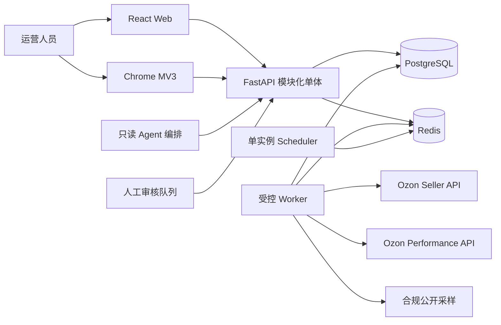
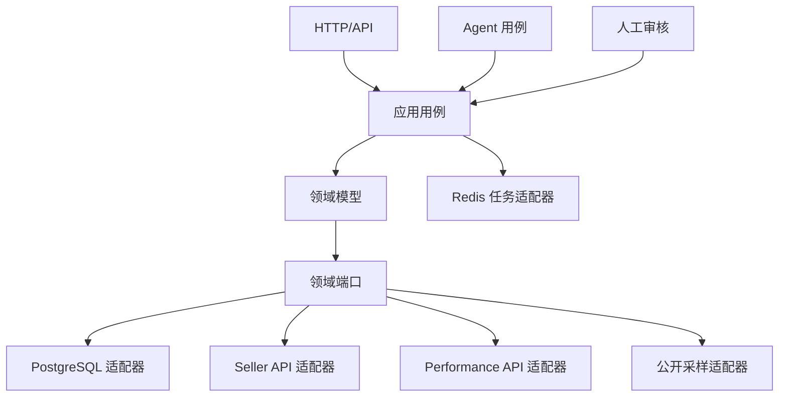
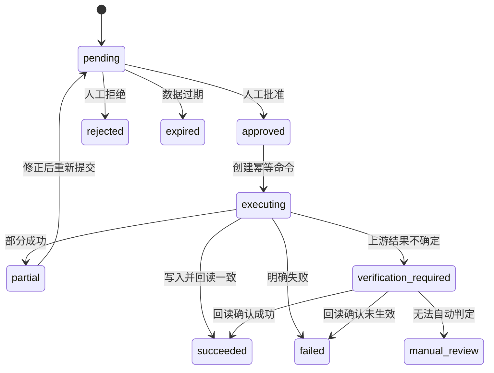
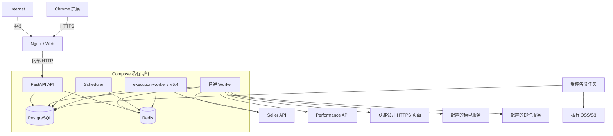
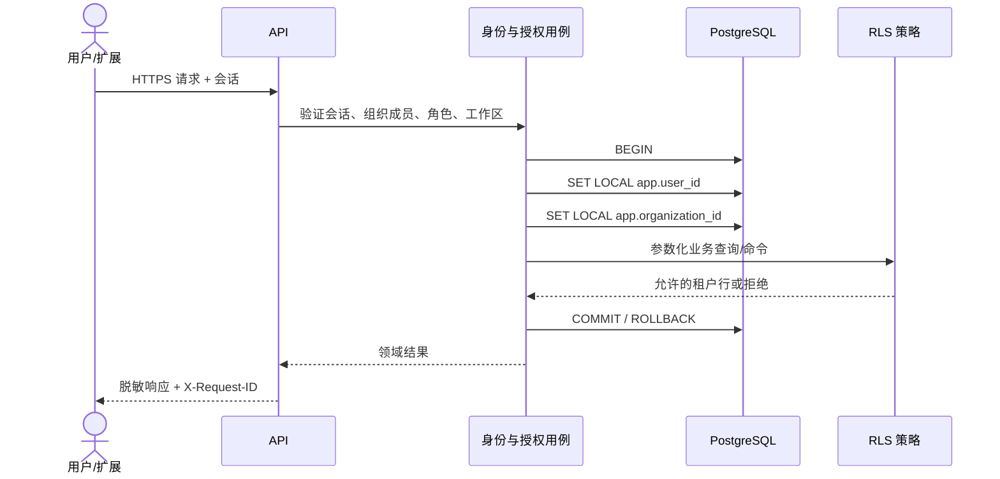
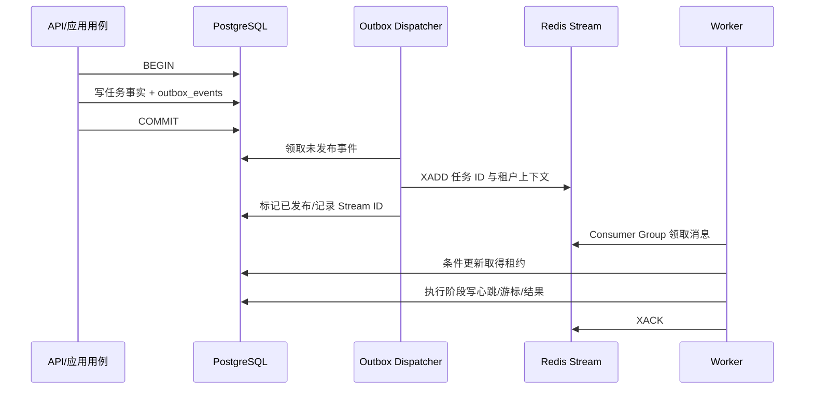

> [!success] 定档状态
> 本文是已确认需求 V5 的配套架构定档版本，自 2026-08-04 起替代架构 V5，作为后续 API、数据库、项目计划和开发实施的架构依据。
>
> 本文负责记录 V6 决策与版本快照；确认后的可复用规则必须按 [`docs/README.md`](./README.md) 的职责同步到 `ARCHITECTURE.md`、`API.md`、`DATABASE.md`、`PROJECT_PLAN.md` 等权威文档，不能只存在于本稿。

# ozonslj 架构设计 V6（已定档）

## 1. 设计目标

V6 在 V5 模块化单体、PostgreSQL、Redis、工作区隔离和只读首期原则上，新增选品、Listing、Performance API、公开采样、人工审核和只读 Agent。首期仍适配 2 核 2GB，不引入微服务、Kubernetes、ClickHouse 或爬虫集群。

所有环境只使用 PostgreSQL 作为业务数据库。Redis 不是业务数据库；旧数据库路径配置、旧持久化适配器、DPAPI 持久化和对应测试路径必须在 V5.1 清理，不保留本地兼容运行模式。退出细节见 [ADR-0001](./decisions/0001-postgresql-only.md)。

### 1.1 当前实现基线

架构状态以仓库代码和自动化测试为准，而不是按规划文字推断：

| 状态 | 当前能力 | V6 处理方式 |
|---|---|---|
| 已开发 | FastAPI 应用骨架、Chrome/Web 共用 React 入口、店铺工作区、本地 Seller 凭据加密保存与独立验证、工作区商品报价读取 | 记录为现状，不重复发起方案确认 |
| 已有结构基础 | PostgreSQL 多组织表、成员与工作区授权表、RLS 函数/策略和迁移契约测试 | 沿用已定档双层隔离原则；实现 PostgreSQL 运行时适配器时补齐事务上下文与集成测试 |
| 部分开发 | 生产环境 PostgreSQL/Redis 配置校验、Seller API 网关边界、Stub/Mock 测试路径 | 在现有端口上增量完成，不另起平行实现 |
| 尚未开发 | 用户认证与会话、PostgreSQL 业务运行时、Redis 任务执行、完整 Seller 同步、搜索词导入、公开采样、选品研究、Listing、Performance、审核写入和 Agent | 仅对其中尚未定档且影响实现方向的决策逐项确认 |

“已有 SQL/schema”不等于功能已经可运行；只有应用用例、基础设施适配器和相应测试形成可观察闭环后，才可把能力标记为已开发。

## 2. 系统上下文

客户端只访问本系统 API。Seller、Performance 和公开采样均通过独立基础设施适配器进入系统。

## 3. 模块边界

| 模块 | 职责 | 禁止事项 |
|---|---|---|
| identity | 用户、会话、组织、角色和工作区授权 | 不持有 Ozon 凭据 |
| seller_accounts | Seller 凭据、验证、轮换和权限诊断 | 不处理广告 OAuth |
| synchronization | 商品、库存、订单、履约同步和任务恢复 | 不直接暴露上游模型 |
| research | 关键词、竞品种子、研究运行和决策书 | 不调用写适配器 |
| public_collection | robots、采集策略、限速、解析和快照 | 不绕过访问控制 |
| listing | 关键词分层、草稿、风险检测和版本 | 不直接发布 |
| performance | OAuth、广告快照和指标计算 | 不复用 Seller 凭据 |
| review | 差异预览、审核、幂等命令和执行回读 | 不接受模型自行批准 |
| agents | 只读分析、报告和告警编排 | 不执行 SQL 或外部写入 |
| audit | 脱敏审计、请求链路和版本追踪 | 不保存凭据或原始 PII |

### 3.1 身份认证与会话（已确认）

- 首期采用内建身份认证，不引入必须常驻的外部身份平台。
- 密码只保存 Argon2id 哈希；密码原文不得进入数据库、日志、审计或任务载荷。
- Web 端使用 `HttpOnly`、`Secure`、`SameSite` Cookie 承载服务端会话，并实施 CSRF 防护和会话轮换。
- Chrome 扩展通过一次性、短时、单次消费的授权码换取扩展会话；授权码不得作为长期令牌使用。
- 浏览器端只保存当前工作区标识和必要的非敏感界面状态，不保存 Seller、Performance 或系统管理凭据。
- `identity` 模块提供身份提供方端口，为后续 OIDC 或企业 SSO 预留扩展点；V6 首期不实现 Auth0、Keycloak 等外部提供方。
- 无论认证来源如何，组织成员关系、组织角色和工作区授权均由本系统判定，外部身份声明不得直接绕过租户授权。
- 验证邮件与密码重置邮件通过可配置 `MailGateway` 发送；开发使用 Mail Sink，测试使用 `FakeMailGateway`，首期不绑定具体 SMTP 或事务邮件厂商。
- 邮箱验证、密码重置和扩展授权码只保存令牌哈希、用途、主体、过期时间和消费时间；原始令牌短时、单次使用，不进入日志、审计或数据库。
- 邮件发送作为可恢复异步任务执行；投递失败不回滚已提交用户事实，重试必须有上限并记录脱敏错误。

## 4. 端口与依赖方向

HTTP 路由、Worker 和 Agent 都只能调用应用用例；领域层不得依赖 FastAPI、HTTPX、Redis、PostgreSQL 或页面解析库。

## 5. 数据模型

V5 已定档实体继续保留，并新增：

| 实体 | 所有权 | 说明 |
|---|---|---|
| research_keywords | 工作区 | 规范化搜索词和导入来源 |
| keyword_report_imports | 工作区 | 文件指纹、字段映射和导入结果 |
| competitor_seeds | 工作区 | 手工维护的公开竞品种子 |
| collection_policies | 组织/域名 | robots 结果、限速和启停策略 |
| public_product_snapshots | 工作区 | 公开字段快照和估算标记 |
| product_research_runs | 工作区 | 研究模式、状态、版本和来源摘要 |
| product_decision_documents | 工作区 | 决策书草稿和假设版本 |
| listing_drafts | 工作区 | Listing 草稿、检测和版本链 |
| performance_accounts | 组织 | Performance OAuth 密文和状态 |
| ad_campaign_snapshots | 工作区 | 广告活动、关键词和日统计 |
| review_requests | 工作区 | 人工审核请求和风险上下文 |
| execution_commands | 工作区 | 一次性幂等执行命令与回读结果 |
| agent_runs | 工作区 | Agent 输入版本、输出和状态 |

跨租户表必须包含或通过受约束外键确定 `organization_id`。公开样本必须保存 `source_type`、`source_url`、`observed_at`、`estimated`、`parser_version` 和内容指纹。

## 6. 数据来源与宽表策略

不建立把所有来源无差别混合的物理“超级宽表”。查询层使用规范化事实表、物化视图或显式读模型构建 `product_research_view`。同名指标必须包含来源与口径，禁止使用 `COALESCE` 静默用公开估算覆盖官方事实。

优先级只用于展示选择，不改变原始事实：

`official_private > operator_imported > public_sample > derived_estimate`

## 7. 公开采样架构

采集流程：策略检查 → robots 检查 → 域名限流 → HTTP 获取 → 内容类型/大小校验 → 解析 → sanity check → 快照持久化 → 审计。

首期采集器只使用受控 HTTP 客户端获取服务端直接返回的 HTML 或公开结构化内容，不在开发云服务器安装或运行 Chromium、Playwright 等浏览器运行时。需要 JavaScript 渲染、登录、验证码或访问限制的页面标记为 `unsupported_access`，不尝试降级绕过。若后续确认 HTTP 采样无法覆盖目标种子，再单独评估隔离采样节点或远程浏览器服务，不占用核心服务器资源预算。

安全约束：

- 只允许 HTTPS 和配置白名单域名，禁止任意 URL 透传，防止 SSRF。
- DNS 解析后拒绝环回、内网、链路本地和云元数据地址；重定向后重新校验。
- 默认每域名并发 1、全局并发 2，使用带抖动退避并遵守 `Retry-After`。
- 不轮换代理或 User-Agent 规避限制，不处理验证码，不使用用户登录态。
- 响应大小、类型、重定向次数和总耗时有硬上限。
- 原始 HTML 默认不落库；解析失败仅保存脱敏诊断摘要和内容指纹。
- 解析器按受支持页面类型和 `parser_version` 显式注册；选择器命中异常、关键字段缺失或结构漂移时，样本进入隔离状态并生成质量告警，不沿用旧字段伪造成功结果。
- 自动化测试仅使用固定 HTML/结构化夹具和 HTTP Mock，不访问真实页面；上线前人工合规验证与自动化契约测试分开执行。

## 8. Seller 与 Performance 适配器

两个适配器共享通用 HTTP 基础组件，但认证、凭据、域名、端点、限流桶、错误映射和审计类别完全分离。

- Seller：`Client-Id` 与 `Api-Key`，用于店铺事实和后续受控写入。
- Performance：使用与 Seller 完全分离的 OAuth 2.0 授权材料。Client ID、Client Secret 以及官方授权流程实际返回的 Refresh Token（若适用）按 Performance 专用加密用途标识进行信封加密，密文保存到 PostgreSQL。
- 短期 Access Token 经加密后保存到 Redis，TTL 不得超过上游有效期，并预留安全窗口提前刷新；Access Token 不写入 PostgreSQL、日志、审计、任务消息或客户端响应。
- 每个 Performance Account 使用独立 Redis 单飞刷新锁；持锁者刷新成功后更新缓存，其他调用者等待并复用结果，避免 API 与 Worker 并发刷新造成令牌竞争。
- Redis 清空后通过 PostgreSQL 中的加密授权材料重新获取 Access Token。授权失效或需要用户重新授权时，将账户转为 `reauthorization_required`，停止无边界自动重试并创建站内通知。
- Seller 与 Performance 使用独立的数据表/聚合、加密用途标识、HTTP 客户端、认证头构造器、令牌/凭据缓存键、限流桶、错误映射和审计类别，禁止任何隐式回退或混用。
- 每个具体方法实施前核对官方路径、版本、请求/响应、分页、权限、配额和弃用状态。
- 自动化测试使用 MockTransport 或等价 Stub，禁止访问真实账号。

## 9. 研究与计算架构

`ProductResearchService` 编排三种研究模式；`ProfitCalculator` 是纯领域服务，只接收整数金额、精度明确的比例和版本化假设；`DecisionDocumentService` 生成结构化草稿，不直接生成不可追溯的自由文本结论。

研究运行必须冻结数据快照引用和算法版本，保证后续能够复现。数据不足时输出缺口和置信限制，不用默认值伪造完整结果。

### 9.1 模型适配端口（已确认，待开发）

- 生成式能力统一通过领域外的 `ModelGateway` 端口调用，选品、Listing、报告和 Agent 不直接导入任何模型厂商 SDK。
- 具体供应商、API Base URL、模型标识、超时、并发和能力标签由部署及组织级配置选择；切换供应商不得修改领域服务和业务数据结构。
- 模型凭据通过后端 Compose Secret 或等价密钥注入，只在模型适配器内使用，不写入 PostgreSQL、Redis、浏览器、任务载荷、日志或审计详情。
- 业务用例向模型传递经过最小化、脱敏并带来源版本的结构化输入，使用 JSON Schema 或等价结构化契约校验输出；格式错误只允许有限重试，最终失败进入可重试或人工处理状态。
- 每次调用记录组织、工作区、用途、适配器、模型标识、提示词模板版本、输入事实版本、Token 用量、耗时、状态和脱敏错误；默认不保存完整敏感提示词和模型原始响应。
- 组织级配置每日/月度预算、并发、单次 Token 上限和超时；达到限制后停止新的模型调用，但利润计算、规则检测、事实查询和人工编辑继续可用。
- 模型不可用时不得用旧输出伪装新结果。依赖生成能力的任务明确失败或等待重试，确定性计算与数据接入不受影响。
- 自动化测试使用确定性 `FakeModelGateway`，不得访问真实模型服务；契约测试使用脱敏夹具验证各适配器的结构化映射。

## 10. 审核与写入状态机

Agent、规则和模型只能创建 `pending` 请求。批准者必须具有目标工作区和操作类型权限；自审限制、批量上限、价格利润线和数据新鲜度在应用层与执行层重复校验。

### 10.1 独立执行进程（已确认，V5.4 启用）

- API 只负责生成操作预览、执行风险检查、接受人工批准并在 PostgreSQL 创建一次性幂等 `execution_command`；API 请求线程不得直接调用 Ozon 写接口。
- 普通 Worker 只运行同步、导入、采样、研究和报告任务，不加载外部写适配器，也不拥有写用途的密钥访问权限。
- V5.4 启用独立 `execution-worker` Compose 服务。它复用同一代码库和镜像，但使用独立进程入口、独立 Redis Stream/Consumer Group、独立服务主体和最小化 Secret 挂载；首期并发固定为 1。
- 只有审核应用用例成功提交批准状态与执行命令后，事务出站投递器才可发布执行消息。Agent、模型、Scheduler、普通 Worker 和通用任务创建 API 均不得直接向执行 Stream 投递。
- `execution-worker` 领取命令后再次校验组织/工作区、批准者权限快照、批准状态、操作类型、数据新鲜度、幂等键、每批 20 件上限、10% 涨跌幅和利润线；任一校验失败都不得调用上游写接口。
- 执行按商品记录分项结果并在写后回读。网络超时、连接中断或上游响应不明确时进入 `verification_required`，先回读判断，不得直接按失败自动重放，以免重复写入。
- 无法通过自动回读确定结果时进入 `manual_review`，冻结该分项后续自动执行并通知运营人员；明确部分成功时保留成功项，失败项必须重新预览和审批。
- V5.1～V5.3 不启动 `execution-worker`，不挂载写用途 Secret，也不占用运行内存。V5.4 上线前必须在 2GB 总预算内重新分配普通 Worker 与执行进程内存并完成压力测试。

## 11. Agent 架构

Agent 是受限应用客户端，不是拥有独立权限的后台超级用户。Agent 工具只暴露参数化查询、指标计算、报告草稿和待办创建；不暴露 SQL、凭据、文件系统或外部写适配器。

每次运行保存用户/服务主体、组织、工作区、输入时间窗、工具调用摘要、数据版本、模型版本、成本和输出。提示词不能改变权限、审核和数据隔离规则。

首期采用项目自建的 `AgentWorkflowEngine` 持久化工作流，不引入 CrewAI 或 LangGraph：

- 销售、库存、广告、竞品、选品和汇总 Agent 是版本化工作流模板，共享同一受限执行引擎，不部署为可自由互调的独立进程。
- PostgreSQL 保存工作流定义版本、运行状态、节点输入快照、完成节点、工具调用摘要、输出引用和失败原因；Redis Streams 只负责触发待执行节点。
- 每个节点只能调用注册表中声明的参数化只读工具，工具注册同时声明所需权限、输入 Schema、输出 Schema、超时和数据敏感级别。
- 汇总 Agent 只读取其他 Agent 已完成并通过 Schema 校验的结构化报告，不允许任意 Agent 间自由对话或无限递归委派。
- 模型调用统一经过 `ModelGateway`；失败恢复从最近一个已提交节点继续，已完成节点不得无理由重复产生模型费用。
- 工作流、工具契约和提示词模板分别版本化，历史运行固定引用版本；版本升级不改变已完成报告的可追溯性。
- 后续确需复杂图编排时，只能在 `AgentWorkflowEngine` 端口后增加适配器，且不得改变只读权限、租户隔离、预算、审计和人工审核边界。

## 12. API 边界

新增目标资源：

- `/v1/store-workspaces/{id}/keyword-report-imports`
- `/v1/store-workspaces/{id}/competitor-seeds`
- `/v1/store-workspaces/{id}/research-runs`
- `/v1/store-workspaces/{id}/product-decisions`
- `/v1/store-workspaces/{id}/listing-drafts`
- `/v1/store-workspaces/{id}/ad-analytics`
- `/v1/store-workspaces/{id}/review-requests`
- `/v1/review-requests/{id}/approve`

响应统一携带请求 ID；研究和分析响应包含来源摘要、数据时间和估算标记。文件导入使用大小、类型和编码限制，不在同步 HTTP 请求中执行大规模解析。

### 12.1 异步任务状态读取（已确认，待开发）

- 创建同步、导入、采样、研究、报告或执行任务后，API 返回 `202 Accepted`、任务 ID、初始状态和状态资源地址；耗时工作不得占用同步 HTTP 请求等待完成。
- Web 与 Chrome 扩展通过 HTTP 退避轮询状态资源，首期不引入 WebSocket 或 SSE。前端只读取 PostgreSQL 中已提交的任务事实，不直接订阅 Redis。
- 状态资源提供稳定 `ETag`；客户端发送 `If-None-Match`，状态未变化时返回 `304 Not Modified`，不重复传输进度详情。
- 轮询间隔由服务端 `Retry-After` 和客户端状态机共同决定：排队/短任务可较快轮询，长时间运行逐步退避；页面隐藏、扩展侧栏关闭或网络离线时暂停或显著降频。
- 响应至少包含状态、阶段、已处理/总数（可得时）、最近心跳、尝试次数、下次重试时间、部分失败计数、脱敏错误摘要和更新时间；未知总量不得伪造百分比。
- `succeeded`、`partial`、`failed`、`cancelled`、`expired` 或需要人工处理等终态停止自动轮询；重新运行必须创建新任务或走明确重试用例。
- 以后若大量实时告警确需推送，只能在通知端口后增加 SSE 等适配器，不改变任务事实表、授权检查和轮询 API。

## 13. 任务、限流与恢复

- PostgreSQL 保存任务事实、租约、游标、尝试次数、下次执行时间和结果；Redis 只保存可恢复投递、消费组状态、锁和限流状态。
- 队列采用 Redis Streams + Consumer Group，不引入 Celery、RabbitMQ 或其他常驻消息组件。
- Stream 按 `seller_sync`、`performance_sync`、`public_collection`、`research`、`report` 分类，分别设置消费者组、并发和重试策略；V5.4 另启仅供 `execution-worker` 消费的 `execution` Stream。消息只携带任务 ID 或命令 ID、组织 ID、工作区 ID、任务类型和跟踪 ID，不携带凭据或大体积业务载荷。
- API 或 Scheduler 必须先在 PostgreSQL 提交任务事实，再向对应 Stream 投递；Worker 只有在数据库事务提交成功后才能确认 Redis 消息。
- Worker 领取任务时以数据库条件更新取得租约并写入心跳；未取得租约的重复消息安全确认，不得重复执行任务。
- 延迟重试和长期调度以 PostgreSQL 的 `next_attempt_at` 为准，由 Scheduler 到期重新投递；不得依赖 Redis 保存长期时间事实。
- 相同工作区、资源、时间窗和输入指纹使用幂等键去重。
- 公开采集任务必须先读取当前策略；策略停用时安全取消。
- Worker 崩溃时，未确认消息可由消费组接管；数据库租约过期后允许重新领取。Redis 清空或不可恢复时，Scheduler 扫描 PostgreSQL 中的排队任务和租约过期任务并重建投递。
- 失败任务不推进长期水位；任务业务结果写入 PostgreSQL 后才允许确认消息，保证至少一次投递下的业务幂等。

## 14. 隐私、保留与审计

- 买家 PII 不进入关键词、竞品、广告、研究、Agent 或 RAG 上下文。
- 开发阶段原始 CSV/XLSX 文件暂存开发云服务器的私有持久化目录 `/var/lib/ozonslj/imports`，通过只挂载给 API 与 Worker 的 Compose Volume 保存，不置于 Nginx 静态目录，也不提供任意路径读取接口。
- 导入文件采用应用层信封加密后落盘；文件名使用系统生成的不可猜测对象键，原始文件名只作为经过清理的元数据保存。加密主密钥通过 Compose Secret 注入，不与密文存放在同一目录。
- PostgreSQL 只保存组织、工作区、文件指纹、对象键、大小、MIME、上传者、保留期限、解析状态和结果摘要，不保存文件二进制；业务层通过 `ImportObjectStore` 端口访问文件，禁止直接依赖服务器路径。
- 上传先写入同文件系统临时区，完成大小、类型和安全校验后原子移动到正式目录；解析使用流式读取，并限制文件大小、解压后大小、行列数量、公式和单任务内存占用。
- 原始导入文件默认保留 7 天，到期清理任务必须幂等、可观测并同步清除数据库对象引用；规范化关键词和导入事实按业务保留策略保存。
- 服务器目录设置总容量配额和剩余空间告警；达到安全水位时拒绝新上传，不得挤占 PostgreSQL、Redis、日志或备份所需空间。
- 该实现仅是开发阶段文件存储适配器。迁移 OSS/S3 时保持对象键和领域端口不变，完成校验和比对后再删除服务器副本；不得降级为 PostgreSQL `bytea`。
- 公开字段快照建议保留 180 天；原始 HTML 默认不保存。
- OAuth 令牌、Api-Key、Client-Id、请求头和原始敏感响应不得进入日志或审计详情。
- 审核、执行、导出、Agent 运行和采集策略变更必须审计。

## 15. 部署与资源预算

沿用 V5 Docker Compose。V5.1～V5.3 复用 API、Worker、Scheduler、PostgreSQL 和 Redis，不新增常驻服务。公开采集与研究任务共享普通 Worker，但使用独立队列和并发配额。大文件导入、报告生成和采集均异步执行。开发云服务器额外挂载受限导入文件卷，但该目录不承担永久归档或备份职责。V5.4 才增加同镜像的 `execution-worker` 进程，并在启用前重新定档完整容器内存预算。

已确认容器内存上限：

| 服务 | 内存上限 | 启用阶段 |
|---|---:|---|
| PostgreSQL 16 | 512MB | 始终 |
| Redis 7.4 | 128MB | 始终 |
| API | 320MB | 始终 |
| 普通 Worker | 192MB | 始终 |
| Scheduler | 64MB | 始终 |
| Nginx/Web | 64MB | 始终 |
| `execution-worker` | 128MB | V5.4 起 |

V5.1～V5.3 容器上限合计 1280MB；V5.4 起合计 1408MB，为 Linux、Docker、文件系统缓存和运维命令预留约 640MB。内存上限不是正常使用目标：核心服务不得持续使用 Swap 或发生 OOM；若压力测试出现持续 Swap，必须降低任务并发、限制输入或升级服务器，禁止依赖约 4GB Swap 扩容。

### 15.1 PostgreSQL 备份与恢复（脚本已实现，定时安装待补）

开发云服务器已有 Compose、备份/恢复脚本、03:15 cron 模板、14 天保留逻辑和日志轮转模板。2026-08-04 核验时 cron 服务运行但 ozonslj 任务尚未安装，因此不得宣称每日自动备份已生效。代码与路径事实见 [服务器上下文](./SERVER_CONTEXT.md)；后续不得重复建设平行备份方案：

- 每天 03:15（Asia/Shanghai）生成 PostgreSQL 一致性全量备份，开发阶段保留 14 天；数据库结构升级前额外生成迁移前备份。
- 保持 V5“每日全量备份 + 增量/WAL 归档、目标 RPO 不超过 1 小时”的恢复目标；若当前 PostgreSQL 部署模式无法安全支持 WAL 归档，必须显式记录降级后的实际 RPO，不得宣称已达到 1 小时。
- 备份先写入服务器受限临时目录，完成压缩、应用层加密、校验和与清单生成后，通过 `BackupObjectStore` 端口上传到服务器之外的私有对象存储。
- `BackupObjectStore` 由配置选择 OSS 或 S3 兼容适配器；访问凭据和备份加密密钥通过 Compose Secret 注入，不进入数据库、镜像、日志或备份包。
- 只有外部上传、对象校验和元数据登记全部成功，备份任务才可标记成功；随后删除本地临时副本。上传失败必须告警，不把同机临时文件视为完整备份。
- 对象存储使用私有访问、服务端加密和 14 天生命周期；删除策略不得早于已验证的新备份，也不得与运行数据库共享故障域。
- 恢复演练必须创建隔离数据库，验证解密、校验和、schema 版本、关键表数量和只读抽样查询；恢复命令默认拒绝以运行库为目标。
- 备份日志只记录任务 ID、对象键、大小、校验和、开始/结束时间和脱敏错误，不记录数据库密码、业务行内容或对象存储密钥。

## 16. 测试与验收

- 领域计算、来源优先级和缺失数据单元测试。
- CSV/XLSX 导入编码、字段映射、重复文件和恶意文件测试。
- URL 白名单、SSRF、robots、重定向、大小限制、429/503 和页面畸形测试。
- Seller/Performance 认证隔离、令牌刷新、限流和错误映射契约测试。
- 研究运行可复现、工作区隔离和 RLS 测试。
- 审核状态机、权限、过期、幂等、部分失败和回读测试。
- Agent 越权、提示注入、任意 SQL 和写入绕过测试。
- Web 与扩展的加载、空数据、过期、部分失败、来源标识和键盘操作测试。

## 17. 架构不变量

1. 官方事实、人工导入、公开样本和推导估算不得静默混合。
2. 公开采集不得绕过访问控制、robots、验证码或服务条款。
3. Seller 与 Performance 凭据、令牌、限流桶和错误映射必须隔离。
4. Agent 永远不直接持有写适配器、SQL 或凭据访问能力。
5. 所有外部写入必须经过预览、权限、人工确认、幂等、回读和审计。
6. PostgreSQL 是业务事实来源；Redis 丢失后任务可恢复。
7. 所有业务查询、任务、采集、报告和 Agent 运行强制组织与工作区隔离。
8. 2 核 2GB 是首期资源约束；新增常驻组件必须先给出必要性与预算。

## 18. 定档记录

需求 V5 和本架构 V6 已于 2026-08-04 确认。定档决策包括：内建认证并预留 OIDC、可配置 `MailGateway`、Redis Streams + Consumer Group、开发服务器加密暂存导入文件、Performance 长短期令牌分层、公开采样仅使用受控 HTTP、可配置 `ModelGateway`、自建 `AgentWorkflowEngine`、V5.4 独立 `execution-worker`、HTTP 退避轮询，以及 Scheduler 64MB / `execution-worker` 128MB 的资源预算。备份继承 V5 方案；所有环境唯一业务数据库进一步确认为 PostgreSQL。可复用规则已同步至 `CONTEXT.md`、`REQUIREMENTS.md`、`ARCHITECTURE.md`、`API.md`、`DATABASE.md`、`PROJECT_PLAN.md` 和开发规范。

## 19. 进程、网络与持久化拓扑

网络边界：

- 公网只开放 Nginx 的 80/443；80 仅用于跳转 HTTPS 或证书验证。API、PostgreSQL、Redis、Worker、Scheduler 和执行进程不直接暴露公网端口。
- PostgreSQL 与 Redis 只监听 Compose 私有网络；禁止在宿主机发布 5432/6379。
- Nginx 只代理固定 API 前缀和 Web 静态资源，不代理任意目标 URL，也不提供导入文件目录。
- API 不直接访问 Seller/Performance 写接口；普通 Worker 承担只读外部调用，`execution-worker` 只承担已批准写入和回读。
- 公开采样出站请求必须经过域名策略、DNS/重定向校验和限流；模型、邮件、备份目标均由配置白名单决定。

持久化卷：

| 卷/目录 | 挂载者 | 内容 | 生命周期 |
|---|---|---|---|
| PostgreSQL 数据卷 | PostgreSQL | 唯一业务与任务事实 | 持久；受备份保护 |
| `/var/lib/ozonslj/imports` | API、普通 Worker | 加密原始导入文件 | 默认 7 天 |
| 备份临时目录 | 备份任务 | 压缩、加密后的待上传文件 | 上传校验后删除 |
| Nginx/Web 静态卷 | Nginx | 已构建前端静态文件 | 随镜像发布 |

Redis 数据、容器可写层、应用日志和临时解析文件都不是业务持久化位置。容器重建后，业务恢复只依赖 PostgreSQL、外部备份及可重新授权的外部凭据。

## 20. Secret 与外部能力矩阵

Secret 采用最小挂载；“使用同一镜像”不表示所有进程获得相同密钥。

| Secret/能力 | API | 普通 Worker | Scheduler | execution-worker | 备份任务 | Nginx |
|---|---:|---:|---:|---:|---:|---:|
| PostgreSQL 应用连接 | 是 | 是 | 是 | 是 | 否 | 否 |
| PostgreSQL 备份连接 | 否 | 否 | 否 | 否 | 是 | 否 |
| Redis 连接 | 是 | 是 | 是 | 是 | 否 | 否 |
| 凭据信封加密主密钥 | 是 | 是 | 否 | 是 | 否 | 否 |
| Seller 只读调用能力 | 否 | 是 | 否 | 否 | 否 | 否 |
| Seller 受控写能力 | 否 | 否 | 否 | 是 | 否 | 否 |
| Performance OAuth 解密能力 | 否 | 是 | 否 | 否 | 否 | 否 |
| 模型服务密钥 | 否 | 是 | 否 | 否 | 否 | 否 |
| 邮件服务密钥 | 否 | 是 | 否 | 否 | 否 | 否 |
| 备份对象存储密钥 | 否 | 否 | 否 | 否 | 是 | 否 |
| TLS 私钥 | 否 | 否 | 否 | 否 | 否 | 是 |

备份对象存储密钥只挂载到一次性备份任务。API 可接收并加密凭据，但不得持有可执行任意 Ozon 写入的通用客户端。Seller 的“只读/写能力”必须在应用端口、进程入口和 Secret 挂载三层同时隔离；若上游不提供细粒度凭据，仍需通过仅执行进程加载写适配器来缩小暴露面。

Secret 文件只读挂载，禁止通过普通环境变量转储、调试端点、日志或错误响应输出。轮换时先加载新版本、验证读取，再停用旧版本；密文记录保存密钥版本以支持渐进重加密。

## 21. 请求授权与 RLS 事务链路

约束：

- 认证成功不等于有权访问目标工作区；授权校验和 RLS 必须同时存在。
- `SET LOCAL` 与业务查询位于同一事务；禁止使用会跨连接池请求泄漏的会话级 `SET`。
- 事务开始后若设置上下文失败，立即回滚；不得在无 RLS 上下文连接上执行“临时查询”。
- Worker/Agent 使用明确服务主体或触发用户主体，恢复组织与工作区上下文后执行同一应用用例。
- 迁移、备份和隔离恢复使用独立受控角色，不复用日常 API 连接用户；日常角色不得拥有 `BYPASSRLS`。
- 授权失败、RLS 拒绝和工作区停用使用稳定错误分类并记录脱敏审计，不记录其他租户对象详情。

## 22. 事务出站与任务执行时序

任务创建采用 PostgreSQL 事务出站，解决“数据库已提交但 Redis 未投递”或“Redis 已投递但数据库无任务”的双写裂缝。

实施规则：

- `outbox_events` 与业务任务在同一 PostgreSQL 事务提交；出站事件只保存引用和路由信息，不复制大载荷或凭据。
- Dispatcher 使用有限批次和 `FOR UPDATE SKIP LOCKED`（或等价安全领取）处理；发布失败记录次数和下次重试时间，不阻塞 API 请求。
- Redis 投递为至少一次语义；Worker 必须依靠任务幂等键、租约和业务唯一约束抵御重复消息。
- Worker 只有在任务状态/结果成功提交 PostgreSQL 后才 `XACK`。若提交成功但确认失败，重复领取不得重复产生业务副作用。
- Redis 清空时，Scheduler/恢复任务扫描 PostgreSQL 中 `queued`、待重试和租约过期任务，重新生成出站事件；不手工重建业务状态。
- 长任务按页/批提交水位；某批失败不推进长期水位。取消是协作式状态转换，不能中断不可安全停止的数据库提交或外部写入。

## 23. 故障降级与恢复策略

| 故障 | 对读取的影响 | 对新任务/写入的处理 | 恢复原则 |
|---|---|---|---|
| PostgreSQL 不可用 | 业务读取不可用 | 拒绝任务、审核和写入 | API 未就绪；数据库恢复后从事实继续 |
| Redis 不可用 | 已提交只读事实仍可查询 | 暂停新异步任务或仅保存待投递事实 | PostgreSQL 重建 Stream、锁和短期状态 |
| Seller API 临时失败 | 旧快照按时间标记可读 | 分类退避，不推进水位 | 恢复后从游标/窗口续跑 |
| Performance 授权失效 | 历史广告快照可读 | 停止同步并标记重新授权 | 用户重新授权后新建任务 |
| 模型服务不可用 | 确定性指标继续可用 | 生成任务失败/待重试 | 不用旧输出冒充新结果 |
| 邮件服务不可用 | 已登录会话不受影响 | 邮件任务有限重试 | 用户事实不回滚，投递可恢复 |
| 公开采样被禁止 | 历史样本按时间可读 | 不发送请求 | 策略变更需人工审计后再启用 |
| 磁盘达到安全水位 | 已有查询尽量保持 | 拒绝新导入/备份临时文件 | 清理到期文件、日志或扩容 |
| execution-worker 结果不确定 | 读取与审核历史可用 | 冻结对应分项自动重试 | 先回读，无法判定则人工处理 |

系统不通过隐藏默认值掩盖外部服务不可用。每个界面显示数据时间、完整度和错误摘要；过期数据是否允许查看与是否允许生成新建议/执行写入是两个独立判断。

## 24. 可观测性与运行门禁

首期不部署重量级监控集群，但所有进程输出结构化日志并提供存活/就绪状态。指标不包含凭据、完整 Client ID、买家 PII、原始模型提示词或导入文件内容。

必须采集：

- API：请求量、状态码、P50/P95/P99 延迟、活动请求、连接池使用率、RLS/授权拒绝和错误分类。
- Worker：各 Stream 待处理数、最老消息年龄、运行/租约过期任务、心跳延迟、重试/失败/部分成功率。
- 外部集成：按适配器统计请求量、限流、认证失败、超时、5xx、退避和熔断状态；Seller 与 Performance 分开。
- 数据质量：隔离记录数、解析器失败、未知枚举、孤儿关系、跨来源不一致和数据新鲜度。
- PostgreSQL：连接数、慢查询、锁等待、事务时长、磁盘、备份、WAL 和隔离恢复结果。
- Redis：内存、Stream 长度、Pending Entries、被拒绝命令和连接状态；`noeviction` 下不得发生静默数据逐出。
- 模型：用途、模型版本、Token、费用、耗时、结构化输出失败和预算拒绝，不保存敏感正文。

运行门禁：

- 就绪检查失败时 Nginx/编排不应继续向该 API 实例分配新流量。
- 队列最老任务年龄、连续备份失败、磁盘安全水位、持续 Swap、OOM、RLS 异常拒绝增长和采样解析器大面积失败必须告警。
- 告警按组织/工作区脱敏聚合；P0/P1 首期进入站内运维视图，外部通知按 P2 适配器实施。
- 日志、指标、审计使用同一 `request_id`、`task_id`、`run_id` 或 `command_id` 关联，但不得用敏感业务值作为追踪 ID。

## 25. 分阶段部署与能力开关

| 阶段 | 启用进程/适配器 | 默认关闭能力 | 上线门禁 |
|---|---|---|---|
| V5.1 | API、普通 Worker、Scheduler、PostgreSQL、Redis、Seller 只读适配器 | Performance、公开采样、模型、写入、Agent | PostgreSQL-only、RLS、任务恢复、备份与 Seller 同步验收 |
| V5.2 | 导入文件适配器、公开 HTTP 采样、研究/利润服务 | Listing 发布、广告、写入、Agent | 文件安全、robots/SSRF、可复现决策书和资源压测 |
| V5.3 | Performance 适配器、ModelGateway、Listing/广告诊断 | 所有外部写入、Agent | OAuth 隔离、预算、结构化输出和只读边界验收 |
| V5.4 | 独立 `execution-worker` 与 `execution` Stream | 超出价格小批量规则的其他写入 | 审核、幂等、回读、不确定状态和单并发压测 |
| V5.5 | `AgentWorkflowEngine`、报告与站内通知 | 未确认的外部通知渠道 | 越权/提示注入/预算/恢复/报告追溯验收 |

能力开关由服务端配置和组织授权共同控制，前端隐藏按钮不能作为安全边界。关闭能力时，API 必须拒绝新任务，Worker 必须在执行前重新读取开关；历史事实与报告仍按权限可读。任何阶段不得提前挂载后续阶段 Secret 或加载写适配器。
