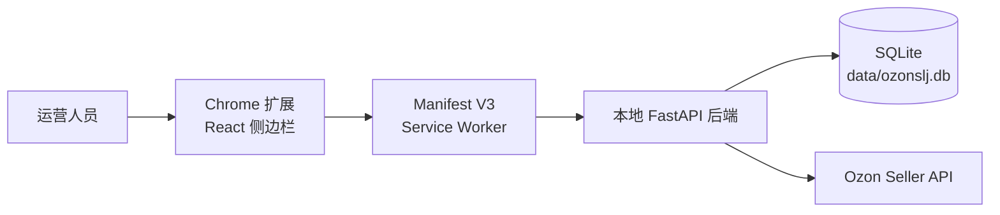
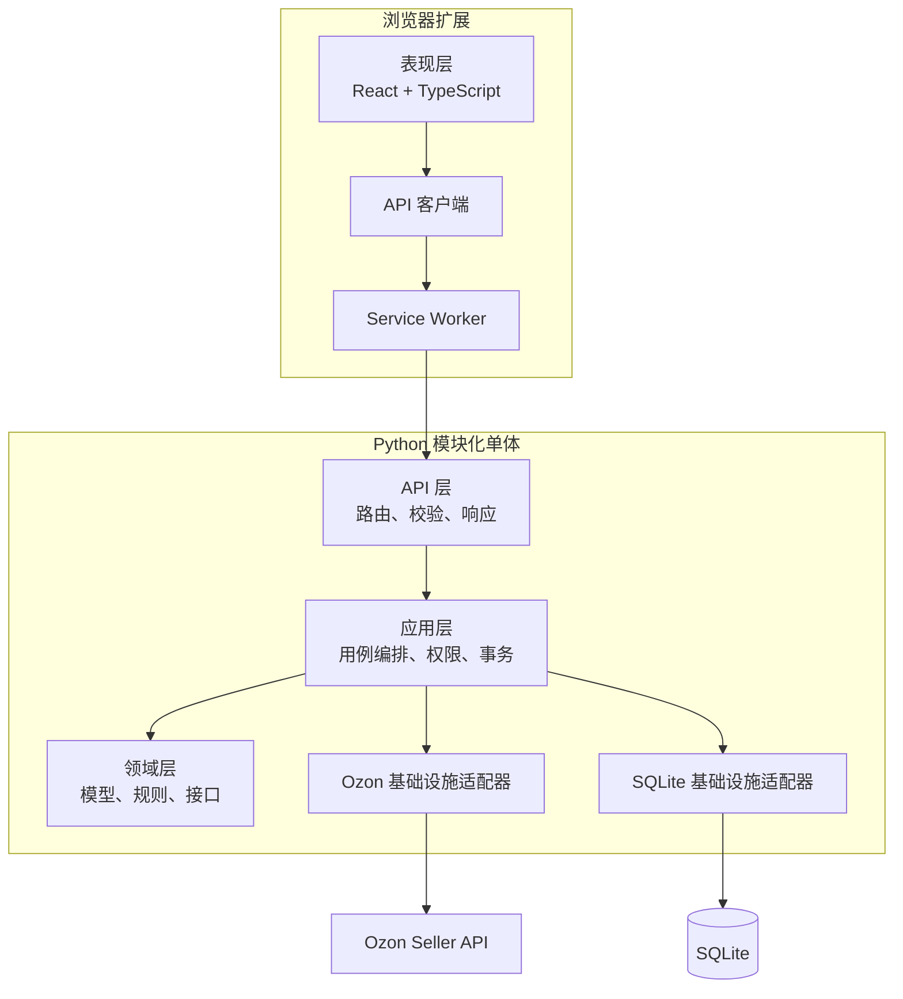
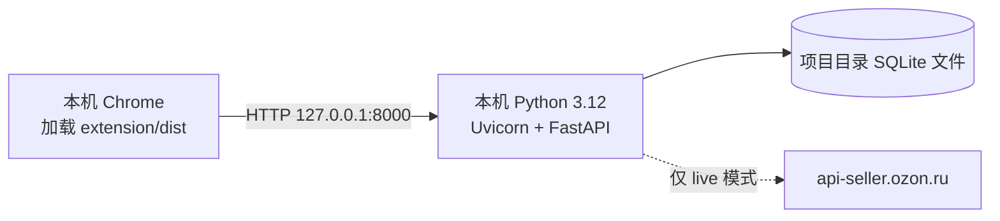
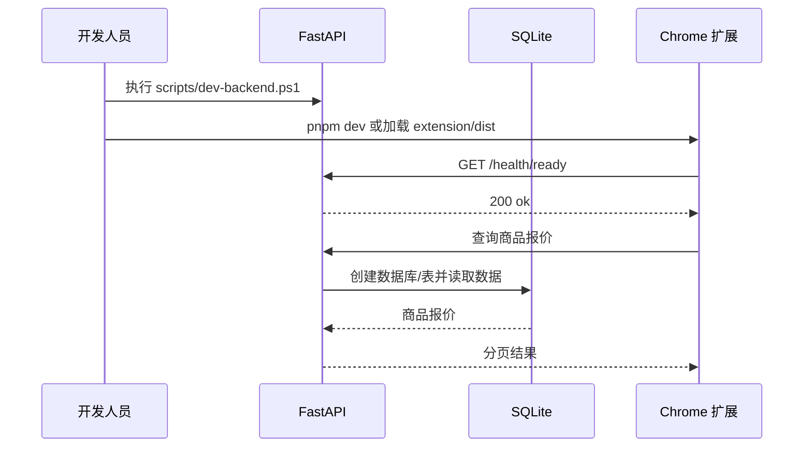
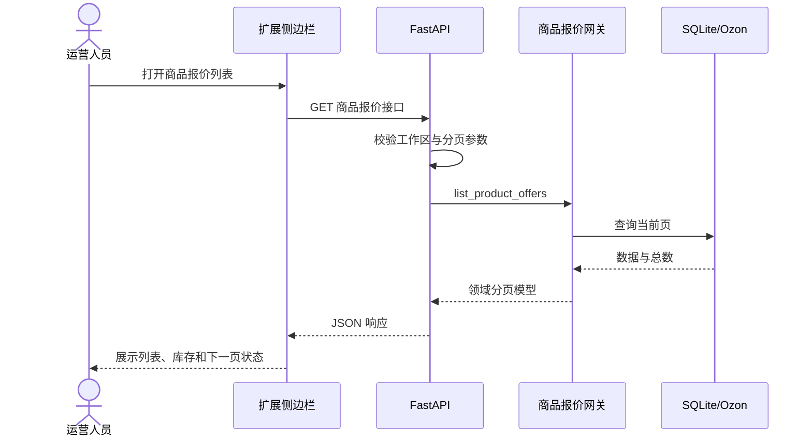
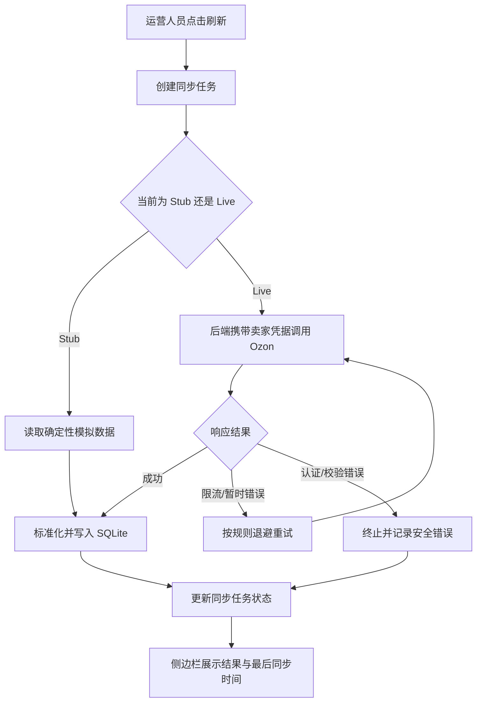
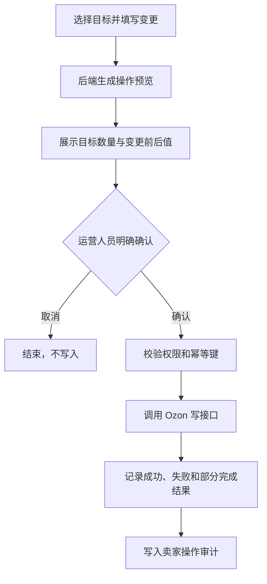

# Ozon 跨境电商运营插件架构设计

## 1. 文档目的

本文定义项目的总体架构、模块职责、主要功能、关键流程、数据边界和演进原则。当前版本采用本地优先方案：Chrome 扩展作为操作界面，Python FastAPI 作为可信后端，SQLite 作为本地持久化存储。

## 2. 架构目标

- 在浏览器侧提供商品、库存、订单和履约数据的统一运营入口。
- Ozon `Client-Id`、`Api-Key` 等凭据只能进入后端，不能进入扩展代码、浏览器存储和日志。
- 无需 Docker 和外部数据库即可启动、调试和测试。
- 通过领域接口隔离 Ozon API、SQLite 和 UI，便于后续替换存储或部署到服务器。
- 第一阶段只读；写操作必须逐项增加操作预览、明确确认、幂等控制和审计。

## 3. 系统上下文

## 4. 逻辑架构

当前代码已完成商品报价只读垂直切片。应用层会随着认证、同步和写操作的引入逐步补齐，API 路由不得直接依赖数据库实现细节。

## 5. 部署架构

本地开发不需要 Docker。后端默认绑定 `127.0.0.1`，数据库默认路径为 `data/ozonslj.db`。开发阶段使用 Ozon Stub 数据；只有显式切换 live 模式并配置凭据后才能访问真实 Ozon 服务。

## 6. 功能架构

| 功能域 | 功能描述 | 当前状态 |
|---|---|---|
| 健康检查 | 提供存活与就绪检查，支持本地启动诊断 | 已实现基础接口 |
| 商品报价 | 查询商品编号、名称、价格、币种和可用库存，支持游标分页 | 已实现本地 SQLite 切片 |
| 卖家账户 | 新增、验证、停用卖家账户，保存加密凭据 | 规划中 |
| 店铺工作区 | 隔离不同卖家账户的数据、权限和操作历史 | 规划中 |
| 库存位置 | 按仓库、FBO/FBS 模式查看库存 | 规划中 |
| 客户订单 | 按状态、时间范围查询订单 | 规划中 |
| 履约单 | 查看履约状态、商品明细和物流信息 | 规划中 |
| 同步任务 | 手动刷新并展示进度、完成时间和失败信息 | 规划中 |
| 审计 | 记录认证、读取、同步和后续写操作 | 规划中 |
| 受控写入 | 价格、库存等写入必须预览、确认、幂等和审计 | 后续阶段 |

## 7. 模块职责

### 7.1 Chrome 扩展

- `extension/src`：侧边栏组件、页面状态和后端 API 客户端。
- `extension/public/manifest.json`：Manifest V3 声明与最小权限。
- `extension/public/service-worker.js`：扩展生命周期和浏览器能力入口。
- 扩展只能调用固定的本地后端接口，不允许接收任意 Ozon 路径后透传。

### 7.2 后端 API 层

- 负责 HTTP 参数校验、响应模型和错误状态转换。
- 不保存 Ozon 凭据，不直接编写 SQL。
- 所有店铺资源接口必须校验运营人员对店铺工作区的访问权限。

### 7.3 应用与领域层

- 应用层组织查询、同步、认证和后续写操作。
- 领域层维护统一业务术语、不变量和端口接口。
- Ozon 原始响应模型与内部领域模型必须分离。

### 7.4 基础设施层

- SQLite 适配器负责本地缓存和业务持久化。
- Ozon 适配器集中处理认证头、超时、分页、重试、限流和错误映射。
- Stub 适配器提供确定性数据，不依赖真实凭据。

## 8. 关键业务流程

### 8.1 本地启动流程

### 8.2 商品报价查询流程

### 8.3 数据同步流程

### 8.4 后续受控写操作流程

## 9. 数据架构

- SQLite 是当前唯一持久化数据库，业务表定义见 [DATABASE.md](./DATABASE.md)。
- `product_offers` 已由当前代码使用，其余表作为 MVP 后续模块的目标结构。
- 外部编号全部按字符串保存，避免数字精度和前导零问题。
- 金额以定点文本或最小货币单位保存，不使用浮点数。
- 时间统一保存为 UTC ISO 8601 字符串，展示时转换时区。
- Ozon 凭据只能保存为加密密文，禁止写入扩展包、日志和测试夹具。

## 10. 接口与安全边界

- 扩展到后端：固定 JSON API，详见 [API.md](./API.md)。
- 后端到 Ozon：只允许后端发起；具体路径、版本、字段和配额须在实现时依据 Ozon 官方文档再次核验。
- CORS 只开放本地开发地址和合法 Chrome 扩展来源。
- 第一阶段 API 为只读风险级别；价格、库存、履约状态、取消等属于重要写操作。
- 日志必须脱敏 `Client-Id`、`Api-Key`、客户信息和敏感请求头。

## 11. 可用性与质量属性

| 属性 | 设计要求 |
|---|---|
| 可维护性 | Python 与 TypeScript 类型检查通过；模块依赖单向 |
| 可测试性 | Stub、临时 SQLite、API 测试和浏览器 E2E 分层 |
| 性能 | 列表必须分页；不得一次加载全部 Ozon 数据 |
| 可靠性 | 只读请求可按规则重试；写请求默认不自动重试 |
| 安全性 | 凭据后端隔离、最小权限、输入校验、日志脱敏 |
| 可观测性 | 请求编号、同步状态、结构化日志、健康检查 |
| 可迁移性 | 数据库和 Ozon 通过适配器隔离，未来可迁移 PostgreSQL |

## 12. 技术选型

- 前端：React、TypeScript、Vite、Chrome Manifest V3。
- 后端：Python 3.12、FastAPI、Pydantic、Uvicorn。
- 数据：SQLite（Python 标准库 `sqlite3`）。
- 质量：pytest、Ruff、mypy、TypeScript 编译、Vite 构建。
- 包管理：Python `venv/pip`、Node.js `pnpm`。
- 版本管理：Git，主分支 `main`。

## 13. 本项目使用的技能汇总

| 技能 | 用途 |
|---|---|
| `find-skills` | 搜索并评估 Git、架构、需求和文档类技能 |
| `domain-modeling` | 统一领域术语并维护 `CONTEXT.md` |
| `ozon-seller-api` | 约束 Ozon 凭据边界、API 网关、分页、重试和写操作安全 |
| `chrome-extensions` | Manifest V3、侧边栏、Service Worker 和最小权限设计 |
| `frontend-design` | 前端视觉方向和界面表达 |
| `design-taste-frontend` | 避免模板化设计并保持产品界面一致性 |
| `vercel-react-best-practices` | React 性能与组件实现规范 |
| `web-design-guidelines` | 后续界面可访问性与 Web 体验审查 |
| `improve-codebase-architecture` | 后续代码库结构评估和架构改进 |
| `tdd` | 以公共接口为测试边界完成红—绿开发 |
| `playwright` | 后续浏览器端到端流程与调试 |
| `security-best-practices` | 后续 Python/TypeScript 安全专项评审 |
| `supabase-postgres-best-practices` | 未来迁移 PostgreSQL 时的结构与性能参考，当前 SQLite 阶段不直接使用 |

## 14. 关联文档

- [项目需求文档](./REQUIREMENTS.md)
- [数据库设计](./DATABASE.md)
- [接口文档](./API.md)
- [前后端开发规范](./DEVELOPMENT_STANDARDS.md)
- [本地开发说明](./LOCAL_DEVELOPMENT.md)
