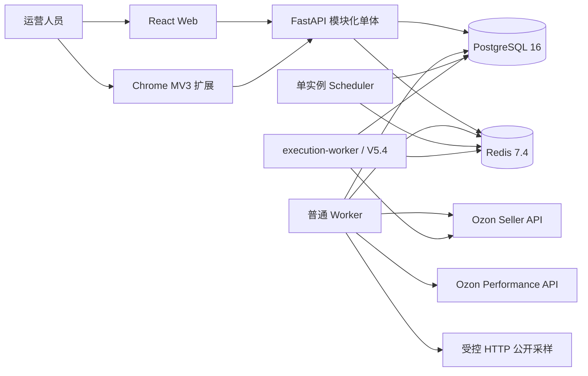
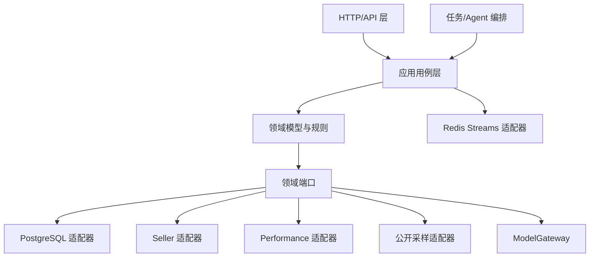

# ozonslj 总体架构

> 本文是系统架构的持续维护入口，文档职责见 [项目文档索引](./README.md)。当前正式架构快照为 [V6](./ARCHITECTURE-V6.md)，自 2026-08-04 起替代 V5；尚未实现的能力继续标记为“已定档待开发”。

## 1. 架构目标

ozonslj 是面向 Ozon 跨境卖家的多组织 SaaS 智能运营工作台，使用 Web 与 Chrome 扩展作为统一 API 的客户端。架构必须同时满足：

- PostgreSQL 是本地、测试、集成和云端唯一业务数据库。
- Redis 只保存可重建队列、锁、限流、短期令牌缓存和协调状态。
- Organization 是租户边界，工作区是店铺业务与授权边界。
- 官方事实、运营导入、公开样本和推导估算分开保存并标明来源。
- AI 与 Agent 永久只读，外部写入必须经过人工审核和独立执行链路。
- 首期适配 Linux 2 核、2GB 内存，不引入 Kubernetes、微服务集群、ClickHouse、向量数据库或浏览器采集集群。

## 2. 当前实现状态

状态以仓库代码和测试为准：

| 状态 | 能力 |
|---|---|
| 已开发 | FastAPI 应用骨架、Chrome/Web 共用 React 入口、店铺工作区、Seller 凭据本地加密/验证、工作区商品报价读取 |
| 已有结构基础 | PostgreSQL 基础 schema、多组织表、成员/工作区授权、RLS 函数与策略、迁移契约测试 |
| 部分开发 | 生产环境 PostgreSQL/Redis 配置校验、Seller HTTP 网关边界、Stub/Mock 路径 |
| 尚未开发 | Redis Streams 完整任务闭环、完整 Seller 同步、搜索词导入、公开采样、选品、Listing、Performance、审核写入和 Agent |
| 已部署基础设施 | 云端 Compose、PostgreSQL/Redis、版本化迁移和 Fernet Secret；备份/恢复、cron 与日志轮转脚本模板已存在，但定时任务安装待补；详见 `SERVER_CONTEXT.md` |
| 已清理历史实现 | 旧持久化适配器、旧数据库路径配置、DPAPI 云端依赖和对应测试路径均已移除 |

已有 schema 不等于功能可运行。PostgreSQL 适配器、事务上下文和集成测试闭环完成前，不能把云端数据库能力标记为已开发。

## 3. 系统上下文

客户端只访问本系统 API，不直接调用 Ozon、PostgreSQL、Redis、模型服务或公开采样目标。API、Worker、Scheduler 和执行进程使用同一代码库的不同进程入口。

## 4. 模块与依赖方向

- API 层负责认证上下文、参数校验、错误映射和响应，不直接执行 SQL 或调用上游。
- 应用层负责用例编排、事务、权限、幂等和任务创建。
- 领域层维护组织、工作区、商品、同步、研究、审核和执行不变量，不依赖 FastAPI、HTTPX、PostgreSQL、Redis 或模型 SDK。
- 基础设施层实现 PostgreSQL、Redis、Ozon、公开 HTTP、文件、邮件、模型和备份端口。
- 上游传输模型必须映射为内部模型，不直接暴露给领域层或前端。

主要模块：`identity`、`seller_accounts`、`synchronization`、`research`、`public_collection`、`listing`、`performance`、`review`、`agents`、`audit`。模块通过应用用例和领域端口协作，不通过跨模块任意 SQL 耦合。

## 5. 身份、租户与 RLS

首期采用内建认证并预留 OIDC 端口（已定档待开发）：

- 密码只保存 Argon2id 哈希。
- Web 使用 HttpOnly、Secure、SameSite Cookie 和 CSRF 防护。
- Chrome 扩展使用短时、单次消费授权码换取扩展会话。
- 外部身份提供方不能绕过本系统组织成员、角色和工作区授权。
- 验证邮件和密码重置邮件统一通过 `MailGateway` 发送，供应商、SMTP/API 地址和发件身份由配置选择；开发使用 Mail Sink，自动化测试使用 `FakeMailGateway`，首期不绑定厂商。
- 邮箱验证、密码重置和扩展授权码只在 PostgreSQL 保存随机令牌的哈希、用途、主体、过期时间和消费时间；原始令牌短时、单次使用，发送或消费后不得写入日志。
- 邮件投递失败进入可恢复任务，不回滚已经提交的用户事实；响应不能泄露某邮箱是否已注册。

每个请求依次校验身份、组织成员关系、组织角色、工作区授权和资源状态。PostgreSQL RLS 是第二道隔离边界：每个事务使用 `SET LOCAL` 设置 `app.organization_id` 与 `app.user_id`；缺少上下文时默认拒绝。Worker 从任务事实恢复用户或服务主体上下文。日常应用账户不得拥有 `BYPASSRLS`。

## 6. 数据与任务架构

数据模型和迁移细节以 [DATABASE.md](./DATABASE.md) 为准。核心原则：

- PostgreSQL 保存业务事实、任务、水位、租约、游标、重试和结果。
- Redis Streams + Consumer Group 负责至少一次投递；Redis 清空后由 Scheduler 根据 PostgreSQL 重建。
- API/Scheduler 先提交数据库任务或事务出站事件，再投递 Redis。
- Scheduler 以受控服务主体和普通 RLS 上下文扫描 `queued` 且到期的同步任务；Redis Stream 消息只携带任务、工作区和资源类型 ID。短期 Redis 去重键失效或 Redis 清空后，Scheduler 可从 PostgreSQL 再次投递。
- Worker 使用数据库条件更新取得租约并写心跳；未取得租约的重复消息安全确认。
- Worker 仅能在未取消、已到重试时间且尝试次数未达上限时原子领取任务；运行中任务只有租约过期后才能被其他 Worker 恢复。心跳、完成和失败更新必须匹配当前租约持有者与未过期租约。
- Worker 通过 Redis Consumer Group 获取最小消息，领取 PostgreSQL 租约后才运行资源处理器；只有完成或失败状态成功持久化后才 `XACK`。处理器异常只写固定脱敏错误，不保存原始异常文本。
- 延迟重试以 PostgreSQL `next_attempt_at` 为准，不依赖 Redis 保存长期时间事实。
- 金额使用最小货币单位整数，时间按 UTC 保存，来源和估算标识不可缺失。

Stream 按 `seller_sync`、`performance_sync`、`public_collection`、`research`、`report` 分类；V5.4 增加隔离的 `execution` Stream。消息只携带 ID 与租户上下文，不携带凭据或大体积业务载荷。

## 7. 外部集成边界

### 7.1 Seller API

Seller `Client-Id`/`Api-Key` 只在后端解密使用。真实方法实施前核对官方路径、权限、分页、限流和错误。自动化测试只使用 Stub、MockTransport 或契约夹具。

### 7.2 Performance API

Seller 与 Performance 使用独立表/聚合、加密用途标识、HTTP 客户端、认证构造器、限流桶和错误映射。长期 OAuth 授权材料加密保存到 PostgreSQL；短期 Access Token 加密保存到 Redis 并设置 TTL 和单飞刷新锁。授权失效时进入 `reauthorization_required`，不无边界重试。

### 7.3 公开采样

首期只使用受控 HTTP，不在核心服务器运行 Chromium/Playwright。流程为：策略检查 → robots → 域名限流 → HTTPS 获取 → 类型/大小校验 → 版本化解析 → 质量检查 → 快照。需要 JavaScript、登录、验证码或访问限制的页面标记 `unsupported_access`，不尝试绕过。

### 7.4 模型服务

所有模型通过可配置 `ModelGateway` 接入，不绑定供应商 SDK。供应商、Base URL、模型、超时和预算由配置选择。业务使用结构化输出契约；测试使用确定性 Fake，不访问真实模型服务。模型不可用时，确定性计算、规则检测和事实查询继续运行。

## 8. 选品、Listing 与 Agent

- `ProductResearchService` 编排 Explore、Validate、Expand；研究冻结数据快照、算法和假设版本。
- `ProfitCalculator` 是纯领域服务，分别计算 FBO/FBS，不使用浮点金额。
- Listing 保存草稿、风险发现和版本；风险检测不覆盖用户原文。
- Agent 首期使用自建 `AgentWorkflowEngine`，不使用 CrewAI 或 LangGraph。
- Agent 是版本化只读工作流模板，只能调用注册的参数化只读工具；汇总 Agent 读取结构化报告，不允许自由递归委派。
- 每次 Agent 运行记录组织、工作区、事实版本、工作流、工具、模型、提示词模板、成本和输出引用。

## 9. 人工审核与受控写入

统一流程：

`操作预览 → 风险检查 → 人工批准 → 幂等命令 → execution-worker → 分项回读 → 审计 → 效果复盘`

API 只创建审核请求和执行命令，不直接调用 Ozon 写接口。普通 Worker 不加载写适配器。V5.4 才启用独立、单并发 `execution-worker`，只有该进程挂载写用途 Secret。

首个写入能力为商品价格：每批最多 20 件、涨跌不超过 10%、不得低于利润线、数据过期必须重新预览。网络超时或上游结果不明确时进入 `verification_required` 并先回读；仍无法判断时进入 `manual_review`，不得盲目重放。

## 10. API 与客户端

HTTP 契约以 [API.md](./API.md) 为准。异步任务返回 `202 Accepted` 和状态资源；Web/扩展使用 ETag 与 `Retry-After` 进行退避轮询，首期不使用 WebSocket/SSE。任务状态只读取 PostgreSQL 已提交事实。

Web 与扩展共享 React 组件、API 类型和业务状态；扩展使用 Manifest V3、最小权限和 Side Panel。浏览器只保存当前工作区 ID 与必要会话信息，不保存 Ozon、模型或对象存储凭据。

## 11. 部署与资源

正式运行目标：Linux 2 核、2GB 内存、约 4GB Swap，Docker Compose，镜像由 ACR 构建后服务器拉取。PostgreSQL 和 Redis 不开放公网；Secret 不进入镜像和仓库。

| 服务 | 内存上限 | 启用阶段 |
|---|---:|---|
| PostgreSQL 16 | 512MB | 始终 |
| Redis 7.4 | 128MB | 始终 |
| API | 320MB | 始终 |
| 普通 Worker | 192MB | 始终 |
| Scheduler | 64MB | 始终 |
| Nginx/Web | 64MB | 始终 |
| `execution-worker` | 128MB | V5.4 起 |

V5.1～V5.3 容器上限合计 1280MB，V5.4 起 1408MB。Swap 只用于故障缓冲；持续 Swap 或 OOM 必须降低并发、限制输入或升级服务器。

开发阶段导入文件加密暂存 `/var/lib/ozonslj/imports` 私有卷，默认保留 7 天，并通过 `ImportObjectStore` 端口为后续 OSS/S3 迁移留出边界。目录不可由 Nginx 提供静态访问。

## 12. 备份与恢复

继承 V5 方案：每天 03:15（Asia/Shanghai）执行 PostgreSQL 一致性全量备份，开发阶段保留 14 天，并按能力归档 WAL，目标 RPO 不超过 1 小时。备份加密并上传到服务器之外的私有 OSS/S3；只有上传和校验成功才标记成功。本地临时副本随后删除。

恢复演练只能恢复到隔离数据库，验证解密、校验和、schema 版本和关键数据；默认拒绝把运行库作为恢复目标。开发云服务器已有 Compose、备份/恢复脚本、cron 和日志轮转模板，后续沿用现有方案；当前定时任务尚未安装，详见 [服务器上下文](./SERVER_CONTEXT.md)。

## 13. 架构不变量

1. PostgreSQL 是所有环境唯一业务数据库；不得提供第二套业务数据库运行模式。
2. Redis 丢失不得造成业务事实或任务事实不可恢复。
3. 所有业务查询、任务、导入、采集、报告、审核和 Agent 都携带组织与工作区上下文。
4. 官方事实、运营导入、公开样本和推导估算不得静默混合。
5. Seller 与 Performance 凭据、令牌、限流和错误域完全隔离。
6. 公开采样不得绕过 robots、登录、验证码、访问限制或服务条款。
7. Agent 不持有 SQL、凭据、文件系统或写适配器。
8. 所有外部写入经过预览、人工批准、幂等、独立执行、回读和审计。
9. 新常驻组件必须说明必要性、启用阶段和资源预算。
10. 自动化测试不得访问真实 Ozon 账户、真实公开页面或真实模型服务。

## 14. 关联文档

- [项目文档索引](./README.md)
- [需求 V5 已确认](./REQUIREMENTS-V5.md)
- [架构 V6 已定档](./ARCHITECTURE-V6.md)
- [API 契约](./API.md)
- [数据库设计](./DATABASE.md)
- [项目计划](./PROJECT_PLAN.md)
- [开发规范](./DEVELOPMENT_STANDARDS.md)
- [本地开发](./LOCAL_DEVELOPMENT.md)
- [故障记录](./troubleshooting.md)

## 15. 实施级架构入口

定档 V6 已进一步给出可直接指导实现的运行设计：

- [进程、网络与持久化拓扑](./ARCHITECTURE-V6.md#19-进程网络与持久化拓扑)：公网入口、私有网络、出站边界和卷生命周期。
- [Secret 与外部能力矩阵](./ARCHITECTURE-V6.md#20-secret-与外部能力矩阵)：各进程最小 Secret 挂载及写能力隔离。
- [请求授权与 RLS 事务链路](./ARCHITECTURE-V6.md#21-请求授权与-rls-事务链路)：身份、授权、`SET LOCAL` 和连接池边界。
- [事务出站与任务执行时序](./ARCHITECTURE-V6.md#22-事务出站与任务执行时序)：PostgreSQL 任务事实、Outbox、Redis Streams、租约与确认顺序。
- [故障降级与恢复策略](./ARCHITECTURE-V6.md#23-故障降级与恢复策略)：PostgreSQL、Redis、外部 API、模型、邮件、磁盘和写入不确定状态。
- [可观测性与运行门禁](./ARCHITECTURE-V6.md#24-可观测性与运行门禁)：日志、指标、追踪关联、告警和就绪门禁。
- [分阶段部署与能力开关](./ARCHITECTURE-V6.md#25-分阶段部署与能力开关)：V5.1～V5.5 的进程、适配器、默认关闭能力和上线条件。

## 16. 知识型混合 RAG 扩展（核心闭环已开发，云端验收待完成）

知识型混合 RAG 是现有模块化单体的目标扩展，不改变业务事实存储基线。此前“首期不引入向量数据库”的约束对普通运营业务仍然有效；经 [ADR-0010](./decisions/0010-chroma-for-knowledge-hybrid-rag.md) 确认，知识 RAG 专项必须增加 Chroma，且仅作为可从 PostgreSQL 已发布知识版本重建的语义索引。

目标拓扑在现有 API 与基础设施旁增加 `rag-worker`、Chroma 和厂商无关模型端口。`rag-worker` 与业务同步 Worker 使用独立 Redis Stream、Consumer Group、死信队列、任务类型、凭据和资源限制；PostgreSQL 继续保存任务、租约、发布和治理事实。RAG 任一组件异常不得影响登录、工作区和现有运营 API，也不得以重建 PostgreSQL、Redis 或 Nginx 作为恢复手段。

该扩展已具备 RAG-1 至 RAG-7 的领域模型、治理 migration、PostgreSQL + Chroma 持久化运行时、API、前端页面和测试闭环；RAG-8 的开发云 Chroma/Worker 健康、备份恢复和真实供应商连通性仍待部署验收。实现边界以 [RAG 技术架构](./RAG_ARCHITECTURE.md) 为准，实施状态以 [RAG 实施计划](./RAG_IMPLEMENTATION_PLAN.md) 为准。
# 当前部署模式：单组织、内部隔离

当前部署是单一运营组织模式。`DEFAULT_ORGANIZATION_ID` 由服务端配置，登录接口和客户端不得提交、选择或切换组织。认证成功后，服务端使用该固定组织建立 PostgreSQL 事务上下文。

现有 `organizations`、`organization_members`、`organization_id` 和 RLS 不删除，它们属于数据安全与未来演进基础，而不是当前需要交付的组织管理模块。P0 不实现组织注册、邀请、切换、成员目录、组织设置或工作区授权管理 API/UI。应用层也不得把内部租户结构直接暴露为运营流程。
## 2026-08-09 开发状态同步

- ERP 仍是领域端口，不引入具体 ERP 供应商；金额与币种在适配边界完成一致性校验后才能进入统一模型。
- Seller 快照保存与历史查询已覆盖商品、库存、订单和履约四类内部模型，真实上游适配器必须继续经过官方路径、权限、分页和限流复核。
- `PaginatedSyncHandler` 按页保存事实，只有完整成功后推进同步水位；中途失败由 PostgreSQL 保留恢复依据，Redis 仅承担短期队列/租约状态。
