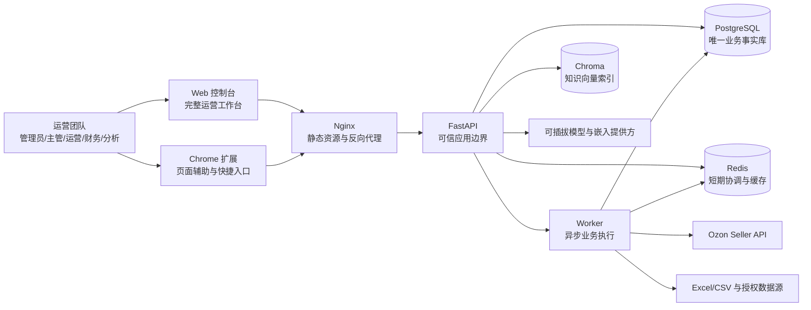
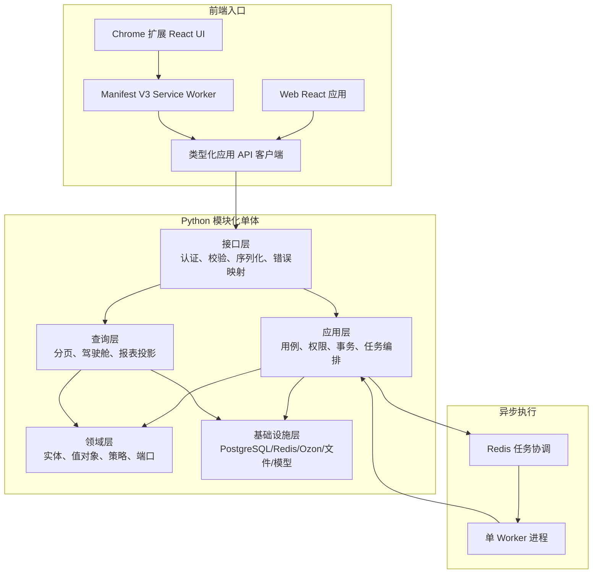
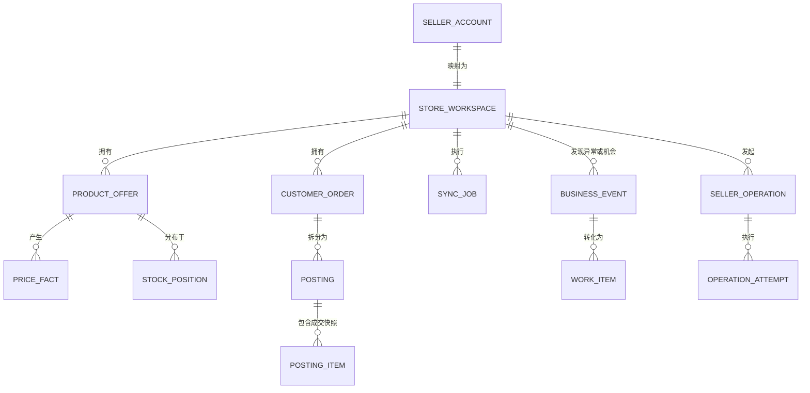
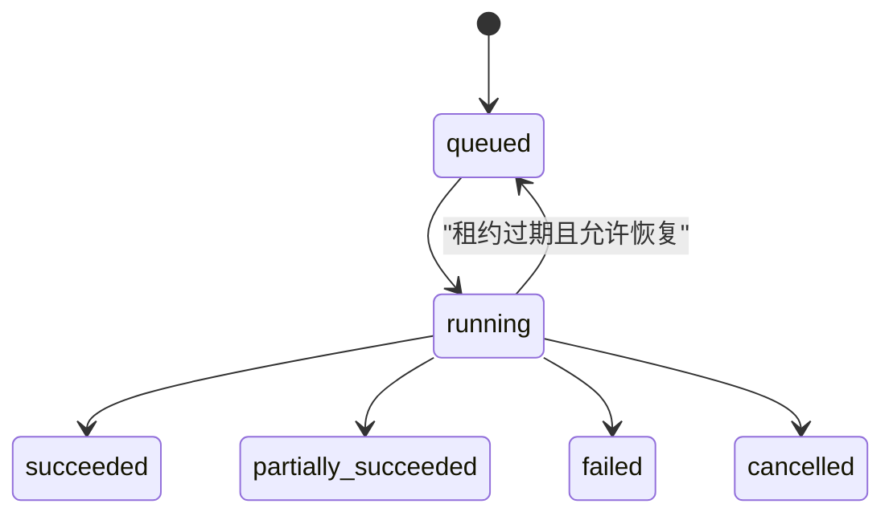
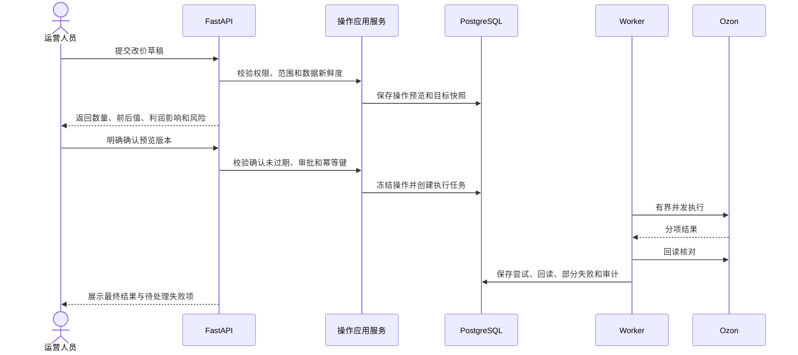
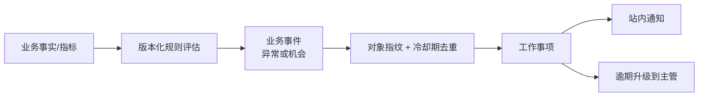
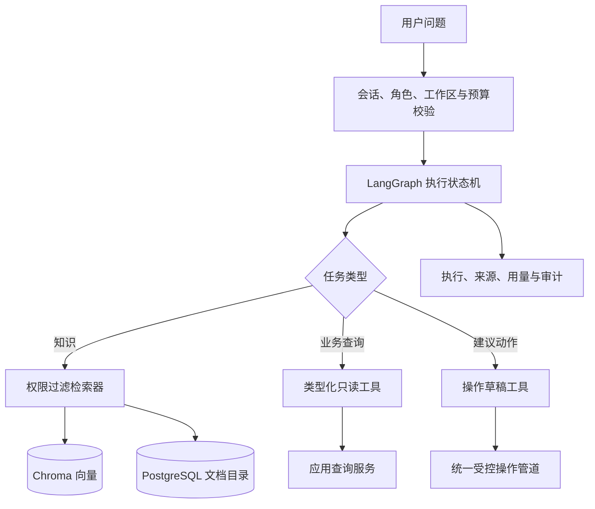
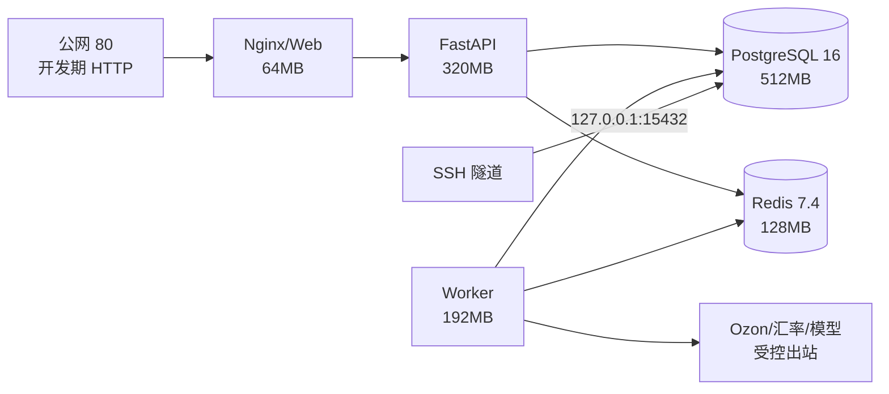

# ozonslj 架构设计文档 V4

> 版本：V4.0  
> 日期：2026-07-31  
> 状态：已按需求 V4 完善，待架构评审  
> 需求基线：[`REQUIREMENTS_V4.md`](./REQUIREMENTS_V4.md)

## 1. 文档目的

本文将已确认的 V4 产品需求转换为可逐步实施的前后端、数据、同步、智能体与部署架构。架构优先满足当前单组织、多工作区和 2 核 2GB Linux 单节点约束，同时避免把未来功能提前拆成难以维护的微服务。

本文不声明具体 Ozon 上游端点。每个适配器实施前必须依据当时的官方 Seller API 文档复核路径、权限、字段、分页、限流和错误语义。

## 2. 架构原则

1. **PostgreSQL 是唯一业务事实来源**：不提供 SQLite 回退，不以 Redis、Chroma 或浏览器存储代替业务事实。
2. **工作区是业务隔离边界**：API、SQL、缓存、任务、导出、通知、审计和 RAG 检索均显式携带工作区。
3. **模块化单体优先**：API 与 Worker 共用领域和应用模块，按业务边界组织；只有出现独立扩缩容或故障隔离需求时才拆服务。
4. **同步与交互请求分离**：耗时采集、导入、导出、规则计算和模型任务进入 Worker，HTTP 请求只负责创建任务和查询状态。
5. **当前状态与历史事实分离**：商品当前状态、价格历史、库存快照、订单事实、费用事实、计算结果和审计分别建模。
6. **高风险写操作统一治理**：所有 Ozon 写入通过操作草稿、预览、审批、幂等执行、回读和审计管道。
7. **模型不拥有业务权限**：LangChain、LangGraph 和模型只能调用后端白名单工具，不能直连 PostgreSQL 或调用任意 URL。
8. **数据最小化**：凭据、客户隐私、日志、导出和 RAG 均遵守最少收集、最少展示和脱敏原则。
9. **渐进增强**：先交付可信账号与真实只读同步，再建设经营闭环、受控写入和智能体。

## 3. 系统上下文



### 3.1 信任边界

- 浏览器、上传文件、Ozon 响应、第三方资料和模型输出均视为不可信输入。
- Nginx 只暴露 Web 和固定 API；PostgreSQL、Redis、Worker 与 Chroma不直接暴露公网。
- Ozon `Client-Id` 与 `Api-Key` 只在后端凭据模块解密并注入上游请求。
- Worker 具有受限的 Ozon 出站能力；数据库容器不需要公网出站。

## 4. 总体逻辑架构



依赖方向始终由外向内：接口层与基础设施层可以依赖应用/领域接口，领域层不得依赖 FastAPI、psycopg、Redis、Ozon SDK、LangChain 或 Chroma。

## 5. 前端架构

### 5.1 Web 控制台职责

Web 是完整运营入口，承载：

- 登录、成员、角色、工作区和卖家账户配置。
- 驾驶舱、异常机会、任务、通知和审批中心。
- 商品、价格、库存、采购在途、订单履约、售后和合规工作台。
- 利润、费用、结算、广告、促销、选品、关键词和翻译。
- 批量导入导出、规则配置、知识库、智能体和系统运维页面。

建议按业务路由分包，首屏只加载框架、用户会话、工作区和待办摘要；图表、编辑器、导入和智能体模块按路由懒加载。

### 5.2 Chrome 扩展职责

扩展是轻量快捷入口，不复制完整 Web：

- 展示当前工作区、关键异常、商品摘要和同步新鲜度。
- 在 Ozon 页面提供合法的上下文辅助和跳转，不抓取凭据或非授权会话数据。
- 发起商品诊断、翻译草稿、任务创建和打开 Web 详情。
- 使用 `chrome.storage.local` 只保存应用会话所需最小信息、界面偏好和选中工作区，不保存 Ozon 凭据。

扩展页面、Content Script、Service Worker 与后端之间的消息必须采用固定类型、来源校验和负载大小限制。Content Script 不直接调用 Seller API。

### 5.3 前端状态分层

| 状态类型 | 保存位置 | 示例 |
|---|---|---|
| 服务端事实 | 查询缓存，短期存在内存 | 商品、订单、异常、利润 |
| 会话状态 | 安全 Cookie 或后端认可的短期令牌 | 当前登录身份 |
| 工作区上下文 | 前端状态 + 最小本地偏好 | 当前工作区编号 |
| 表单草稿 | 页面状态；必要时后端草稿 | 改价预览、翻译审校 |
| 长任务状态 | 后端任务记录，前端轮询或后续事件推送 | 同步、导入、导出 |

前端不得把权限判断、利润公式或操作限制作为唯一事实；后端必须重新校验。

## 6. 后端业务模块

模块以业务能力而不是页面命名。初期位于同一 Python 应用中，共用 PostgreSQL 事务与基础设施。

| 模块 | 主要职责 | 关键所有权 |
|---|---|---|
| `identity` | 登录、会话、密码、角色与授权 | 操作人员、角色、工作区成员关系 |
| `seller_accounts` | 卖家账户、加密凭据、权限探测 | 卖家账户、凭据版本、能力矩阵 |
| `catalog` | 商品报价、内容、属性、图片、变体与质量 | 商品当前状态、内容版本、诊断结果 |
| `pricing` | 价格历史、定价规则、利润底线 | 价格事实、定价策略、价格操作草稿 |
| `inventory` | 仓库库存、销量窗口、补货和滞销 | 库存状态、补货策略、库存建议 |
| `procurement` | 供应商、采购单、在途与到货差异 | 采购单、采购明细、在途批次 |
| `orders` | 客户订单和成交快照 | 客户订单、订单项快照 |
| `fulfillment` | FBO/FBS 履约、物流和时限 | 履约单、履约项、状态历史 |
| `after_sales` | 退货、退款、赔付、争议与评价 | 售后案件、证据、质量主题 |
| `finance` | 成本、汇率、费用、预计/实际利润与对账 | 成本版本、汇率版本、费用事实、结算 |
| `marketing` | 广告、促销日历和效果复盘 | 活动、广告事实、促销评估 |
| `growth` | 选品、竞品、关键词和翻译 | 研究项目、来源快照、内容建议 |
| `risk` | 审核、合规、账号健康和数据质量 | 风险事件、规则依据、诊断记录 |
| `work_management` | 异常、机会、待办、审批和站内通知 | 事件、任务、审批、通知 |
| `automation` | 规则定义、试跑、触发与冷却 | 规则版本、命中记录、动作草稿 |
| `data_exchange` | 模板、导入、导出和错误报告 | 文件任务、行级错误、下载授权 |
| `sync` | Ozon 采集、任务、水位和对账 | 同步任务、检查点、适配器能力 |
| `operations` | 统一受控写操作管道 | 操作草稿、目标、执行尝试、回读结果 |
| `analytics` | 驾驶舱、目标、指标口径和读模型 | 指标定义、目标、聚合投影 |
| `knowledge` | 文档目录、分块、索引和检索权限 | 知识文档、版本、索引状态 |
| `agent` | 智能体执行、工具、预算与记忆 | 执行、步骤、工具调用、记忆条目 |
| `audit` | 不可变业务与安全审计 | 审计事件 |

### 6.1 模块交互约束

- 模块通过应用服务或显式端口交互，禁止跨模块直接修改对方数据表。
- `analytics` 读取标准化事实并生成可重建投影，不成为订单、利润或库存事实所有者。
- `automation` 只能创建事件、待办、通知或操作草稿，首版不能直接执行 Ozon 写入。
- `agent` 与 `automation` 均调用 `operations` 管道，不能绕过权限和审批。
- `audit` 接收业务事件摘要，不保存凭据和完整客户隐私。

## 7. 领域模型与统一术语



关键术语：

- **业务事件**：规则或人工发现的异常、机会或风险证据，不等同于团队待办。
- **工作事项**：分配给人员、具有状态和截止时间的协作对象，可由业务事件产生。
- **受控操作**：对 Ozon 或关键内部状态产生影响的有边界命令，必须经过统一治理流程。
- **事实记录**：从 Ozon、导入或结算获得且可追溯的数据；与可重建指标、建议和缓存分离。
- **能力矩阵**：卖家账户经过验证后，各数据域和操作的实际授权结果；“无权限”不能表示为“无数据”。
- **知识文档**：可进入 RAG 的受版本与权限管理的资料，不等同于业务数据库记录。

这些术语应在后续确认无冲突后同步补充到 `CONTEXT.md`；本轮不覆盖该文件中的用户未提交修改。

## 8. PostgreSQL 数据架构

### 8.1 存储设计包

- 工作负载：事务型为主，兼有运营分析读模型和审计事件。
- 数据通道：关系优先的混合模型。
- 变更类型：在现有 PostgreSQL 基线上增量扩展。
- 所有权重点：工作区业务事实、团队协作、审计与智能体治理。
- 主要风险：工作区隔离、历史事实覆盖、JSON 滥用和大表迁移安全。

PostgreSQL 保存强关系、资金、状态、版本和审计；`jsonb` 只用于结构确实可变且不承担核心查询/约束的脱敏摘要、规则配置或模型元数据。驱动筛选、关联、唯一性、金额和生命周期的字段必须是可查询列。

### 8.2 数据分层

| 数据层 | 示例 | 生命周期 |
|---|---|---|
| 主数据与当前状态 | 工作区、商品、库存、当前规则 | 更新并保留版本或审计 |
| 历史事实 | 价格、订单、履约、费用、结算、广告 | 追加或更正，不物理覆盖原依据 |
| 协作与流程 | 异常、任务、审批、操作 | 状态机 + 状态历史 |
| 计算与投影 | 驾驶舱日汇总、利润结果、补货建议 | 带口径版本，可重建 |
| 知识与智能体治理 | 文档目录、执行、工具调用、预算 | 按权限和保留策略管理 |
| 审计 | 登录、授权、敏感读取、业务写入 | 追加式，普通用户不可修改 |

### 8.3 工作区完整性

- 所有卖家业务表包含 `workspace_id`。
- 工作区内业务唯一键采用 `(workspace_id, external_id)` 或明确的内部复合键。
- 跨表关系优先使用含 `workspace_id` 的复合外键，数据库直接拒绝跨工作区关联。
- 所有热点索引按“工作区等值列 → 状态/类型等值列 → 时间范围/排序列”组织。
- 跨工作区报表通过授权查询服务显式汇总，不取消底层工作区条件。

### 8.4 迁移策略

1. 以 `database/postgres/migrations` 为唯一 DDL 来源，已登记迁移不可修改。
2. 新模块采用“新增表/可空列 → 部署兼容代码 → 分批回填 → 校验 → 收紧约束 → 清理旧结构”。
3. 大表索引评估 `CREATE INDEX CONCURRENTLY`，不得在迁移事务中盲目锁表。
4. 结构升级前生成备份；失败时停止应用升级，不用应用代码猜测结构。
5. 回填记录批次、水位和错误；达到行数、空值和外键校验条件后才收紧约束。
6. 当前不为全部 V4 模块一次性建空表，按垂直切片增量迁移。

## 9. Ozon 集成与同步架构

### 9.1 适配器分层

```text
Ozon HTTP 传输模型
        ↓ 运行时校验
资源适配器（商品/库存/订单/履约/...）
        ↓ 标准化映射
领域导入模型
        ↓ 应用用例
PostgreSQL 短事务 UPSERT / 事实追加
```

统一传输层负责认证头、请求编号、超时、取消、限流、`Retry-After`、指数退避、错误映射与日志脱敏。资源适配器只负责当前端点的请求、分页和映射，不各自实现重试策略。

### 9.2 同步顺序与策略

已确认首批顺序：

`商品/价格 → 库存 → 订单 → FBO/FBS 履约`

- 首次有限全量建立主数据与当前状态。
- 订单和履约使用重叠时间窗口增量，抵御延迟更新。
- 商品和库存使用状态快照；整轮成功后才软失效缺失项。
- 周期性对账发现历史窗口变化、漏页和跨资源不一致。
- 页面读取 PostgreSQL，不在用户请求中同步调用 Ozon。

### 9.3 任务状态机



长期检查点只有 `succeeded` 任务可以推进。分页游标属于执行状态，不等于长期水位。同一工作区最多一个活动同步任务，避免资源依赖和写入竞争。

## 10. 异步任务与 Redis

Redis 只承担短生命周期协调：

- 任务唤醒、短期分布式锁、限流计数、幂等窗口和热点查询缓存。
- PostgreSQL 保存任务真相、状态、进度、重试次数、租约和结果；Redis 丢失不能丢失业务任务。
- Worker 从 PostgreSQL 领取任务并使用租约防止重复执行，Redis 用于降低轮询和并发竞争。
- 当前节点运行单 Worker、受限并发；模型、导入、导出和同步任务按队列类型设优先级。

建议优先级：用户确认的受控操作回读 > 履约/严重异常 > 增量同步 > 导入导出 > 模型批量生成 > 周期性对账。

## 11. 统一受控操作架构



首个写操作为价格：默认单批最多 20 个商品、单次涨跌不超过 10%、不得低于利润底线。限制由后端策略执行，前端与智能体只能展示，不能绕过。

若上游无原生幂等键，使用操作编号、目标指纹、短期去重锁和回读降低重复风险。禁止对未知结果的写请求自动无限重试。

## 12. 经营分析与计算架构

### 12.1 指标计算

- 原始事实写入后发布内部领域事件，由 Worker 增量更新日级投影。
- 驾驶舱读取预聚合表，并允许下钻到订单、履约、费用和异常事实。
- 指标定义包含名称、版本、币种、时区、过滤范围和公式说明。
- 首批以 `Asia/Shanghai` 统计 8 个确认指标；底层事实仍保存 UTC。
- 数据迟到或结算修正时重算受影响日期，不覆盖原始事实。

### 12.2 完整贡献利润

利润计算依赖成本版本、汇率版本、订单收入、平台费用、物流、仓储、广告、促销、退款、税费和汇兑事实。计算结果保存：

- 计算版本和输入快照引用。
- 预计、实际、完整或不完整状态。
- 缺失项目、保本价和目标利润价。
- 计算时间与适用业务日期。

自动汇率按日同步，财务锁定的结算汇率产生新版本，不修改历史版本。

## 13. 规则、异常、任务和通知



- 首批包含同步、价格、利润、库存、履约、费用、审核、退款、广告和合规异常。
- 严重程度为紧急、严重、警告、提示，判级依据作为规则版本保存。
- 默认按工作区和异常类型分配负责人，未配置时归工作区主管。
- 规则引擎首版只能生成业务事件、待办、通知或操作草稿，不能直接写 Ozon。
- 站内通知为首版唯一通知渠道；通知是投递结果，不是任务真相。

## 14. 批量导入与导出

### 14.1 导入管道

`上传 → 病毒/类型/大小检查 → 文件落入受控临时区 → 解析 → 行级校验 → 差异预览 → 确认 → 分批写入 → 结果报告`

- PostgreSQL 保存文件任务、内容哈希、模板版本、统计和行级错误。
- 文件不进入数据库大字段；本地受控目录仅短期保存，并设置清理期限。
- 同一工作区、模板类型和文件哈希构成重复上传判断依据。
- 首版采购单、在途库存和成本使用 Excel/CSV 模板。

### 14.2 导出管道

大导出进入 Worker，按工作区授权和字段脱敏生成短期文件。下载使用一次性或短期授权，记录生成者、范围、下载时间和过期清理结果。

## 15. 智能体与 RAG 架构



### 15.1 组件职责

- LangChain：模型、嵌入、检索器、结构化输出和类型化工具适配。
- LangGraph：步骤状态、人工确认、暂停恢复、超时和失败终止。
- PostgreSQL：知识目录、权限、版本、索引状态、Agent Run、步骤、预算和记忆元数据。
- Chroma：允许检索的文档分块、向量和非敏感来源元数据；不是业务事实库。
- 模型网关：多提供方配置、任务路由、超时、Token/费用记录、预算和脱敏。

### 15.2 工具边界

首批工具包括今日异常、同步状态、商品诊断、低库存、负利润、履约风险、费用异常和经营指标解释。所有工具：

- 使用固定名称与类型化输入输出。
- 后端注入当前用户和授权工作区，不信任模型提供的身份。
- 限制时间范围、结果数量、执行时间和可见字段。
- 不接受任意 SQL、任意 URL、任意文件路径或任意 Ozon 请求体。

### 15.3 预算与记忆

- 组织月度预算达到 70%、90%、100% 时告警；达到上限后暂停非必要生成任务。
- 会话短期记忆、个人偏好、团队规则和组织知识分开保存并有不同权限。
- 记忆写入必须分类、可查看、可更正、可删除；不得把模型推断自动升级为组织事实。

### 15.4 2GB 节点约束

Chroma 与智能体不在 V4.1 启用。启用前重新评估内存；首选独立 Compose Profile、低并发和外部模型 API。若基础容器常态内存不足以保留安全余量，则 Chroma迁移到独立节点或托管服务。

## 16. API 架构约定

- `/v1` 表示应用 API 版本，不映射 Ozon 版本。
- 面向资源的查询使用游标分页，游标为不透明值。
- 耗时动作返回任务编号，查询接口返回状态、进度、计数和脱敏错误。
- 高风险操作采用草稿/预览资源与独立确认命令，确认必须绑定预览版本。
- 所有响应附请求编号；后续可增加数据新鲜度和权限能力摘要。
- 错误区分认证失败、权限不足、无数据、数据过期、上游不可用、限流和部分失败。
- API 响应不返回 Ozon 凭据、密文、完整客户隐私或内部异常堆栈。

接口明细仍由 [`API.md`](./API.md) 管理；V4 实施时按模块逐项扩展，不一次性定义虚假接口。

## 17. 认证、授权与隐私

### 17.1 认证

- 密码使用成熟强哈希方案，登录与会话由后端管理。
- Web 首选 `HttpOnly`、`Secure`、`SameSite` Cookie；在 HTTP 开发节点仅使用开发配置，正式数据进入前必须 HTTPS。
- 扩展使用短期、受限应用会话，不持有 Ozon 凭据。

### 17.2 授权

授权检查顺序：用户状态 → 组织角色 → 工作区成员关系 → 功能权限 → 操作范围/数量/金额限制 → 审批策略。数据库工作区条件是纵深防御，不能代替应用授权。

### 17.3 隐私

- 客户信息按业务必要性分字段保存，默认遮罩展示。
- 日志、通知、导出、审计、RAG 和模型上下文分别执行脱敏。
- `source_payload_json` 由后端白名单构造，不保存未知上游字段。
- 敏感导出记录申请人、工作区、字段范围、用途和下载行为。

## 18. 可观测性与运行保障

### 18.1 可观测信号

| 类别 | 关键指标 |
|---|---|
| API | 请求量、P95、错误率、认证拒绝、连接池等待 |
| 同步 | 队列等待、任务耗时、分页数、水位延迟、失败和限流 |
| Worker | 心跳、租约过期、任务积压、重试、内存 |
| 数据质量 | 缺字段、未知枚举、孤儿关系、对账差异 |
| 业务操作 | 预览、确认、成功、部分失败、回读不一致 |
| 智能体 | Token、费用、延迟、工具失败、无来源回答和预算比例 |
| 基础设施 | CPU、内存、Swap、磁盘、数据库连接、备份和恢复演练 |

结构化日志使用请求编号、任务编号和操作编号关联，但不记录密钥和完整客户隐私。当前首版仅站内业务通知；系统自身不可用的基础设施告警需要在进入正式运营前另选独立渠道。

### 18.2 备份与恢复

- PostgreSQL 每日自定义格式备份，本地保留 14 天。
- 每月至少一次隔离恢复演练，结构升级前必须备份并验证。
- 当前接受服务器和本地备份同时丢失的开发阶段风险；正式运营前重新评审异地备份。
- Redis 缓存不纳入业务恢复点；任务真相在 PostgreSQL。
- Chroma索引可由 PostgreSQL 文档目录和原文重建，不作为唯一备份来源。

## 19. 部署架构



### 19.1 网络

- 公网只发布 Nginx 80；域名和 HTTPS 就绪后发布 443 并重定向 HTTP。
- PostgreSQL 仅服务器回环端口用于 SSH 隧道，Redis 不映射宿主机端口。
- API/Worker 使用独立出站网络；数据库与 Redis 不接入出站网络。
- Chroma 后续只在内部网络提供服务。

### 19.2 发布

1. 质量检查和 PostgreSQL 迁移测试通过。
2. 使用仓库根上下文在 ACR 构建不可变版本镜像。
3. 结构升级前备份，并在真实 PostgreSQL 16 上验证迁移。
4. 服务器拉取镜像，执行 Compose 配置校验并滚动重建应用容器。
5. 验证存活、就绪、迁移、API 冒烟、Worker 心跳和资源使用。
6. 失败时停止发布；数据库只按已设计的迁移回滚/恢复策略处理，不执行破坏性 Git 或临时 DDL。

## 20. 质量属性与验收门禁

| 属性 | 架构措施 |
|---|---|
| 安全 | 后端凭据边界、强制授权、统一受控写入、脱敏和审计 |
| 可靠 | PostgreSQL 任务真相、租约、检查点、短事务、回读和恢复演练 |
| 性能 | 游标分页、读模型、增量聚合、异步导入导出和有界并发 |
| 可维护 | 模块化单体、领域端口、传输/领域模型分离、版本化迁移 |
| 可测试 | Stub、契约、真实 PostgreSQL 迁移、API、Worker 和浏览器 E2E |
| 可解释 | 指标口径、数据时间、规则版本、来源、输入快照和计算版本 |
| 可演进 | 按切片加表、Expand-and-Contract、Redis 可替换、模型网关可插拔 |

每个垂直切片至少通过 pytest、Ruff、mypy、PostgreSQL Schema/迁移、TypeScript、Vite 和 `git diff --check`。Ozon 适配器还需覆盖认证失败、权限不足、限流、超时、分页边界、空响应、重复数据和畸形响应。

## 21. 演进路线与拆分条件

### V4.1：可信账号与真实数据

- 实现身份、工作区授权、加密凭据和能力矩阵。
- 按确认顺序实现真实只读同步。
- 完成数据质量、同步页面、审计、域名/HTTPS准备和监控基础。

### V4.2：日常运营闭环

- 新增驾驶舱投影、异常任务、价格历史、采购在途、库存建议、利润与对账。
- 保持单 Worker，通过任务优先级和有界并发保护 2GB 节点。

### V4.3：增长与售后

- 新增内容版本、翻译、关键词、选品来源、售后和合规模块。
- 导入导出采用异步任务，文件设置清理期限。

### V4.4：营销与受控写入

- 先价格写入，验证统一操作管道后再扩展其他写能力。
- 广告、促销和活动复盘按实际 API 权限启用。

### V4.5：智能运营助手

- 启用文档目录、Chroma、模型网关、LangGraph和首批只读工具。
- 通过越权、提示注入、跨工作区、过期数据、预算和审批绕过测试后，才评估智能体操作草稿。

只有满足以下任一条件才考虑拆服务：

- 某类 Worker 任务需要独立扩缩容且长期挤压交互请求。
- 智能体/Chroma 内存使核心 API 无法满足节点安全余量。
- 某模块有独立合规、发布节奏或故障隔离要求。
- 单体内部边界已经稳定并有明确调用契约。

## 22. 关键架构决策

| 决策 | 选择 | 原因 |
|---|---|---|
| 应用形态 | 模块化单体 + Worker | 当前团队和节点规模下事务简单、部署成本低 |
| 业务数据库 | PostgreSQL 16 | 强完整性、工作区复合约束、事务和运营查询 |
| 异步协调 | Redis + PostgreSQL 任务真相 | Redis 提效，PostgreSQL保证可恢复 |
| 知识检索 | PostgreSQL 目录 + Chroma向量 | 权限与版本可审计，向量索引可重建 |
| Ozon 访问 | 后端资源适配器 | 隔离凭据、限流、错误语义和审计 |
| 高风险写入 | 统一受控操作管道 | 防止不同功能各自实现不一致的安全流程 |
| 分析 | 事实表 + 可重建投影 | 兼顾追溯、下钻和驾驶舱性能 |
| 扩展定位 | 轻量上下文入口 | 降低权限和维护复杂度，完整能力放 Web |
| 智能体 | 类型化白名单工具 | 模型输出不构成权限，禁止任意 SQL/URL |

## 23. 当前实现与目标差距

### 已具备

- PostgreSQL-only、版本化迁移、连接池和真实同步兼容基线结构。
- FastAPI 存活/就绪、工作区目录和商品报价分页 API。
- Redis 连接、Worker 进程骨架、Nginx/Web 和 Docker Compose。
- Chrome 扩展商品列表和工作区切换基础。
- PostgreSQL SSH 隧道、定时备份和隔离恢复演练。

### 下一架构切片

1. `identity` 与工作区成员授权。
2. `seller_accounts` 加密凭据、权限验证和能力矩阵。
3. `sync` 统一 Ozon 传输层与商品/价格适配器。
4. 真实 PostgreSQL 短事务 UPSERT、检查点和同步任务页面。
5. 在上述边界稳定后依次增加库存、订单和履约。

## 24. 关联文档

- [产品需求 V4](./REQUIREMENTS_V4.md)
- [历史架构设计](./ARCHITECTURE.md)
- [数据库设计](./DATABASE.md)
- [接口文档](./API.md)
- [部署说明](./DEPLOYMENT.md)
- [项目计划](./PROJECT_PLAN.md)
- [统一领域语言](../CONTEXT.md)

