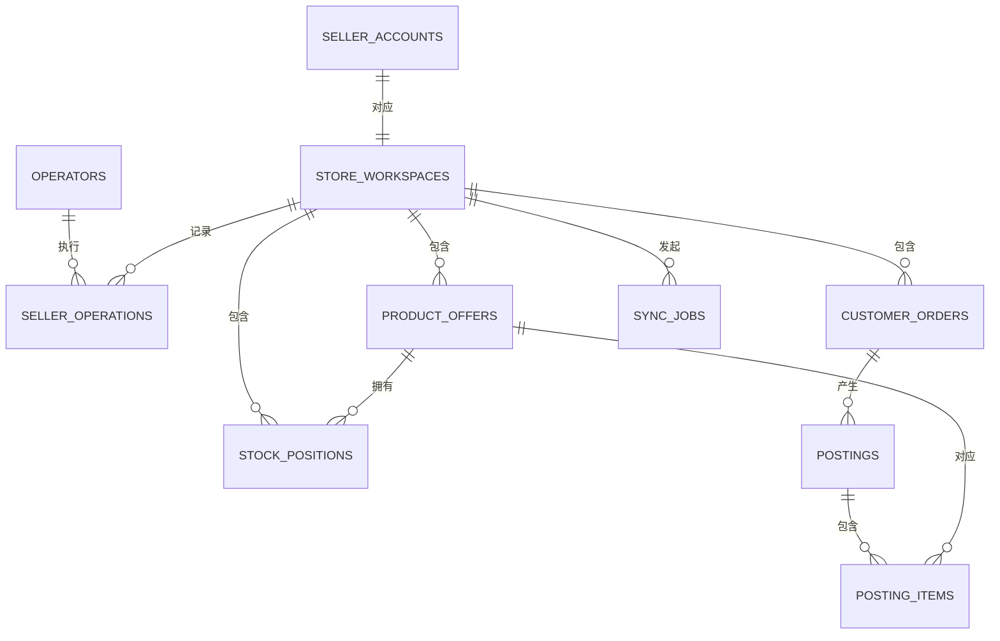

# 数据库设计文档

## 1. 总体说明

项目当前使用 SQLite，默认文件为 `data/ozonslj.db`。完整建库脚本位于 [database/schema.sql](../database/schema.sql)。当前代码已使用 `product_offers` 表；其余表是 MVP 后续功能的目标结构。

## 2. 设计约定

- 主键使用文本 UUID，便于未来迁移和离线生成；Ozon 原始编号也统一保存为文本。
- 布尔值使用 `INTEGER`，取值为 `0` 或 `1`。
- 时间使用 UTC ISO 8601 文本，例如 `2026-07-28T08:00:00Z`。
- 金额使用十进制定点文本，禁止 SQLite `REAL` 浮点数。
- JSON 扩展信息使用文本保存，读取时必须校验结构。
- 外键默认开启，删除卖家账户时级联清理所属业务数据。
- 凭据字段只保存加密密文，不保存明文 `Api-Key`。

## 3. 表清单

| 表名 | 用途 |
|---|---|
| `operators` | 本地运营人员 |
| `seller_accounts` | Ozon 卖家账户与加密凭据 |
| `store_workspaces` | 卖家账户的隔离工作区 |
| `product_offers` | 商品报价缓存 |
| `stock_positions` | 仓库和履约模式库存 |
| `customer_orders` | 客户订单 |
| `postings` | FBO/FBS 履约单 |
| `posting_items` | 履约单商品明细 |
| `sync_jobs` | 数据同步任务 |
| `seller_operations` | 可审计的卖家操作 |

## 4. 实体关系

## 5. 字段说明

### 5.1 `product_offers`（当前已使用）

| 字段 | 类型 | 约束 | 描述 |
|---|---|---|---|
| `position` | INTEGER | NOT NULL | 本地稳定展示顺序 |
| `offer_id` | TEXT | 主键 | 卖家商品报价编号 |
| `ozon_product_id` | TEXT | 可空 | Ozon 商品编号 |
| `name` | TEXT | NOT NULL | 商品名称 |
| `price` | TEXT | NOT NULL | 十进制定点价格 |
| `currency` | TEXT | NOT NULL | 三位币种代码 |
| `available_stock` | INTEGER | NOT NULL | 可用库存数量 |

其余表的逐字段中文说明直接写在 `schema.sql` 的字段前注释中，结构变更时必须同时更新本文件和接口文档。

## 6. 索引策略

- 工作区相关表均以 `workspace_id` 建立索引。
- 商品报价支持工作区与 `offer_id` 唯一约束。
- 订单和履约单按状态、创建时间建立组合索引。
- 同步任务按工作区、资源类型和状态建立索引。
- 审计记录按工作区和发生时间建立索引。

## 7. 数据生命周期

- 商品、库存、订单和履约数据属于可重新同步缓存，可按保留策略清理。
- 卖家账户、工作区和审计记录属于本地配置与追踪数据，清理前必须明确确认。
- 删除 `data/ozonslj.db` 会重置全部本地数据，目前无自动恢复机制。
- 后续增加备份时，应采用 SQLite 在线备份 API 或停机复制，避免复制写入中的数据库文件。
