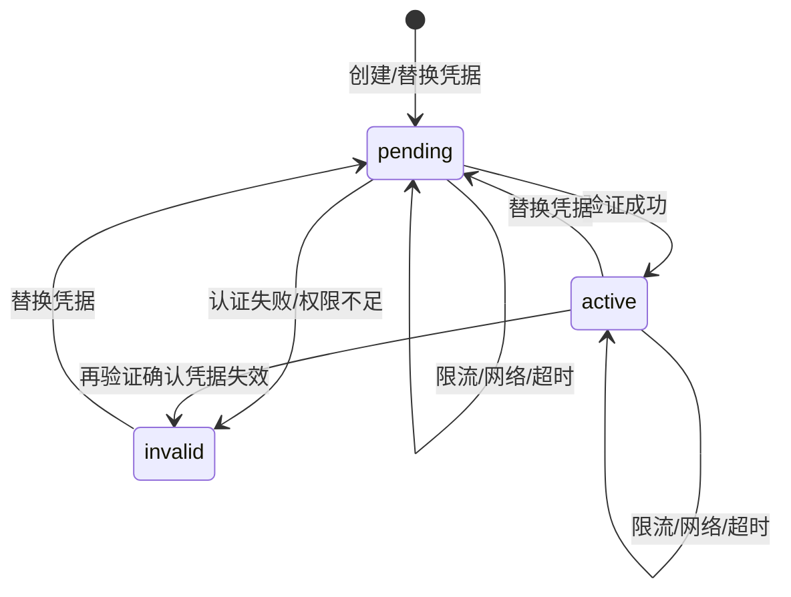

# Ozon 跨境电商运营插件开发计划

> 文档职责与版本关系见 [项目文档索引](./README.md)。当前技术基线为 PostgreSQL + Redis；下文阶段 1～2 是已经完成的本地兼容层历史，不再作为云端实施依据。

知识型混合 RAG 的需求与架构已经定档，核心本地闭环已开发；专项基线见 [RAG 需求](./RAG_REQUIREMENTS.md)、[RAG 技术架构](./RAG_ARCHITECTURE.md) 和 [RAG 详细实施计划](./RAG_IMPLEMENTATION_PLAN.md)。当前剩余工作是开发云 Chroma/Worker 实际部署、备份恢复演练和真实供应商连通性验收。

## 1. 技术基线

- 扩展：React、TypeScript、Vite、Chrome Manifest V3。
- 后端：Python 3.12、FastAPI、Pydantic、Uvicorn。
- 数据：PostgreSQL + Redis，支持 Docker Compose 本地运行。
- 凭据：`CredentialProtector` 端口 + 应用级信封加密；主密钥通过 Secret 注入，测试使用 Fake。
- 测试：pytest、隔离 PostgreSQL/Redis 实例、httpx Mock、Stub 与浏览器主流程。
- 版本管理：Git，主分支 `main`。

## 2. 阶段状态

| 阶段 | 范围 | 状态 |
|---|---|---|
| 阶段 0 | 需求、架构、数据库、API 与开发规范 | 已完成并持续维护 |
| 阶段 1 | FastAPI、商品垂直切片、侧边栏、本地调试 | 已完成（历史持久化实现待退出） |
| 阶段 2 | 卖家账户、版本化 Fernet 加密、验证、工作区切换与隔离 | 已完成 |
| 阶段 3 | 库存、订单、履约、手动同步与只读审计 | 开发中（Scheduler/Worker 进程、Consumer Group、租约执行和 Stub 处理器已完成） |
| 阶段 4 | 逐项评审的受控写入 | 未开始 |

## 3. 阶段 2 实施包

### 3.1 数据与安全

- `seller_accounts` 保存组织内唯一 Client ID、Fernet 密文、主密钥/格式版本、状态和验证时间。
- `store_workspaces` 与卖家账户一对一，并作为商品及后续业务数据的所有权边界。
- 凭据保护通过 `CredentialProtector` 端口隔离；运行时使用 Compose Secret 注入的 Fernet 主密钥，测试使用临时 Fernet 密钥或内存 Fake。
- 操作审计允许 `operator_id` 为空，详情只保存脱敏状态和错误类别。

### 3.2 后端接口

- `GET /v1/store-workspaces`
- `POST /v1/store-workspaces`
- `PUT /v1/store-workspaces/{id}/credentials`
- `POST /v1/store-workspaces/{id}/verify`
- `GET /v1/store-workspaces/{id}/product-offers`

### 3.3 状态机

### 3.4 扩展交互

- 顶部选择器列出所有工作区及其状态。
- 账户连接页支持创建、验证、重试和替换凭据。
- 只有工作区 ID 进入 `chrome.storage.local`；Api-Key 不进入浏览器持久化。
- 切换工作区会中止旧请求并刷新新工作区商品。
- 未验证、无效和停用状态不发起商品读取。

## 4. 阶段 2 质量清单

- [x] 创建、列表、替换、验证和未知工作区 API 测试。
- [x] Client ID 唯一、状态迁移、重启持久化和工作区隔离测试。
- [x] Ozon 成功、认证、权限、限流、服务端错误和畸形响应 Mock。
- [x] 凭据密文、用户范围、损坏密文和响应不泄漏测试。
- [x] React 工作区选择、账户表单、加载、失败和重试状态。
- [x] TypeScript 类型检查与 Vite 构建。
- [x] 使用 Stub 模式完成浏览器主流程验收。
- [x] 完整执行 `scripts/check.ps1` 并记录最终结果。

## 5. 阶段 2 退出条件

- 至少两个 Stub 工作区可创建、验证、切换并读取隔离商品。
- 后端重启后数据恢复，扩展重开后选择恢复。
- Api-Key 不出现在客户端响应、审计、日志或构建产物。
- 所有质量门禁通过。

## 6. 下一阶段启动规则

阶段 3 开发前必须先形成新的需求计划，明确库存、订单、履约和同步的目标、接口、数据变化、验收标准与非目标。任何实质需求变更经用户确认后，都要询问是否同步到 Obsidian 的 `项目设计/ozonslj`。

## 7. V5 云端实施路线

| 阶段 | 目标 | 状态 | 退出条件摘要 |
|---|---|---|---|
| V5.1 | 单组织运营基线、云端 PostgreSQL/Redis、Seller 商品/库存/订单/履约同步、任务恢复、数据质量 | 开发中 | 内部 RLS 隔离；Redis 清空可恢复；真实适配器通过脱敏验收 |
| V5.2 | 搜索词导入、竞品种子、受控 HTTP 公开采样、Explore/Validate/Expand、利润与决策书 | 已开发（Stub/闭环） | 脱敏报告和人工种子可生成可复现决策书，样本范围和估算标识完整 |
| V5.3 | 关键词库、Listing 草稿与风险检测、Performance OAuth、只读广告分析 | 已开发（Stub/只读） | 草稿不改变 Ozon；广告指标可追溯；Seller/Performance 凭据完全隔离 |
| V5.4 | 审核队列、价格小批量写入、幂等执行、回读、部分失败和审计 | 已开发（Stub/审核闭环） | 未批准、过期、超量、超幅和低利润线命令全部拒绝；不确定结果进入人工处理 |
| V5.5 | 只读 Agent、定时报告、告警、汇总和后续外部通知 | 已开发（Stub/只读闭环） | Agent 越权与提示注入测试通过；报告可追溯到事实、工作流和模型版本 |
| V5.6 | 知识型混合 RAG：接入、切片、Chroma/关键词检索、意图路由、精排、引用、拒答、评测和模型降级 | 已开发（本地闭环；云端验收待完成） | API/页面/测试闭环通过；开发云完成 Chroma/Worker 健康、备份恢复和真实供应商验收 |

实施必须按阶段退出条件推进，不能因为 schema、端口或界面已存在就把阶段标记完成。V5.4 才启用 128MB、单并发的 `execution-worker`；此前不启动该进程，也不挂载写用途 Secret。

## 8. V5.1 PostgreSQL-only 迁移实施包

所有环境只使用 PostgreSQL。历史实现的识别和删除边界以 [ADR-0001](./decisions/0001-postgresql-only.md) 为准，并按以下顺序收敛：

### 8.1 Expand：补齐 PostgreSQL 结构

- 将 `database/postgresql_schema.sql` 和迁移目录确定为唯一 schema 来源，停止继续扩展旧 schema。
- 新增会话、邮箱令牌、任务租约/心跳/重试、事务出站和必要审计结构。
- [x] 通过 `0003_business_facts_rls.sql` 为商品、库存、订单、履约、任务和审计补齐直接 `organization_id`、可验证的同组织复合外键，并启用/强制 RLS。
- 为任务恢复增加 `status`、`next_attempt_at`、`lease_expires_at` 等真实查询索引。
- 空库执行、重复迁移和从现有 schema 升级都必须有自动化验证。

退出条件：schema 可在隔离 PostgreSQL 完整创建；所有跨租户关系由约束保护；没有业务表依赖应用约定才能判断组织所有权。

### 8.2 Implement：PostgreSQL 运行时

- [x] 实现用户、组织、工作区、Seller 凭据、商品报价、审计和多组织身份 PostgreSQL 适配器；完成 scrypt 登录、哈希会话、Cookie/Bearer 认证、Redis 登录限流和 RLS 上下文装配。
- 每个应用用例在明确事务内设置 `SET LOCAL app.organization_id` 与 `app.user_id`。
- [x] API 数据库依赖只接受认证层写入的服务端 `TenantContext`；缺少上下文返回 `401`，不信任客户端租户请求头。
- [x] `/health/ready` 实际检查 PostgreSQL 连接池与 Redis，不再固定返回成功；`/health/live` 保持无外部依赖。
- [x] 首个组织所有者仅允许通过离线引导工具创建；工具强制验证 `BYPASSRLS`/超级用户角色，普通 API 连接和公网路由不能调用。
- [x] 组织角色与 V5 对齐；卖家账户和凭据写操作仅允许所有者/管理员，其他角色继续受显式工作区授权与 RLS 限制。
- Worker 使用服务主体恢复组织/工作区上下文，不使用 `BYPASSRLS` 规避策略。
- [x] 凭据改为版本化 Fernet 应用级加密；本地和云端都通过 Secret 文件注入主密钥。
- Stub 只替代 Ozon 上游，不替代 PostgreSQL 数据库。

退出条件：已实现接口在 PostgreSQL 上通过单元、集成、RLS、并发和重启持久化测试；运行时不再创建本地业务数据库文件。

### 8.3 Migrate：历史数据一次性导入

- 切换窗口开始前停止历史数据源写入并生成只读备份。
- 使用一次性迁移工具读取旧工作区、商品和审计，映射到明确组织及用户；无法解密的 DPAPI 凭据不迁移，账户转为待重新授权。
- 按实体统计源数量、导入数量、跳过数量和错误；核对工作区、商品、金额、状态和审计时间线。
- 迁移工具必须幂等或记录批次，失败时可清理该批次后重跑，不允许形成长期双写。

退出条件：数量与抽样内容核对通过；跨组织、孤儿、重复、金额和时间异常为零或已隔离；运营人员完成凭据重新授权。

### 8.4 Switch：切换与观察

- 部署 PostgreSQL 运行时，先在隔离环境执行影子读/对账，再切换应用流量。
- 观察错误率、连接池、慢查询、锁等待、RLS 拒绝、磁盘和备份。
- 停止条件：任何跨租户结果、关键数量不一致、持续锁等待、连接池耗尽、恢复验证失败或明显性能退化。
- 回滚只回滚应用版本并保持 PostgreSQL 数据，不恢复历史数据源写入；需要数据修复时使用明确迁移补丁。

退出条件：稳定观察窗口通过，备份可恢复至隔离库，核心接口和工作区隔离验收通过。

### 8.5 Contract：删除历史实现

- [x] 删除旧数据库路径配置、旧 schema、旧持久化适配器、临时测试夹具和运行依赖。
- 删除仅服务机器绑定密文或旧持久化实现的云端不适用代码；保留通用 `CredentialProtector` 端口。
- 更新 AGENTS、README、启动脚本、检查脚本和 CI，阻止重新引入第二套业务数据库。
- 历史备份按确认的保留策略归档或销毁，不进入仓库。

退出条件：运行时和测试不再引用旧适配器、旧数据库路径或旧驱动；全量检查和云端冒烟通过。
# 范围修正：暂停组织产品化

- 当前按单组织运营系统继续开发；登录组织由服务端配置绑定。
- 组织注册、切换、邀请、成员目录、组织设置和复杂工作区授权管理不进入当前开发队列。
- 已有 PostgreSQL 组织字段、约束和 RLS 作为内部隔离基础保留，不继续扩展组织管理适配器和 UI。
- 后续优先投入 Seller 数据同步、运营工作区、选品、Listing、广告诊断和只读 Agent。
- 本范围由 [ADR-0002](./decisions/0002-pause-saas-productization.md) 固化；除非重新确认，不得新增 SaaS 产品化任务。
## 2026-08-09 开发状态同步

- 最近完成：DAT-013 金额/币种边界校验、DAT-009～DAT-012 快照历史查询、SYN-009 分页同步逐页落库与最终水位推进。
- 下一步仍按真实 Seller 只读适配优先：先核对官方契约并验证商品/库存/订单/履约读取，再进行云端 Worker/Scheduler 恢复验证。
- 在外部授权到位前，Stub、PostgreSQL、本地 API、前端页面和自动化测试继续推进；不开发具体 ERP，不调用真实写入接口。
