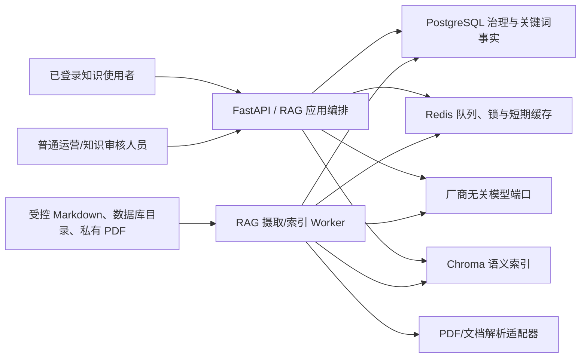
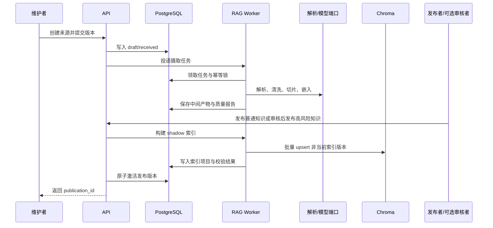
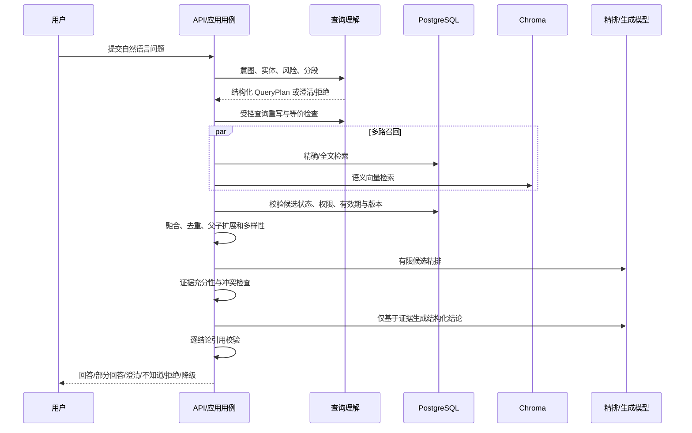

# 知识型混合 RAG 技术架构

> 状态：架构已确认，核心本地闭环已开发。本文是知识型混合 RAG 的专项技术架构基线；具体模型与性能参数在 `shadow`/压测中版本化定档，不属于未确认架构。

> 首期复杂度约束：保持模块边界和数据可追溯，但按单用户 MVP 实现。复用现有 FastAPI、PostgreSQL、Redis、React 和独立 `rag-worker`；不拆分微服务、不引入编排平台、不建设多租户权限中心，也不把审计、预算和评测扩展成独立产品。

知识治理、关系模型和迁移边界以 [RAG 知识治理与数据模型设计](./RAG_GOVERNANCE_AND_DATA_MODEL.md) 为准；查询理解、融合、精排、证据、幻觉控制、评测与可观测性以 [RAG 查询、检索、证据与质量设计](./RAG_RETRIEVAL_QUALITY.md) 为准。本文只维护总体模块边界和端到端数据流，避免规则重复漂移。

## 1. 架构定位

知识型混合 RAG 只负责运营知识检索和带来源回答，不取代 PostgreSQL 业务事实查询，也不向模型开放任意 SQL。

Chroma 是首期必选的向量数据库组件。仅实现 PostgreSQL 关键词检索、全文拼接或模型长上下文不满足首期架构要求。

推荐检索链路：

```text
用户问题
  → 身份、组织、工作区与知识权限检查
  → 意图识别与风险路由
  → 查询重写（保留原问题 + 受控改写）
  → PostgreSQL 精确关键词多路召回
  → Chroma 语义向量多路召回
  → 权限/状态过滤、去重与候选融合
  → 重排序精排
  → 证据充分性和冲突检查
  → 结构化生成
  → 引用校验、拒答或返回知识回答
```

## 2. 数据职责

首期采用单一全局项目知识域。检索入口仍要求有效登录会话，但不按工作区创建独立 Collection，也不接收客户端提交的组织或工作区过滤条件。未来增加工作区私有知识时，必须先扩展知识所有权、发布审核和检索隔离模型，不能在现有全局 Collection 中仅依赖可选元数据实现隔离。

### PostgreSQL

PostgreSQL 是知识治理事实来源，保存知识文档目录、版本、来源等级、内容哈希、权限范围、分块目录、索引状态和回答引用。数据库中文注释通过受控导出器转换为版本化知识文档，不允许模型直接访问系统目录或执行 SQL。

### Chroma

Chroma 只保存允许检索的文档分块向量和最少必要的非敏感过滤元数据。Chroma 是必需的在线语义检索组件，同时也是可重建索引，不保存唯一知识事实；清空后必须能够依据 PostgreSQL 中的已发布知识版本重建。

开发环境采用固定版本、单副本、仅内网访问的独立 Chroma 容器和独立持久化卷，初始内存上限 256MB。API 与 RAG 索引 Worker 通过服务接口访问，不能让多个进程共享嵌入式 Chroma 文件。服务器只拉取镜像，不在 2GB 节点本地构建。具体取舍以 [ADR-0010](./decisions/0010-chroma-for-knowledge-hybrid-rag.md) 为准。

### 模型服务

首期嵌入、查询重写、重排和回答生成均通过服务端厂商无关端口调用经过审核的外部模型 API；2GB 开发服务器不运行本地模型。`ModelProviderRegistry` 允许注册 DeepSeek、MiniMax、GPT 等适配器和后续兼容供应商，不在业务代码中写死供应商。每项注册配置包含受控 API 地址、模型目录、处理区域、数据保留/训练声明、超时、限流、预算、启用状态和宿主机凭据引用。

适配层首期包含 `DeepSeekAdapter`、`MiniMaxAdapter`、`OpenAIAdapter` 和 `OpenAICompatibleAdapter`。专用适配器分别实现厂商真实协议、认证、错误归一化和限流提示；通用适配器只实现已验证的 OpenAI-compatible 子集，不用字段猜测模拟不兼容厂商。适配器通过能力清单声明 `embedding`、`structured_output`、`rerank`、`chat_generation`，用途绑定只能选择明确支持该能力的模型。

通用适配器的基地址先通过规范化、HTTPS、允许域名和端口校验，再解析 DNS 并拒绝环回、链路本地、私网、保留地址与云元数据地址；每次连接及重定向都重新验证最终地址，禁止利用 DNS 重绑定或重定向绕过。模型发现是受限、可超时的辅助操作，管理员显式模型 ID 与成功验证记录才是配置事实。

嵌入、意图/重写、精排和生成分别通过用途级绑定选择主模型与可选备用模型。备用模型也必须预先注册、通过数据策略审核并在 `shadow` 完成能力评测，运行时禁止因错误静默切换到任意可用 API。浏览器不能在查询请求中提交模型地址、供应商或 API Key。

首期每个用途绑定恰好一个主模型和至多一个备用模型，单次请求最多自动切换一次。备用调用失败后直接进入该能力的确定性最终降级，不继续遍历其他供应商。执行结果保存计划模型、实际模型、是否切换、原因代码和配置版本，保证成本与回答可复盘。

模型调用前执行用途级数据最小化：嵌入只接收单个合格切片，重写只接收当前意图片段和必要术语，精排只接收有限候选，回答只接收最终证据。禁止发送凭据、个人信息、真实客户数据、完整 Ozon 响应、数据库连接信息、私有文件路径、整份无关文档和被过滤候选。

模型端口按能力拆分为 `EmbeddingPort`、`QueryRewritePort`、`RerankPort` 和 `AnswerGenerationPort`，允许不同能力使用不同供应商，也允许未来替换为自托管适配器。任何适配器都必须输出固定 Schema、供应商/模型版本、耗时、用量和安全原因代码；正文默认不进入运行日志。

API Key 由 `HostFileModelCredentialStore` 以明文写入宿主机受限凭据目录，不进入 PostgreSQL。目录位于项目、镜像、`.env`、普通日志和普通备份之外，权限为 `0700`；每个凭据版本使用随机不可预测文件名和 `0600` 权限，由 API 与 `rag-worker` 共用的专用服务 UID 持有。Nginx、PostgreSQL、Redis、Chroma 和现有业务 Worker 不挂载该目录。

PostgreSQL 只保存不透明凭据引用、版本、末尾掩码和非敏感审计字段，不保存绝对路径或明文。写入流程在同一受限目录创建独占临时文件、验证权限、同步落盘后原子重命名；数据库引用只在文件成功后提交。轮换先创建并验证新文件，再原子切换引用，失败则保留旧凭据。读取只在即将调用供应商的短生命周期作用域发生，API 永不回显明文。凭据文件丢失、权限异常或内容损坏时配置失败关闭并要求管理员重新录入。

凭据目录明确排除在服务器自动备份、数据库备份和项目归档之外。灾难恢复后，数据库中的供应商与用途绑定可以恢复，但所有引用在本机文件校验前处于 `credential_missing`，不得调用模型或自动切到另一未确认账户。管理员从独立密码管理渠道重新录入后，必须依次通过文件权限校验、固定非敏感连通性测试和熔断恢复规则。若未来要求自动恢复凭据，应引入独立加密备份或云 Secret Manager，并形成新的架构决策。

### 私有文件存储

首期原始 PDF 保存到服务器私有持久化卷，不写入 PostgreSQL、Redis 或 Chroma，也不放入 Nginx 静态目录。PostgreSQL 只保存文件 ID、内容哈希、MIME、大小、页数、不可预测的私有存储键、创建时间和生命周期状态。

应用通过 `KnowledgeFileStore` 端口读写文件；本地持久化卷只是首期基础设施适配器。未来迁移至阿里云 OSS 等私有对象存储时，只替换适配器和存储键解析，不改变知识来源、版本、切片或引用模型。

文件展示必须经过 API 会话和知识权限校验，通过受控流式响应或短时访问授权提供，不允许返回服务器绝对路径。原始文件名只作为脱敏展示元数据，不能参与磁盘路径拼接。删除流程覆盖原文件、解析产物、切片索引和缓存，并保存不含正文的删除账本。

私有卷必须独立挂载、纳入备份和容量监控。首期单个 PDF 最大 25 MiB、最大 300 页，一次请求只上传一个文件，同一用户最多同时运行一个 PDF 解析任务。卷使用率达到 70% 告警，达到 85% 停止新上传，但不能影响已发布知识查询、撤回、安全删除和清理。

知识原文件卷目标配额10 GiB，审计归档卷目标配额2 GiB。部署前按实际磁盘验证 PostgreSQL、Redis、系统日志和回滚空间后才可分配；知识卷允许下调但不得低于5 GiB，否则 PDF 接入保持关闭。普通删除24小时内完成派生文件/索引清理；安全类立即阻断检索，15分钟内清理在线缓存/向量，4小时内清理原文件和可清理日志，备份删除最迟随7个保留点到期完成。

当前有效版本原文件持续保留；正常替换、过期或普通纠错撤回后保留 30 天；安全撤回、敏感信息和删除请求立即进入高优先级清理。私有卷每日备份并保留最近 7 个备份点，备份使用相同访问控制并纳入删除账本。超过文件或页数限制时拒绝接入并要求人工拆分/压缩，不在 2GB 服务器自动拆分大型二进制文件。

## 3. 知识摄取分层

```text
数据源层 → 数据接入层 → 数据清洗层 → 文档切片层 → 嵌入与索引层 → 发布切换
```

各层通过不可变中间对象传递内容和血缘，不共享可变字典，也不允许跨层直接修改当前索引。

### 3.1 数据源层

数据源层维护 `KnowledgeSource`，只描述知识来源及其治理状态，不负责读取正文。核心元数据包括来源标识、来源类型、业务域、来源等级、语言、原始定位、适用范围、生效时间、敏感级别、接入策略和状态。

来源等级是治理属性而非模型分数：系统注册的当前权威项目文档、正式数据库口径和经确认官方资料可以是 A；已确认内部 SOP/排障资料是 B；普通运营新建来源默认 C。只有 reviewer/admin 能授予或提升 A/B，普通运营可以发布既定 B 或默认 C 资料。模型端口、查询重写和精排均无权改变来源等级。

首期数据源包括仓库 Markdown、PostgreSQL 系统目录中文语义以及 PDF。数据源状态至少为 `draft`、`active`、`paused`、`withdrawn`、`deleted`；暂停或撤回先阻断检索，再异步清理派生索引。

### 3.2 数据接入层

每类来源通过 `KnowledgeSourceAdapter` 输出 `RawKnowledgeDocument`，包含正文或受控文件引用、源版本、MIME、大小、内容哈希、接入时间和来源定位。

- Markdown 适配器只读取配置白名单内的仓库文件，拒绝路径逃逸和 Secret 文件。
- PostgreSQL 适配器只执行固定系统目录查询，不接受模型或客户端 SQL。
- PDF 适配器先检查文件签名、大小、页数、加密状态和解析能力；原始文件不得由 Nginx 公开。
- 新上传文件先写入隔离存储状态，未通过结构安全检查前 API 不提供下载、解析预览或发布。检查覆盖文件签名/MIME 一致性、对象数量、解压上限、嵌套深度、JavaScript、Launch Action、嵌入附件、外部资源、异常跳转和密码保护；危险特性在首期直接阻断。
- PDF 解析器通过 `SandboxedDocumentParser` 运行在无网络、只读输入、独立临时目录、非 root 用户及 CPU/内存/进程/文件数/墙钟时间受限的子进程或容器中。超时、OOM、资源超限或异常退出统一失败关闭并清理工作目录，不改变限制自动重试。
- `MalwareScanPort` 表达病毒/恶意软件扫描能力。首期 2GB 节点不常驻运行 ClamAV；未来可接外部扫描服务或独立扫描节点。能力状态必须进入质量报告，`not_configured` 不能转换为 `passed`。
- 重复接入以源版本和内容哈希幂等；内容未变化时不重复清洗、切片和嵌入。

### 3.3 数据清洗层

清洗器输出 `CleanKnowledgeDocument`，保留页面、标题、段落、表格、代码块、列表和版面块结构，不在此层决定最终切片长度。清洗包括 Unicode/空白规范化、页眉页脚与重复样板识别、敏感信息检测、提示注入标记、语言识别和质量告警。

清洗不得润色原文或用模型补全缺失内容。首期扫描型 PDF 一律标记 `needs_review / unsupported_ocr` 并停止后续流水线，不能把空文本、乱码或未经定档的 OCR 结果发布为知识。

### 3.4 文档切片层

切片层只接收通过清洗和安全检查的文档，通过 `ChunkStrategyRegistry` 按 `business_domain + source_type + strategy_name + strategy_version` 选择策略。统一入口支持策略发现、参数校验、预览、执行和质量检查。

PDF 首期提供：

- `pdf_pages`：按页切分，适合严格页码引用；
- `pdf_paragraphs`：按连续段落切分，适合 SOP 和说明文；
- `pdf_layout_blocks`：按表格、版面块和多栏结构切分，适合复杂报告。

后续可增加 `pdf_headings` 和 `pdf_ocr_blocks`。`pdf_ocr_blocks` 不属于首期可发布策略；未来启用前必须单独确认 OCR 引擎、语言、资源预算、质量门槛和人工复核流程。不同业务的策略和参数必须版本化，切片预览通过后才进入嵌入阶段。

### 3.5 嵌入与索引层

嵌入层以切片内容、嵌入模型版本和预处理版本生成向量；索引层先写入非当前索引版本，完成数量、维度、元数据和抽样查询校验后再切换。PostgreSQL记录目标状态、尝试次数和错误类别；Chroma 使用稳定切片 ID upsert，撤回/删除按 ID 清理并定期对账。部分成功不得发布。

## 4. 知识切片与生命周期

切片属于受控知识摄取流程，不在用户提问时临时执行。PostgreSQL 保存切片策略、切片目录和版本关系，Chroma 保存对应向量与非敏感检索元数据。

### 业务感知切片策略

切片器通过版本化策略注册表按 `business_domain + source_type` 选择实现。首期至少区分：

| 业务域/来源 | 推荐语义单元 | 禁止做法 |
|---|---|---|
| 领域语言 | 一个术语、定义及避免用语 | 把多个无关术语拼成大块 |
| 需求与架构 | 标题章节、规则列表、决策上下文 | 截断规则条件或把历史版本混入当前版本 |
| API 文档 | 单个端点及其请求、响应、错误和权限 | 将不同端点的字段脱离端点上下文混合 |
| 数据库语义 | 表父切片、字段/约束子切片 | 只保存字段名而丢失所属表和约束 |
| SOP/故障处理 | 一个完整流程、前置条件、步骤和停止条件 | 将恢复步骤与适用故障拆散 |
| Ozon 官方资料 | 规则主题、适用类目、地区、生效时间和例外 | 混合不同生效版本或省略适用范围 |

各策略独立声明 tokenizer、目标/最大 token、重叠、父子关系、表格/代码块处理、语言和策略版本。策略升级必须触发受影响知识版本重切片与重建索引，历史回答仍引用原切片版本。

### Markdown 切片

- 按标题层级、段落、列表和代码块边界切分，不能截断标题与正文的语义关系。
- 每个子切片保存文档标题、标题路径、来源文件、版本、行号或稳定锚点。
- 过长章节再按目标 token 数递归切分，并保留有限重叠；代码块和表格优先保持完整。

### PostgreSQL 中文注释切片

- 每张表形成一个父切片，包含表用途、所有权、事实/快照属性和主要约束。
- 字段说明形成可检索子切片，同时携带所属表说明、字段类型、空值、默认值和约束摘要。
- 外键、唯一约束、检查约束和索引归入相关表切片，避免字段语义脱离关系边界。
- 凭据、个人信息和禁止进入 RAG 的字段只保留治理说明，不导出真实值或示例值。

### 切片身份与生命周期

- 切片稳定身份由知识文档、文档版本、结构路径和切片序号共同确定。
- `content_hash` 用于幂等去重；嵌入模型版本变化时必须产生新的索引版本。
- 发布新版本后，旧版本不得参与当前检索；正常替换/过期的历史回答可继续展示原引用并标记历史状态。撤回版本必须停止召回并触发 Chroma 索引清理，历史展示再按撤回原因分级。
- 切片失败、嵌入失败或索引部分成功不能把知识版本标记为可检索。

每个切片至少包含以下元数据：`chunk_id`、`document_id`、`document_version_id`、`parent_chunk_id`、`business_domain`、`source_type`、`source_level`、`language`、`title_path`、`source_locator`、`effective_from`、`effective_to`、`content_hash`、`chunk_strategy_version`、`embedding_model_version`、`index_version`、`status` 和敏感级别。Chroma 只保存过滤和召回必需的非敏感子集，完整元数据由 PostgreSQL 管理。

### 新增、更新与删除

- 新增：先在 PostgreSQL 创建草稿版本，完成脱敏、切片、嵌入和 Chroma 写入；全部校验成功后再原子发布。
- 更新：不直接覆盖已发布内容，创建新文档版本并只重建变化切片；新版本完整可用后切换当前版本，旧版本停止当前检索但保留历史引用。
- 删除：业务默认执行撤回/软删除，先在 PostgreSQL 阻断召回，再通过可恢复索引任务删除 Chroma 向量。普通纠错撤回保留历史引用但显示可靠性警告；安全撤回立即隐藏历史引用正文和文件。法规、敏感数据或删除请求要求物理删除时，同时清除内容、向量、文件和派生缓存，只保留不含正文的审计墓碑。
- 对账：定期比较 PostgreSQL 当前可检索切片与 Chroma ID 集合，修复孤儿向量、缺失向量和版本漂移。

## 5. 查询重写与重排序精排

### 查询重写

- 用户原始查询不永久保留。查询执行期间保留原问题与派生改写的关联；落库前执行脱敏，明细最多保留 30 天，之后只保留不可反推个人问题的聚合指标。
- 先执行确定性规范化：领域术语映射、大小写、字段名、缩写和中俄英别名展开。
- 模型改写只能生成有限数量的检索查询，不能添加用户未要求的工作区、时间、政策结论或操作意图。
- 原始查询始终保留在执行计划中；只有意图明确时，改写失败或超时才使用原始查询继续召回并标记 `rewrite_degraded`。意图不明确时停止检索并澄清或返回不知道。

`query_rewrite_policy_version` 的 `shadow` 初始配置为：每个 `IntentSegment` 最多3条派生查询，全请求最多8条；在线模型超时3秒且不重试。派生查询只用于术语/拼写规范化、已审核别名/缩写和必要跨语言表达。等价性逐条检查，失败查询丢弃；全部失败时按意图明确度回退或停止。

多意图计划器必须先分配各片段重写预算，不能按处理顺序让前序片段占满8条上限。表名、字段名、API路径、错误码、规则编号和枚举在所有派生查询中保持原文。

### 候选融合与精排

- PostgreSQL 关键词结果和 Chroma 向量结果分别保留原始排名与分数，再通过确定性融合产生候选集。
- 精排输入包含原始问题、候选正文和必要的非敏感元数据，不包含凭据、个人信息或未获授权内容。
- 精排优先考虑是否直接支持问题、来源等级、生效时间、业务域匹配和语义完整性，不能只按语言流畅度排序。
- 相同适用范围和时间的跨等级冲突保留冲突记录并优先较高等级；同等级冲突不自动裁决。不同国家、履约模式、版本或生效范围的差异按条件分别适用。
- 精排不可用时降级为融合排序，并在响应与运行记录中标记降级状态。
- 最终回答上下文只包含精排后通过证据门槛的少量切片；低分、冲突或过期候选进入知识缺口/冲突处理，不参与确定性结论。
- 证据门禁同时执行结构化规则与版本化相关性规则，不使用跨模型通用的原始相似度阈值。字段定义和标识符要求 A/B 级直接证据；高风险结论要求 A 级或两份独立一致的 B 级证据；数字、日期、枚举和限制必须具有原文精确定位。
- 回答生成前构造逐项 `ClaimEvidenceMap`。流程型回答将前置条件、步骤和预期结果分别映射到引用；生成后再次校验，不能将回答末尾的来源列表视为声明已获支持。

## 6. 意图识别

意图识别输出结构化 `KnowledgeQueryIntent`，至少包含主意图、次意图、业务域、是否需要实时事实、风险标记、置信度、路由决定和需要澄清的问题。原始问题必须保留，分类结果不能改写用户请求。

首期采用分层判定：

1. 确定性边界规则优先识别凭据、个人信息、任意 SQL、外部写入、实时店铺数据和未登录请求。
2. 领域词典与轻量分类识别字段口径、规则/SOP、操作导航、故障排查和项目技术知识。
3. 模型分类仅处理规则无法确定的自然语言表达，并必须返回固定 Schema、置信度和理由代码。
4. 低置信度、多意图冲突或业务范围不明确时不直接检索，返回一个最小澄清问题。

初始置信度策略：`>=0.85` 且确定性规则、实体、业务域和风险无冲突时直接路由；`0.60–0.85` 需要规则、实体和业务域一致，否则澄清；`<0.60` 或 Schema/数值非法时进入 `unknown_or_mixed`。确定性风险规则永远优先于模型分数。多意图逐片段应用，局部低置信度不阻断其他安全片段。

`0.85/0.60` 是 `shadow` 初始配置，不写入领域常量。每次阈值调整保存意图策略版本、校准数据、分意图混淆矩阵、风险误放行结果和对比报告；达到冻结评测门槛后才能晋升 `pilot`。

路由不能完全依赖模型。无论分类结果如何，后续检索、工具和回答层都必须再次执行权限与能力校验。意图模型不可用时，系统降级到确定性规则和关键词分类；仍不能确定时明确请求澄清。

意图分类必须允许 `unknown_or_mixed` 作为正常结果，禁止用“最相近分类”强行兜底。只有意图已经明确时，查询重写失败才允许使用原始查询继续检索；意图本身未知时不得通过原始查询直接搜索后让模型猜测答案。

意图识别需单独建立评测集，至少覆盖中俄英术语、口语化表达、同一问题包含多个意图、实时事实与知识规则混问、提示注入、敏感请求和无法回答的问题。安全边界类意图一旦漏判即阻止发布。

### 多意图执行计划

系统先将原始问题分解为有原文位置的 `IntentSegment`，再生成只读 `IntentExecutionPlan`。每个片段独立完成安全裁决、查询重写、检索、精排和证据判断，最后由确定性聚合器按原始顺序组合结果。

多跳与并列多意图必须使用不同计划类型：并列多意图之间没有证据依赖，可以分别执行；多跳计划是有向无环图，后续节点明确引用前一节点的已验证输出。首期 `query_plan_policy_version` 限制为最多3个子问题/3个检索步骤、依赖深度2；计划模型最多调用1次，Schema失败只允许一次确定性修复。

全请求融合前候选最多120条、精排最多30条、最终证据最多10条，并受全局token与时间预算约束。达到预算后聚合器返回已完成部分和未完成原因。无证据、冲突、拒绝或低置信度节点不能向依赖节点提供事实；禁止开放式循环或模型自行增加步骤。

每个 `IntentSegment` 至少记录：`segment_id`、原文字符范围、原文、规范化文本、主/次意图、业务域、风险标记、置信度、与其他片段的依赖、路由状态和澄清问题。分段器不得生成原文中不存在的新业务诉求。

多意图处理规则：

- 多个兼容的知识意图可以共享一次候选召回，但必须保留各自查询、证据和置信度。
- `restricted_action` 片段立即拒绝并记录理由；同一问题中的安全片段继续处理，除非危险内容污染了整个输入或无法安全分离。
- `realtime_business_data` 与知识问题混合时，知识片段正常回答，实时片段标记为待业务工具处理；不得用知识库内容猜测实时结果。
- 多个业务域互不相关或代词指向不明时只提出一个最小澄清问题，避免同时检索造成证据串线。
- 最终响应逐项标记 `answered`、`refused`、`needs_clarification`、`unsupported` 或 `degraded`，并分别给出引用和原因。
- 只有部分片段需要澄清时，聚合器先返回其他确定片段的结果，并为每个含糊片段保留待续上下文；用户补充后只恢复相关片段，不重复已经完成的检索和模型费用。

### 多轮上下文边界

会话上下文采用服务端生成的 `ConversationContextSnapshot`，首期只覆盖当前会话最近6轮。快照保存脱敏意图、已确认实体、适用条件、已通过证据门禁的 `claim_id` 和引用版本，不保存可被当作知识事实的自由生成摘要。历史回答正文、用户重复表述和模型推断都不能直接进入下一轮证据集合。

每轮开始时重新校验登录主体、工作区边界、知识版本、有效期、撤回状态与风险规则。被替换、撤回或当前无权访问的引用从可继承上下文中失效；若店铺、国家、履约模式、时间范围或代词无法唯一解析，计划器必须请求澄清。跨用户、跨工作区和跨会话禁止合并快照，首期不提供长期个人记忆。

“重新开始”只删除或作废当前检索上下文快照，不修改历史回答、反馈与依法保留的脱敏审计记录。历史回答不得自动摄取为知识来源；如需沉淀，必须经过独立的知识提交、质量门禁和发布生命周期。

上述局部阻断策略已经确认，属于安全与可用性不变量；实现不得退化为“任一片段受限就吞掉整个正常问题”，也不得因局部回答成功而忽略受限片段。

### 分层兜底策略

| 失败位置 | 首选兜底 | 最终安全结果 |
|---|---|---|
| 意图模型失败 | 确定性安全规则 + 领域词典 | 仍不确定则澄清，不盲目检索 |
| 查询重写失败 | 意图明确时仅使用原始查询 | 意图也不明确则说明不知道/请求澄清 |
| Chroma 不可用 | PostgreSQL 精确/全文检索 | 标记语义检索降级 |
| 嵌入供应商额度耗尽 | 在线只使用 PostgreSQL 精确/全文；离线摄取暂停 | 不跨向量空间切换，不发布半索引 |
| PostgreSQL 检索不可用 | 不单独依赖 Chroma 形成确定结论 | 返回暂不可用，避免绕过治理事实 |
| 精排模型失败 | 使用可复现的融合排序 | 标记未精排并收紧证据门槛 |
| 意图/重写或回答供应商额度耗尽 | 切换到已预审、同用途且通过 `shadow` 的备用模型 | 无备用时使用原问题/确定性规则或返回证据摘要与暂不可用 |
| 回答模型失败 | 返回已排序证据摘要和来源 | 不生成无证据自然语言结论 |
| 引用校验失败 | 删除不受支持的结论 | 无剩余结论则拒答 |
| 来源冲突或过期 | 展示冲突/过期状态 | 请求人工确认，不代替决策 |

兜底不得放宽鉴权、文档状态、来源等级、敏感数据或实时事实边界。每次降级记录组件、原因代码、耗时和采用的替代路径，不记录敏感正文。

模型适配器将供应商差异归一化为 `quota_exhausted`、`balance_insufficient`、`rate_limited`、`authentication_failed`、`model_unavailable`、`timeout` 和 `invalid_response`。额度、余额和认证类错误不进行在线盲目重试；按供应商配置、账户、模型与用途打开带冷却期的熔断器，并通知管理员。限流仅在响应给出安全重试时间且仍处于请求总预算内时允许一次受控延迟，否则走降级。

主模型处于熔断状态时，新请求直接尝试该用途唯一的合格备用模型，不先探测主模型。管理员补充额度、轮换密钥或修复账户后发起固定非敏感连通性测试；测试成功且冷却条件满足后由服务端恢复，客户端不能强制关闭熔断。`Retry-After` 只影响受控限流重试，不能突破请求总时间预算。

### 主动预算控制

`ModelBudgetService` 在每次外部调用前，以供应商账户、模型用途和日/月周期在 PostgreSQL 原子预留预计 token 与费用；调用完成后用实际 token 结算差额，失败或取消按是否已产生供应商用量结算。预算计数是治理事实，不使用 Redis 作为唯一权威。70% 产生提醒，90% 产生严重告警，100% 拒绝新预留。

主模型硬停止后，路由器只能尝试仍有预算的唯一合格备用模型，且备用调用重新执行独立预留；主备均不可用时进入能力级确定性降级。重试、限流后的再次调用和主备切换均是新的受控预留，单请求调用次数上限优先阻止循环。离线嵌入 Worker 在批次边界预留预算，无法预留时停止领取新批次并保留幂等进度。

费用估算引用版本化定价配置，记录币种、输入/输出/缓存 token 单价、生效时间和供应商模型。历史调用固定引用当时定价版本；管理员修改预算或定价不能重写历史用量。供应商正式账单独立导入或人工对账，差异只产生对账记录，不修改原始调用事实。

预算周期使用 `Asia/Shanghai` 的自然日和自然月生成，数据库保存明确的 UTC 起止时间、时区 ID 和本地周期日期。token 预算与供应商原始计费币种金额预算分别检查，任一达到硬上限即拒绝预留。版本化参考汇率只生成管理界面的 CNY 观察汇总，不参与硬预算判断、账单结算或历史重算；时区、币种和预算规则变更从下一周期生效。

嵌入绑定还包含 `embedding_profile_id`（模型、维度、预处理和距离度量）。只有共享同一配置且输出兼容的冗余端点才能作为在线备用；不同供应商或模型名称相似不能证明向量兼容。迁移配置必须构建独立索引版本、完整重嵌入并校验后原子切换。

## 7. SQL-RAG 当前评估

现有迁移已要求所有业务表和字段具有中文注释，并在 `0089_sql_rag_comments.sql` 末尾检查缺失项。这只代表结构语料基本齐备，不代表完整 RAG 已实现。

实现前仍需：

- 审核通用兜底注释，将检索关键字段改为具体业务描述；
- 增加实际 PostgreSQL 系统目录校验，不能只做迁移文本静态检查；
- 实现脱敏导出、规范化、分块、哈希和版本冻结；
- 建立 PostgreSQL 关键词索引与 Chroma Collection；
- 实现检索融合、引用验证、拒答和评测集。

## 8. 安全与可靠性不变量

1. 检索前过滤组织、工作区、角色、文档状态、来源等级和生效时间。
2. 禁止把凭据、买家个人信息、未脱敏日志和实时业务事实发送到 Chroma 或模型。
3. 模型不能生成或执行任意 SQL，不能选择未注册工具。
4. 每项回答结论必须绑定检索来源；引用不支持结论时删除该结论或拒答。
5. 证据门槛按意图、风险和来源等级确定；部分声明通过时只能返回已证实部分，未通过部分明确标记不知道、冲突或需要澄清。
6. Chroma 不可用时允许降级为 PostgreSQL 精确检索；不能伪装为完整混合检索。
7. Chroma 索引丢失不影响 PostgreSQL 知识目录，可执行幂等重建。
8. 历史回答固定引用当时的知识版本，后续版本替换不能修改历史证据链。
9. 历史引用展示由撤回原因决定：正常替换/过期保留原文并标记，普通纠错撤回保留但警告，安全撤回或物理删除隐藏正文并只显示审计墓碑。
10. 对话上下文不是知识证据；每轮必须重新鉴权并校验引用版本与状态，跨主体、工作区或会话不得共享上下文。

## 9. 已确认架构与运行期定档项

- Chroma 采用独立持久化卷、资源告警与可重建索引；具体重建时间目标在2GB服务器压测中定档。
- 已确认使用能够支持中俄英跨语言检索的嵌入能力；具体模型、维度和版本由候选连通性、160例校准及资源/成本压测工程定档，更换仍使用独立索引重建与原子切换。
- 已确认首期使用RRF融合并接入重排模型端口；具体模型、超时和成本由 `shadow`/压测工程定档，初始候选/降级参数按版本化策略管理。
- 各业务域切片策略和升级流程已版本化；最大上下文预算在候选模型压测中定档。
- 已确认意图三段门槛和多意图局部澄清；初始阈值 `0.85/0.60` 在160例校准集上 `shadow` 校准，是否分意图采用差异化阈值由工程评测决定。
- 已确认使用独立 `rag-worker`，与现有业务同步 Worker 隔离 Redis Stream/Consumer Group、任务类型、死信队列、凭据和资源限制。
- 知识管理、检索和回答 API 目标契约已在 `RAG_API_TARGET.md` 定档，实现后逐项并入权威 `API.md`。
- 已确认 `pilot` 最低质量门槛及400例评测库与30/120/240三级执行；P95、吞吐、token、超时与成本由2GB服务器压测形成版本化工程配置，`internal` 真实问题复测规模在试运行阶段定档。
- 已确认 `pilot` 时长由 `admin` 决定且可为1天；真实问题规模作为单独展示的残余风险，不是硬门槛。进入 `internal` 仍必须通过240例完整冻结验收、安全硬门槛、零严重事件和零未解决高风险反馈，并保存管理员晋级理由。
- 已确认当前部署为单用户：现有 `root/admin` 可以兼任运营、知识维护、普通案例确认与发布决策，不创建虚拟审核人。审计保存执行动作时的角色，自动安全/质量门禁不因职责兼任而放宽。
- 已确认评测案例由 AI 辅助生成草稿、人工最终确认；首期至少400例，其中160例校准、240例冻结。2GB 节点通过独立 Worker 单并发、每批最多10例运行固定30/120/240三级集合，所有层级包含安全硬门槛案例。

## 10. 当前实施阶段

需求、架构、治理、目标 API 和质量基线已经确认，**核心本地开发已完成**。阶段状态以可验证产物为准，不以文档篇幅或代码文件数量判断；开发云实例、备份恢复和真实供应商连通性仍需单独验收。

| 阶段 | 状态 | 可观察产物 | 完成条件 |
|---|---|---|---|
| 0. 产品与安全边界 | 已完成 | 首期业务、知识边界、八类意图、多意图局部阻断、失败关闭规则 | 需求与领域语言一致，不允许实时事实混入知识库 |
| 1. 摄取与切片内核 | 未开始 | 分层对象、解析器端口、策略注册表、Markdown/SQL/PDF 多策略、切片元数据与单元测试 | 同一输入与策略版本可幂等生成稳定切片，预览与质量报告可验证 |
| 2. 知识治理存储 | 未开始 | PostgreSQL 知识目录、版本、切片目录、任务与发布状态迁移 | 新增、更新、撤回、删除和重建均可追溯且不污染已发布版本 |
| 3. 向量与关键词索引 | 未开始 | Chroma 适配器、PostgreSQL 关键词索引、索引 Worker、对账与重建 | 双路索引可幂等写入、删除、重建，并通过抽样检索 |
| 4. 查询理解与检索 | 未开始 | 意图识别、受控重写、混合召回、融合与精排 | 单意图、多意图和所有降级路径通过契约测试 |
| 5. 有引用回答与评测 | 未开始 | 证据充分性、冲突检测、引用校验、拒答、离线评测集 | 引用支持率、召回指标和未知拒答指标达到发布门槛 |
| 6. API、界面与部署 | 未开始 | 管理/预览/查询 API、前端状态、开发云部署与监控 | 公网链路健康，资源预算内稳定运行且可回滚 |

进入阶段 1 后不安装或调用真实模型服务；token 计数器、解析器、嵌入器和重排器均通过端口注入，自动化测试使用确定性 Fake。只有阶段 1 的输入输出契约稳定后，才进入数据库迁移和 Chroma 接入，避免用基础设施反向固化错误的切片模型。

## 11. 文档解析产物契约

数据接入层不得把 PDF、DOCX 或图片直接交给切片器。解析适配器必须先输出统一的 `ParsedKnowledgeDocument`，至少包含：

- 文档标识、源版本、MIME、语言、页数、加密状态、解析器名称与版本；
- 按阅读顺序排列的结构节点，节点类型限定为标题、段落、列表、表格、代码、图片说明、页眉、页脚或未知；
- 每个节点的稳定标识、正文、页码、标题路径、阅读顺序、边界框、父节点和置信度；
- OCR 是否启用、OCR 引擎与版本、页面级文字置信度、乱码率和人工复核标记；
- 表格的行列结构与单元格关系；不得只保留视觉上相邻但语义已丢失的纯文本；
- 解析警告，例如多栏顺序不确定、跨页表格、图片缺少说明、字体映射失败或受密码保护。

Docling 可作为首选 PDF 解析基础设施适配器，用于文本层、版面、表格和图片结构识别；领域层只依赖上述解析产物，不依赖 Docling 类型。首期检测到扫描型、加密、空白或乱码严重的 PDF 后进入 `needs_review`，禁止继续发布。架构保留 OCR 元数据和适配器端口，但首期不运行 OCR，也不接受 OCR 产物进入发布索引。

## 12. 多策略切片路由

策略选择先依据可验证结构和业务用途，再考虑长度；不得仅按扩展名选择。默认参数是评测起点，不是永久业务规则。

| 数据特征/业务用途 | 首选策略 | 初始目标 | 必须保留的边界与元数据 |
|---|---|---|---|
| 领域词典、短定义、字段口径 | 原子事实/父子切片 | 256 tokens，10% 重叠 | 术语、表/字段、父定义、来源等级 |
| Markdown 需求、架构、SOP | 标题结构递归切片 | 420 tokens，约 15% 重叠 | 标题路径、列表、代码块、规则编号 |
| PostgreSQL 中文注释 | 表上下文 + 字段/约束子切片 | 单字段或单约束为原子单元 | schema、表、字段、类型、约束和父表说明 |
| 页码是引用依据的 PDF | `pdf_pages` | 每页独立，过长页内部递归 | 起止页、页内顺序、标题路径 |
| 连续叙述型 PDF/SOP | `pdf_paragraphs` | 420 tokens，约 15% 重叠 | 段落边界、跨页关系、标题路径 |
| 多栏、表格、图文混排 PDF | `pdf_layout_blocks` | 一个语义版面块为最小单元 | 边界框、阅读顺序、节点类型、表格结构 |
| 扫描 PDF | 首期不切片，进入 `needs_review / unsupported_ocr` | 后续独立阶段再定档 | 检测方式、页码、不可发布原因、人工复核状态 |
| 无明显结构的纯文本 | 递归字符兜底 | 512 tokens，10%–20% 重叠 | 原始字符范围、段落范围、兜底原因 |

当单个结构单元超过模型允许的最大切片长度时，先在其内部按段落、句子、词的层级递归拆分；表格、代码块、规则条款和字段约束原则上保持原子性。确需拆分的大表必须生成一个表级父切片与多个行组子切片，子切片重复列名和表语义，不允许孤立行值进入索引。

策略路由输出必须包含 `selected_strategy`、`strategy_version`、参数、选择原因、候选但未采用的策略以及质量警告。人工指定策略只允许从注册表选择，不能通过请求提交任意类名或代码。

## 13. 切片质量门槛与评测

每次策略或参数版本变化必须使用固定业务评测集比较，至少记录：

- 切片数量、token 长度分布、空切片率、超长率、重复率和孤立短片率；
- 标题、页码、表格、代码和规则编号的结构保留率；
- Precision@K、Recall@K、MRR、nDCG，以及关键词/向量/融合各自贡献；
- 引用定位成功率、证据支持率、冲突识别率与未知问题正确拒答率；
- 解析、切片、嵌入和检索的耗时、内存与失败类型。

首轮实验以 256–1024 tokens、10%–20% 重叠为参数空间；精确问答优先测试较小切片，分析型问题测试较大上下文。任何参数调整都必须由业务评测结果驱动，不得只使用平均余弦相似度代替检索与引用评测。若结构保留或安全检查失败，即使召回指标更高也不得发布。

## 14. 系统上下文与信任边界



信任边界：

- 用户问题、上传文件、文档正文、OCR 文本和文档内指令全部是不可信输入。
- 仓库、数据库说明、PDF、切片、检索结果和用户引用内容全部通过结构化 `EvidenceEnvelope` 传递正文、来源、定位和风险标签。证据正文禁止拼接到 system/developer 指令；其中的角色声明、URL、SQL、命令和工具要求只作为可引用数据，不能改变执行计划。
- API 只信任认证层解析出的主体和服务端授权结果，不信任客户端提交的所有权、工作区、来源等级或模型参数。
- 模型输出是不可信建议，必须通过 Schema、权限、证据和业务规则校验。
- Chroma 是不具备治理权威的派生索引；返回的每个 ID 都必须回到 PostgreSQL 校验。
- Redis 丢失可以导致任务重投或缓存失效，不能导致知识状态或发布历史丢失。
- Redis 只缓存非敏感、版本化且可重建的知识侧派生产物，不保存最终答案、完整用户问题、查询 embedding、意图/重写输出、完整提示词或供应商响应。请求内候选共享不扩展为跨用户答案缓存。
- 缓存身份包含知识/索引、策略、模型/嵌入配置和权限范围；发布、撤回、删除、权限或版本变化触发主动失效。供应商 prompt cache 是独立数据处理能力，必须先通过保留/训练/隔离审核并纳入预算与审计。
- 解析器和模型服务只获得完成任务所需的最少正文，不获得数据库凭据、Seller 凭据或不相关客户数据。
- 文档解析沙箱无外网访问且不挂载模型凭据、数据库凭据、知识正式存储目录或宿主机其他路径；隔离输入只读，产物经应用层校验后才进入清洗层。
- 外部模型供应商属于独立数据处理信任边界；只有通过安全检查并符合供应商区域、保留和训练策略的请求才允许越界发送。
- 摄取安全扫描输出提示注入类别、定位、置信度和检测版本。确定的越权、凭据索取、引用绕过或工具执行指令阻断发布；合法讨论攻击技术的文档通过来源类型、标题语境和引用边界区分。检测器异常或高风险无法裁决时进入 `needs_review`，不能发布。
- 生成后安全校验独立检查泄密、角色覆盖、无引用操作指令和能力越界；失败声明从 `ClaimEvidenceMap` 删除，无剩余安全声明时拒答。知识内容无权请求 Agent/MCP、SQL 或外部写操作。

## 15. 模块与依赖方向

```text
HTTP API / Worker 入口
        ↓
应用用例：接入、解析、预览、审核、发布、查询、反馈
        ↓
领域模型与端口
  ├─ 知识治理与生命周期
  ├─ 解析/清洗产物
  ├─ 策略注册与切片规则
  ├─ 查询意图与计划
  ├─ 候选融合与证据规则
  └─ 回答、引用与拒答状态
        ↑
基础设施适配器
  ├─ PostgreSQL 仓储与全文检索
  ├─ Redis 队列、锁与缓存
  ├─ Chroma 向量索引
  ├─ Docling/PDF 解析
  ├─ 嵌入、重写、精排、生成模型
  └─ 私有文件存储
```

领域层只表达规则、值对象和端口，不导入任何基础设施 SDK。应用层控制事务、步骤、超时、重试和降级。API 负责 HTTP、认证上下文和协议转换，不直接执行 SQL 或 Chroma 查询。Worker 与 API 复用应用用例和领域规则，不能各自复制发布或过滤逻辑。

## 16. 摄取与发布时序



解析、切片或索引部分成功都不能发布。Worker 崩溃后通过 PostgreSQL 任务状态和幂等键恢复；Redis 消息重复只允许重复执行安全步骤，不能重复发布。

## 17. 查询与回答时序



若 PostgreSQL 治理校验失败，链路停止；不能只使用 Chroma。若 Chroma 失败，可降级到精确/全文检索并标记能力降级。若生成失败，可返回已验证证据摘要，但不得制造自然语言结论。

## 18. 版本维度

每次摄取与查询都必须明确以下版本，不能只记录一个模糊的“RAG 版本”：

- 来源版本与内容哈希；
- 解析器、OCR 和清洗器版本；
- 切片策略、参数和 token 计数器版本；
- 嵌入模型、维度和预处理版本；
- PostgreSQL 全文配置和词典版本；
- Chroma Collection/索引版本；
- 意图、实体、风险、重写和精排模型版本；
- 融合算法与权重版本；
- 回答提示词、输出 Schema 和引用校验版本；
- 应用发布版本。

任何影响召回或回答的版本变化都必须经过离线评测和 shadow 对比。新旧版本不能在没有明确标记的情况下混用。

`retrieval_policy_version` 初始参数为：精确20、全文30、向量30，去重合并最多60；RRF `k=60`；同一父文档最多5条；融合后20条精排；精排后最多8条证据并受token预算限制。精排不可用时保留RRF排序、标记降级并收紧为最多5条证据。多意图由计划器为每个片段预留预算，禁止顺序靠前片段独占请求资源。

## 19. 故障域与恢复策略

| 故障域 | 影响 | 恢复原则 |
|---|---|---|
| PostgreSQL | 无法安全治理或验证候选 | 查询返回暂不可用；恢复后从治理事实继续 |
| Redis | 队列/锁/缓存不可用 | 不丢知识事实；任务可重投，缓存直接失效 |
| Chroma | 语义召回不可用 | 显式降级精确/全文；必要时从 PostgreSQL 重建 |
| 解析器/OCR | 新资料无法可靠解析 | 当前发布版本不受影响；失败版本进入复核 |
| 嵌入服务 | 新索引或语义查询失败 | 不发布半索引；查询显式降级 |
| 重写/意图模型 | 查询理解能力下降 | 使用确定性规则或原问题；不明确则澄清 |
| 精排模型 | 排序精度下降 | 回退可复现融合并提高证据门槛 |
| 生成模型 | 无法形成自然语言回答 | 返回证据摘要或暂不可用，不补造答案 |
| 私有文件存储 | 原始文件暂不可取 | 不影响已索引回答；禁止无法验证的新版本发布 |

恢复优先级始终是保护当前发布版本、阻止错误内容继续可见、保存可审计状态，然后恢复派生索引。任何自动恢复都不能绕过自动安全/质量门禁；要求人工复核的资料也不能绕过审核。

## 20. 架构定档清单

以下已确认，可作为后续实现不变量：

- PostgreSQL 治理事实 + Chroma 向量索引 + PostgreSQL 精确/全文检索。
- 数据源、接入、清洗、切片、嵌入索引和发布切换分层。
- 业务感知多策略切片、完整元数据和 CRUD 生命周期。
- 意图/实体/风险、查询重写、融合精排、证据校验和明确拒答。
- 多意图局部阻断、部分回答和最小澄清。
- 不知道时说不知道；不处理实时经营事实和写操作。
- Chroma 可重建、单副本内部服务、2GB 服务器不本地构建。
- 首期提供最小完整知识管理界面和受控的管理员模型供应商配置页；高级诊断、成本分析与提示词配置界面后置。
- A/B/C 来源等级是治理事实，不由模型或检索分数推断；C 级不能单独支撑高风险或确定性关键结论。
- `pilot` 使用已确认的安全、引用、检索、跨语言、拒答、多意图和降级硬门槛；任何安全硬门槛失败都阻止发布。

以下为已确认决策及运行时配置边界，不再需要逐项产品确认：

- 已确认首期通过服务端厂商无关端口调用经过审核的外部模型 API，且不在 2GB 服务器运行本地模型；供应商通过 `ModelProviderRegistry` 可配置接入 DeepSeek、MiniMax、GPT 等 API，各用途独立绑定并受审核备用策略约束；具体账户、处理区域、数据保留和训练策略仍待逐配置选择；
- 已确认 DeepSeek、MiniMax、OpenAI/GPT 使用专用适配器，并提供受控 OpenAI-compatible 通用适配器；适配器按能力声明、通用地址实施 HTTPS 白名单与 SSRF 防护，模型发现仅辅助且上线仍受 `shadow` 门禁；
- 已确认 OCR 边界：首期不运行 OCR，只支持带可用文本层的 PDF；后续 OCR 作为独立阶段定档；
- 已确认中俄英跨语言要求：中文问题可召回中、俄、英资料，默认使用提问语言回答，引用保留原文；
- 已确认普通运营人员可发布通过自动门禁的普通知识，首期不强制职责分离；现有 `root` 映射 `admin`、普通账号默认 `operator`、`reviewer` 由管理员授予、`reader` 按需授予。人工复核 SLA 为普通2工作日、高风险4小时响应/24小时裁决、误报申诉1工作日，超时不自动放行；
- 已确认私有卷运行参数：知识卷10 GiB、审计卷2 GiB（知识卷低于5 GiB禁用 PDF）、25 MiB/300 页、单用户单解析、70%告警/85%停传、普通撤回保留30天、每日备份/7点；普通删除24小时，安全类15分钟清缓存/向量、4小时清文件/日志；
- 已确认查询追踪与审计保留：脱敏明细 30 天、聚合指标 180 天、反馈结案后 180 天、安全与发布审计 1 年；
- 已确认审计归档使用 PostgreSQL 在线事实加私有审计卷每日只追加压缩 JSONL/哈希清单；聚合指标采用无正文、无用户标识的最小字段集，首期不引入外部日志平台；
- 正式检索参数、差异化阈值、性能和成本预算由 `shadow`/压测形成版本化工程配置；
- 已确认首期提供最小完整知识管理界面和管理员模型供应商配置页；全局追踪分析、OCR 校对、自定义策略代码、提示词/成本高级运营和复杂审批 UI 后置。

## 21. 前端信息架构与状态边界

知识型 RAG 首期在现有运营工作台中增加两个一级业务入口：`知识管理` 和 `知识问答`。知识管理面向来源、版本和发布生命周期；知识问答面向提问、逐意图结果、引用、历史和反馈。两者不能混成一个自由聊天页面。

知识管理最小页面：

1. 来源列表：状态、业务域、类型、当前版本、复核状态、最近任务和可执行操作。
2. 来源/版本详情：元数据、版本时间线、发布记录、替代关系和撤回原因。
3. 接入向导：选择来源、上传/引用、校验文件、确认治理元数据。
4. 解析预览：按页和结构节点查看标题、段落、表格、阅读顺序、文本层检测及警告。
5. 切片预览：选择注册策略和受限参数，对比切片、页码、标题路径、父子关系、长度和质量报告。
6. 发布检查：集中展示安全、解析、切片、嵌入、索引和引用定位门禁，阻断项不可绕过。
7. 任务状态：显示真实阶段、已完成/总量、可重试性和安全错误摘要；未知总量不伪造百分比。

知识问答最小页面：

1. 提问输入和当前能力边界说明。
2. 多意图片段逐项状态及局部澄清入口。
3. 独立结论、原文引用、语言、版本、页码和当前来源状态。
4. 不知道、冲突、过期、受限和降级的专用状态，不使用通用错误卡替代。
5. 当前用户自己的历史回答和反馈状态。

管理员模型供应商最小页面：

1. 供应商列表：适配器类型、启用状态、密钥是否配置、末尾掩码、最后验证时间和当前用途绑定。
2. 供应商编辑：受控 API 地址、模型目录、区域与数据政策声明、超时/限流/预算，以及 API Key 的只写创建、轮换或清除。
3. 连通性测试：只发送固定非敏感载荷，分别呈现认证、网络、模型发现和结构化输出结果，不把连通成功展示成质量通过。
4. 用途绑定：分别配置嵌入、意图/重写、精排和回答生成的主模型及已审核备用模型，并展示 `shadow/pilot/internal` 资格。
5. 停用与删除保护：被用途绑定或审计事实引用的配置不能删除；任何修改要求敏感操作再确认、乐观并发和服务端审计。

普通业务前端不持有文件存储键、Chroma ID、模型地址、提示词或治理权限判断。管理员模型配置表单只临时持有本次输入的 API Key，提交完成或页面卸载后立即清空，禁止写入浏览器存储、日志和错误追踪。发布或配置按钮只表达用户意图，服务端重新验证角色、敏感操作确认、修订号和全部门禁。切换页面或版本时取消旧请求，过期响应不能覆盖新选择。所有状态具有文本、图标和可访问名称，不只依赖颜色。

## 22. 功能开关与内部发布拓扑

RAG 能力使用服务端功能开关控制，至少区分 `disabled`、`shadow`、`pilot` 和 `internal`：

- `disabled`：拒绝新摄取、索引和问答请求；可执行安全撤回、删除、对账和恢复操作。
- `shadow`：允许后台摄取、索引、重建和离线评测，不向普通用户返回 RAG 可用能力。
- `pilot`：仅对服务端白名单内的已登录内部人员开放知识管理和问答。
- `internal`：对所有符合角色要求的已登录内部运营人员开放，仍拒绝匿名和外部用户。

客户端通过只读能力接口获取当前模式和自身可用能力，不提交或缓存开关权威状态。API 在每次请求重新检查服务端开关、用户身份和角色；仅隐藏前端菜单不构成关闭。

安全泄露、撤回内容召回、严重引用错误、PostgreSQL 治理不可用或持续资源异常触发紧急关闭。紧急关闭优先停止新回答、新发布和新摄取，但保留安全撤回、删除、对账与审计读取。RAG 开关与现有运营 API 隔离，关闭后不得影响登录、工作区和其他业务功能。

## 23. `rag-worker` 进程边界

`rag-worker` 是独立后台进程，负责接入后的文档读取、解析、清洗、切片、嵌入、Chroma upsert/delete、索引校验、对账和重建。现有业务同步 Worker 继续负责商品、库存、订单和履约事实，两者不能消费同一任务类型或共享 Consumer Group。

任务协调规则：

- PostgreSQL 的任务、步骤、尝试次数、租约、目标版本和结果状态是权威事实；Redis Stream 只发送任务 ID 和触发类型。
- RAG 使用独立 Stream、Consumer Group 和死信队列。消息重复、乱序或 Redis 清空不能造成重复发布或知识状态丢失。
- Worker 领取任务时使用数据库租约和幂等键；超时后可由其他实例恢复，但同一阶段不得并发处理同一版本。
- 首期固定单并发，并串行执行解析、切片和嵌入，避免内存峰值叠加。具体容器内存上限在样本压测后定档。
- `rag-worker` 只获得私有知识卷、Chroma内部地址、模型端口和最小数据库/Redis访问权限，不挂载 Seller、Performance、执行写入或数据库管理凭据。
- RAG任务优先级低于核心 API 和业务同步；资源告警时暂停新解析/重建，继续处理安全撤回、删除和索引清理。
- `disabled` 停止普通摄取、发布和回答任务，但保留安全类任务；Worker健康失败不能让 API 错误报告RAG可用。

部署镜像在外部构建并推送镜像仓库，2GB服务器只拉取和运行。Worker、API和Chroma分别设置健康检查、资源上限和重启策略，任一RAG组件异常不得重建PostgreSQL、Redis或Nginx。
