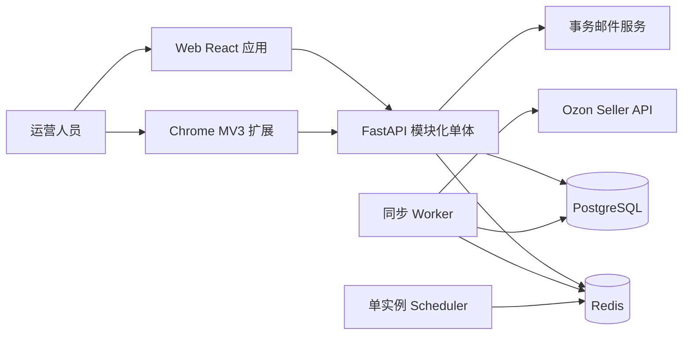
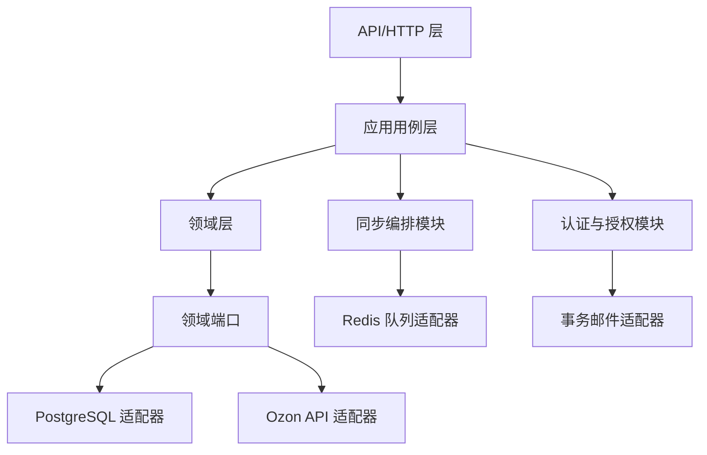

# ozonslj 架构设计 V5（定档草案）

## 1. 定档范围

ozonslj 是面向 Ozon 跨境卖家的多组织 SaaS 运营平台。系统以 Web 应用和 Chrome 扩展作为统一 API 的两个客户端，首期提供只读运营能力、店铺凭据管理、商品与库存同步、订单及履约手动同步和脱敏审计。

本版本已确认的运行前提：

- 云部署、多用户、多组织、多店铺。
- PostgreSQL 是唯一业务数据库；不使用 SQLite 作为正式运行时存储。
- Redis 承担异步任务队列和短期协调状态；不承担业务数据的唯一持久化。
- 首期服务器规格为 2 核 CPU、2GB 内存。
- 使用 Docker Compose，不引入 Kubernetes 或微服务集群。
- 后端采用 FastAPI 模块化单体；Web、Worker、Scheduler 使用同一代码库的不同进程入口。
- 首期严格只读，不执行价格、库存、订单或履约写入。

`docs/REQUIREMENTS.md` 中关于 Windows 单用户、DPAPI、SQLite、本地无登录的内容属于早期本地版本约束；与本定档版本冲突的部分以本文件为准。

## 2. 系统上下文

所有客户端只访问本系统 API。Ozon 凭据只在后端短暂解密和使用，不进入浏览器存储、任务消息、日志、审计或 API 响应。

## 3. 部署拓扑

首期使用 Docker Compose 管理以下容器：

| 服务            | 职责                     | 约束                 |
| ------------- | ---------------------- | ------------------ |
| reverse-proxy | TLS 终止、域名路由、静态资源       | 不承载业务逻辑            |
| web/api       | REST API、认证、权限、查询、任务创建 | 多 worker 不作为首期默认配置 |
| worker        | 消费 Redis 任务并调用 Ozon    | 全局并发初始上限 2         |
| scheduler     | 生成定时同步任务               | 单实例，避免重复调度         |
| redis         | 队列、短期锁、限流状态            | 设置最大内存和持久化策略       |
| postgres      | 业务数据、认证数据、任务、审计        | 连接池和连接数设上限         |

PostgreSQL 和 Redis 首期可与应用同机部署，但配置必须支持迁移到云托管 PostgreSQL 和 Redis。备份必须存放在服务器之外的对象存储。

## 4. 后端模块边界

- **HTTP 层**：解析请求、认证上下文、参数校验、错误映射和响应模型；不直接写 SQL 或调用 Ozon。
- **应用层**：编排登录、组织管理、工作区授权、凭据操作、同步任务和查询用例；负责事务边界和幂等入口。
- **领域层**：维护组织、成员、角色、卖家账户、店铺工作区、商品报价、库存、订单、履约、同步任务和卖家操作等概念及不变量。
- **基础设施层**：实现 PostgreSQL、Redis、Ozon HTTP、邮件和密钥加密端口。
- **Worker**：只执行已持久化的任务；恢复组织、工作区和操作者上下文后运行用例，不绕过应用权限规则。

这是模块化单体，不是微服务。模块通过领域接口和应用用例隔离，未来可拆分同步服务或认证服务，但当前不引入额外网络跳转。

## 5. 租户、身份与权限

租户边界是 **Organization**。一个组织拥有多个 Ozon Seller Account；一个 Seller Account 只能属于一个组织；每个账户对应一个或多个业务工作区的关系必须由领域模型明确约束。

组织成员角色：

- `owner`：组织所有权、成员和全部资源管理。
- `admin`：成员和全部业务操作管理，但不能转移或删除组织所有权。
- `operator`：访问被授权工作区并执行允许的只读运营操作。
- `viewer`：访问被授权工作区的只读数据。

成员与工作区之间使用显式授权表。组织级角色不能替代工作区级授权。每个请求必须同时校验：用户身份、组织成员关系、角色权限和目标工作区授权。

PostgreSQL 启用 Row-Level Security 作为第二道隔离边界。应用在事务内设置当前组织和用户上下文，RLS 约束业务表查询；Worker 执行任务时必须恢复相同上下文。应用层过滤和 RLS 不能互相替代。

## 6. 认证与客户端授权

认证由本项目自建：

- 用户名/邮箱、Argon2id 密码哈希、邮箱验证和密码重置。
- 设备级会话、主动注销和全部设备注销。
- Web 使用 HttpOnly、Secure、SameSite Cookie。
- 会话令牌不以明文持久化，服务端保存令牌摘要、设备信息、过期时间和撤销状态。
- 邮件通过第三方事务邮件服务发送，邮件令牌短时有效、单次使用。

Chrome 扩展不接触用户密码。用户在 Web 登录后，通过短时、单次使用、可撤销的一次性授权码向扩展换取扩展专用短期令牌。扩展只保存当前工作区 ID 和必要的短期会话信息，不保存 Ozon 凭据或长期 Refresh Token。

## 7. Ozon 凭据保护

采用应用级信封加密：

1. 生成或替换凭据时使用数据密钥加密 Api-Key。
2. PostgreSQL 只保存密文、密钥版本和必要元数据。
3. 应用主密钥通过部署密钥或环境变量注入，不进入数据库、镜像、日志或任务消息。
4. 解密只发生在后端调用 Ozon 的短暂生命周期内。
5. 支持密钥版本轮换；未来可将保护端口替换为云 KMS/Secret Manager。

Client-Id 也不得出现在前端日志、审计详情或错误响应中。凭据创建、替换和验证均写入脱敏审计。

## 8. 首期业务能力

### 已定档能力

- 组织、成员和工作区管理。
- Ozon 凭据创建、替换和独立验证。
- 商品报价和库存查询。
- 商品报价、库存定时同步和手动同步。
- 订单、履约单手动同步和查询。
- 同步进度、失败原因、重试记录和脱敏审计。

### 明确不在首期范围

- 修改价格、库存、订单或履约状态。
- 删除卖家账户或工作区。
- 任意 Cron 配置。
- 完整买家姓名、电话、地址等 PII 的持久化。
- 微服务集群、Kubernetes 和独立认证服务。

## 9. 同步与任务架构

同步采用：API 创建任务 → PostgreSQL 持久化任务 → Redis 投递 → Worker 执行 → PostgreSQL 写回状态和结果。

约束如下：

- 同一工作区同时最多一个运行中的同步任务。
- 不同工作区可并发；全局 Worker 并发初始上限为 2。
- 重复请求通过幂等键、工作区锁和资源类型去重。
- 商品和库存支持固定档位定时同步；订单和履约只支持手动同步。
- 定时频率只提供平台固定档位，例如每小时、每 6 小时、每天一次。
- 调度器必须避免同一工作区重复排队。
- Redis 丢失时，Worker 可从 PostgreSQL 找回排队或超时未完成任务。

错误分类：

- Ozon 限流、网络错误、超时和服务端临时错误：指数退避重试。
- 认证失败、权限不足、参数错误和明确业务拒绝：不自动重试。
- 每次重试记录次数、错误类别、下次执行时间和最终结果。

分页同步使用 Ozon 游标、固定时间窗口和重叠区间；使用 Ozon 业务主键及更新时间进行幂等 upsert，避免数据变化造成遗漏或重复。

## 10. 数据模型原则

PostgreSQL 是关系型事务核心。关键实体包括：

| 实体 | 所有权 | 说明 |
|---|---|---|
| users | 平台 | 登录身份和安全状态 |
| organizations | 平台 | 租户边界 |
| organization_members | 组织 | 用户角色和成员状态 |
| seller_accounts | 组织 | Ozon 凭据密文及验证状态 |
| store_workspaces | 组织/卖家账户 | 店铺运营隔离视图 |
| workspace_memberships | 工作区 | 成员级工作区授权 |
| product_offers | 工作区 | 标准化商品报价 |
| stock_positions | 工作区 | 仓库、FBO/FBS 和可用库存 |
| customer_orders | 工作区 | 去 PII 或脱敏的订单摘要 |
| postings | 工作区 | 履约单状态和物流摘要 |
| sync_jobs | 工作区 | 任务状态、游标、重试和错误 |
| seller_operations | 组织/工作区 | 脱敏审计记录 |
| raw_ozon_payloads | 组织/工作区 | 限时、脱敏的诊断数据 |

所有跨租户业务表必须能直接或通过受约束外键链路确定 `organization_id`。唯一约束、外键、状态检查、时间索引和工作区复合索引必须与主要查询形状一起设计。禁止用 JSON 隐藏需要过滤、排序、统计或授权的数据。

## 11. 数据隐私与保留

- 不持久化买家姓名、电话、地址等完整 PII。
- Ozon 原始响应只保存脱敏版本，默认保留 14 天，用于排错和重新解析。
- 审计记录保留 1 年，保存组织、工作区、操作者、请求 ID、任务 ID、结果和错误类别。
- 不记录 Api-Key、完整请求头、令牌、原始 Ozon 响应或不必要的买家数据。
- 数据清理任务必须可观测、可重试，并受 RLS 和组织边界约束。

## 12. API 与前端边界

API 使用 REST/JSON，统一前缀 `/api/v1`。Web 和 Chrome 扩展共享 API 客户端、类型和业务展示组件；只有入口、路由和认证适配不同。

API 必须统一提供：

- 组织和工作区授权校验。
- 游标分页和稳定排序。
- 结构化错误码、用户可读消息和请求 ID。
- 同步创建的幂等键。
- loading、success、empty、error、retry 状态。
- 不返回凭据、密文、敏感请求头或未脱敏原始数据。

Chrome 扩展使用 Manifest V3、最小权限、限定 API 域名、service worker 和 side panel。Web 是登录、组织管理、成员授权和扩展授权的主入口；扩展是高频工作区查看和同步状态入口。

## 13. Ozon API 适配与限流

Ozon 原始 HTTP、认证头、超时、分页、重试、限流和错误映射全部封装在基础设施适配器中，领域层只接收内部模型和分类后的领域错误。

限流按组织和卖家账户分别控制，同时设置全局保护上限。Redis 保存短期计数、退避和锁；PostgreSQL 保存任务结果和审计摘要。所有外部请求设置连接超时、读取超时和总超时，禁止无限等待。

## 14. 可观测性与运行安全

首期使用结构化日志、存活检查、就绪检查和基础告警，不在服务器部署重量级监控栈。

必须监测：

- Web、Worker、Scheduler、Redis、PostgreSQL 健康状态。
- 队列长度、任务年龄、失败率和重试次数。
- Ozon 限流、认证失败和临时错误。
- 数据库连接池耗尽、慢查询和磁盘空间。
- 备份成功、WAL 归档延迟和恢复演练结果。

## 15. 测试与验收

- 领域和应用用例单元测试。
- REST API 集成测试。
- PostgreSQL 约束、事务和 RLS 集成测试。
- Worker 的幂等、重试、断点、并发和恢复测试。
- 多组织、角色和工作区越权测试。
- Web 与 Chrome 扩展浏览器端到端测试。
- Ozon 全部使用 Mock/Stub，不访问真实账号。
- 通过 Python 测试、类型检查、schema 校验、前端构建和浏览器主流程门禁。

## 16. 备份、迁移与演进

- PostgreSQL 每日全量备份 + 增量/WAL 归档。
- 目标恢复点为最多丢失 1 小时数据。
- 备份上传到服务器之外的对象存储，并定期进行恢复演练。
- 数据库采用 Expand-and-Contract：先扩展、兼容发布、回填、切换、再清理旧结构。
- Web、Worker、Scheduler 必须允许短暂版本并存。
- 每次迁移前备份，定义停止条件、兼容窗口和回滚路径。
- 未来可独立迁移 PostgreSQL、Redis、密钥保护和同步 Worker，但不改变领域契约。

## 17. 必须保持的架构不变量

1. 任何业务查询都不能跨组织或越过工作区授权。
2. 任何 Ozon 凭据都不能进入浏览器持久化、日志、任务消息、响应或审计明细。
3. 所有外部 Ozon 调用必须经过适配器、超时、限流、错误分类和审计。
4. 所有同步任务必须可追踪、可重试、可恢复且幂等。
5. PostgreSQL 是业务事实来源；Redis 丢失不能造成不可恢复的业务状态丢失。
6. 首期只读能力不得暗中演变为写操作；未来写操作必须新增明确的预览、确认、权限、幂等和审计设计。
7. 架构演进必须优先适配 2 核 2GB 服务器，新增常驻组件必须证明其必要性和资源预算。

