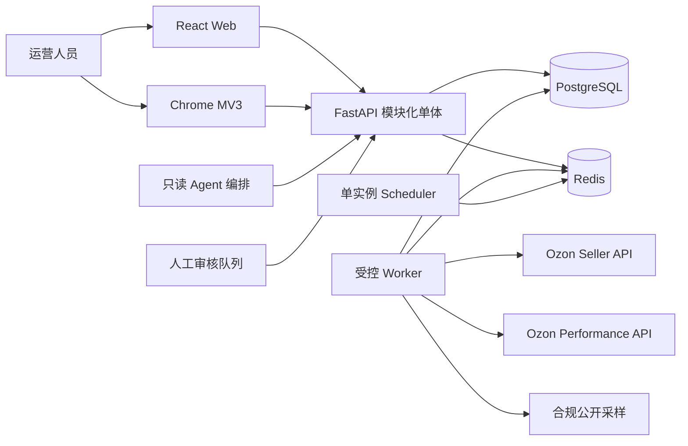
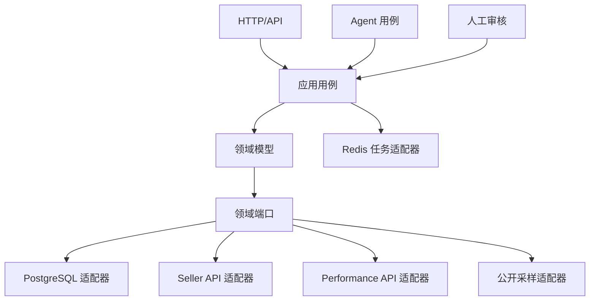
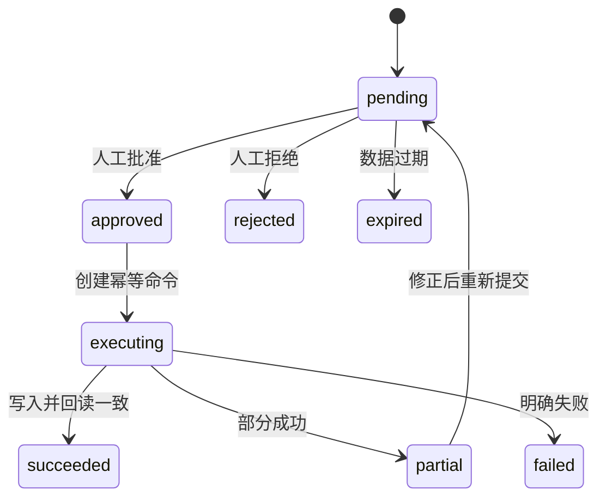

> [!warning] 定档状态
> 本文是需求 V5 的配套架构草案。需求 V5 未确认前，架构 V5 仍是当前定档版本。

# ozonslj 架构设计 V6（待确认）

## 1. 设计目标

V6 在 V5 模块化单体、PostgreSQL、Redis、工作区隔离和只读首期原则上，新增选品、Listing、Performance API、公开采样、人工审核和只读 Agent。首期仍适配 2 核 2GB，不引入微服务、Kubernetes、ClickHouse 或爬虫集群。

## 2. 系统上下文

客户端只访问本系统 API。Seller、Performance 和公开采样均通过独立基础设施适配器进入系统。

## 3. 模块边界

| 模块 | 职责 | 禁止事项 |
|---|---|---|
| identity | 用户、会话、组织、角色和工作区授权 | 不持有 Ozon 凭据 |
| seller_accounts | Seller 凭据、验证、轮换和权限诊断 | 不处理广告 OAuth |
| synchronization | 商品、库存、订单、履约同步和任务恢复 | 不直接暴露上游模型 |
| research | 关键词、竞品种子、研究运行和决策书 | 不调用写适配器 |
| public_collection | robots、采集策略、限速、解析和快照 | 不绕过访问控制 |
| listing | 关键词分层、草稿、风险检测和版本 | 不直接发布 |
| performance | OAuth、广告快照和指标计算 | 不复用 Seller 凭据 |
| review | 差异预览、审核、幂等命令和执行回读 | 不接受模型自行批准 |
| agents | 只读分析、报告和告警编排 | 不执行 SQL 或外部写入 |
| audit | 脱敏审计、请求链路和版本追踪 | 不保存凭据或原始 PII |

## 4. 端口与依赖方向

HTTP 路由、Worker 和 Agent 都只能调用应用用例；领域层不得依赖 FastAPI、HTTPX、Redis、PostgreSQL 或页面解析库。

## 5. 数据模型

V5 已定档实体继续保留，并新增：

| 实体 | 所有权 | 说明 |
|---|---|---|
| research_keywords | 工作区 | 规范化搜索词和导入来源 |
| keyword_report_imports | 工作区 | 文件指纹、字段映射和导入结果 |
| competitor_seeds | 工作区 | 手工维护的公开竞品种子 |
| collection_policies | 组织/域名 | robots 结果、限速和启停策略 |
| public_product_snapshots | 工作区 | 公开字段快照和估算标记 |
| product_research_runs | 工作区 | 研究模式、状态、版本和来源摘要 |
| product_decision_documents | 工作区 | 决策书草稿和假设版本 |
| listing_drafts | 工作区 | Listing 草稿、检测和版本链 |
| performance_accounts | 组织 | Performance OAuth 密文和状态 |
| ad_campaign_snapshots | 工作区 | 广告活动、关键词和日统计 |
| review_requests | 工作区 | 人工审核请求和风险上下文 |
| execution_commands | 工作区 | 一次性幂等执行命令与回读结果 |
| agent_runs | 工作区 | Agent 输入版本、输出和状态 |

跨租户表必须包含或通过受约束外键确定 `organization_id`。公开样本必须保存 `source_type`、`source_url`、`observed_at`、`estimated`、`parser_version` 和内容指纹。

## 6. 数据来源与宽表策略

不建立把所有来源无差别混合的物理“超级宽表”。查询层使用规范化事实表、物化视图或显式读模型构建 `product_research_view`。同名指标必须包含来源与口径，禁止使用 `COALESCE` 静默用公开估算覆盖官方事实。

优先级只用于展示选择，不改变原始事实：

`official_private > operator_imported > public_sample > derived_estimate`

## 7. 公开采样架构

采集流程：策略检查 → robots 检查 → 域名限流 → HTTP 获取 → 内容类型/大小校验 → 解析 → sanity check → 快照持久化 → 审计。

安全约束：

- 只允许 HTTPS 和配置白名单域名，禁止任意 URL 透传，防止 SSRF。
- DNS 解析后拒绝环回、内网、链路本地和云元数据地址；重定向后重新校验。
- 默认每域名并发 1、全局并发 2，使用带抖动退避并遵守 `Retry-After`。
- 不轮换代理或 User-Agent 规避限制，不处理验证码，不使用用户登录态。
- 响应大小、类型、重定向次数和总耗时有硬上限。
- 原始 HTML 默认不落库；解析失败仅保存脱敏诊断摘要和内容指纹。

## 8. Seller 与 Performance 适配器

两个适配器共享通用 HTTP 基础组件，但认证、凭据、域名、端点、限流桶、错误映射和审计类别完全分离。

- Seller：`Client-Id` 与 `Api-Key`，用于店铺事实和后续受控写入。
- Performance：OAuth 2.0 客户端凭据换取短期访问令牌；令牌只存内存或加密短期缓存，提前刷新并使用单飞锁避免并发刷新。
- 每个具体方法实施前核对官方路径、版本、请求/响应、分页、权限、配额和弃用状态。
- 自动化测试使用 MockTransport 或等价 Stub，禁止访问真实账号。

## 9. 研究与计算架构

`ProductResearchService` 编排三种研究模式；`ProfitCalculator` 是纯领域服务，只接收整数金额、精度明确的比例和版本化假设；`DecisionDocumentService` 生成结构化草稿，不直接生成不可追溯的自由文本结论。

研究运行必须冻结数据快照引用和算法版本，保证后续能够复现。数据不足时输出缺口和置信限制，不用默认值伪造完整结果。

## 10. 审核与写入状态机

Agent、规则和模型只能创建 `pending` 请求。批准者必须具有目标工作区和操作类型权限；自审限制、批量上限、价格利润线和数据新鲜度在应用层与执行层重复校验。

## 11. Agent 架构

Agent 是受限应用客户端，不是拥有独立权限的后台超级用户。Agent 工具只暴露参数化查询、指标计算、报告草稿和待办创建；不暴露 SQL、凭据、文件系统或外部写适配器。

每次运行保存用户/服务主体、组织、工作区、输入时间窗、工具调用摘要、数据版本、模型版本、成本和输出。提示词不能改变权限、审核和数据隔离规则。

## 12. API 边界

新增目标资源：

- `/api/v1/store-workspaces/{id}/keyword-report-imports`
- `/api/v1/store-workspaces/{id}/competitor-seeds`
- `/api/v1/store-workspaces/{id}/research-runs`
- `/api/v1/store-workspaces/{id}/product-decisions`
- `/api/v1/store-workspaces/{id}/listing-drafts`
- `/api/v1/store-workspaces/{id}/ad-analytics`
- `/api/v1/store-workspaces/{id}/review-requests`
- `/api/v1/review-requests/{id}/approve`

响应统一携带请求 ID；研究和分析响应包含来源摘要、数据时间和估算标记。文件导入使用大小、类型和编码限制，不在同步 HTTP 请求中执行大规模解析。

## 13. 任务、限流与恢复

- PostgreSQL 保存任务事实、租约、游标、尝试次数和结果；Redis 只保存可恢复队列、锁和限流状态。
- 队列按 `seller_sync`、`performance_sync`、`public_collection`、`research`、`report` 分类，分别设置并发和重试策略。
- 相同工作区、资源、时间窗和输入指纹使用幂等键去重。
- 公开采集任务必须先读取当前策略；策略停用时安全取消。
- Worker 崩溃后由租约过期恢复，失败任务不推进长期水位。

## 14. 隐私、保留与审计

- 买家 PII 不进入关键词、竞品、广告、研究、Agent 或 RAG 上下文。
- 原始导入文件默认保留 7 天；规范化关键词按业务需要保留。
- 公开字段快照建议保留 180 天；原始 HTML 默认不保存。
- OAuth 令牌、Api-Key、Client-Id、请求头和原始敏感响应不得进入日志或审计详情。
- 审核、执行、导出、Agent 运行和采集策略变更必须审计。

## 15. 部署与资源预算

沿用 V5 Docker Compose。P0 复用 API、Worker、Scheduler、PostgreSQL 和 Redis，不新增常驻服务。公开采集与研究任务共享 Worker，但使用独立队列和并发配额。大文件导入、报告生成和采集均异步执行。

## 16. 测试与验收

- 领域计算、来源优先级和缺失数据单元测试。
- CSV/XLSX 导入编码、字段映射、重复文件和恶意文件测试。
- URL 白名单、SSRF、robots、重定向、大小限制、429/503 和页面畸形测试。
- Seller/Performance 认证隔离、令牌刷新、限流和错误映射契约测试。
- 研究运行可复现、工作区隔离和 RLS 测试。
- 审核状态机、权限、过期、幂等、部分失败和回读测试。
- Agent 越权、提示注入、任意 SQL 和写入绕过测试。
- Web 与扩展的加载、空数据、过期、部分失败、来源标识和键盘操作测试。

## 17. 架构不变量

1. 官方事实、人工导入、公开样本和推导估算不得静默混合。
2. 公开采集不得绕过访问控制、robots、验证码或服务条款。
3. Seller 与 Performance 凭据、令牌、限流桶和错误映射必须隔离。
4. Agent 永远不直接持有写适配器、SQL 或凭据访问能力。
5. 所有外部写入必须经过预览、权限、人工确认、幂等、回读和审计。
6. PostgreSQL 是业务事实来源；Redis 丢失后任务可恢复。
7. 所有业务查询、任务、采集、报告和 Agent 运行强制组织与工作区隔离。
8. 2 核 2GB 是首期资源约束；新增常驻组件必须先给出必要性与预算。

## 18. 待定档事项

架构 V6 的定档依赖需求 V5 第 8 节八项产品决策确认。确认后还需同步更新 `CONTEXT.md`、`API.md`、`DATABASE.md`、`PROJECT_PLAN.md` 和 PostgreSQL schema 迁移计划。
